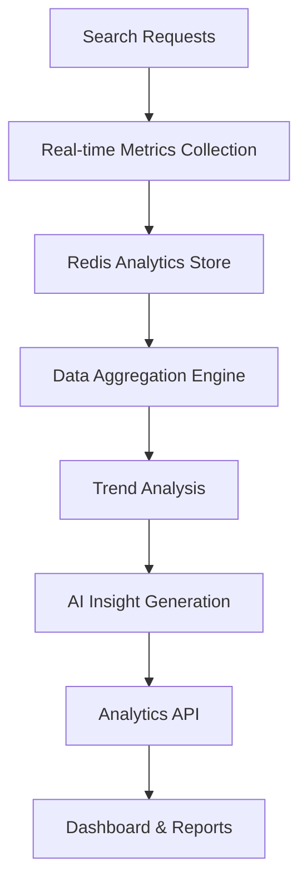

# Analytics & Insights

Comprehensive Analytics API Documentation

Altus 4 provides powerful analytics capabilities to help you understand search patterns, optimize performance, and gain insights into your data usage. The analytics API offers real-time metrics, historical trends, and AI-generated insights.

## Analytics Overview

### Analytics Architecture



### Available Metrics

- **Search Performance** - Response times, success rates, error patterns
- **Usage Analytics** - Search volume, popular queries, user patterns
- **Database Health** - Connection status, query performance, index utilization
- **AI Insights** - Query categorization, trend analysis, optimization suggestions
- **Business Intelligence** - User engagement, feature adoption, growth metrics

## Analytics Endpoints

All analytics endpoints require an API key with the 'analytics' permission. Admin analytics endpoints additionally require the 'admin' permission. Include your API key in the Authorization header as `Bearer <YOUR_API_KEY>`.

### Dashboard Overview

Get a comprehensive dashboard view of your search analytics.

**Endpoint**: `GET /api/v1/analytics/dashboard`

**Query Parameters**:

- `startDate` - YYYY-MM-DD (optional)
- `endDate` - YYYY-MM-DD (optional)
- `period` - `day`, `week`, `month`, `3months`, `6months`, `year` (default: `week`)

**Headers**:

```http
Authorization: Bearer <YOUR_API_KEY>
```

**Response**:

```json
{
  "success": true,
  "data": {
    "trends": {
      "period": "week",
      "topQueries": ["database optimization"],
      "queryVolume": 1250,
      "avgResponseTime": 234,
      "popularCategories": ["Performance"]
    },
    "performance": {
      "summary": {
        "totalQueries": 1250,
        "averageResponseTime": 234,
        "topQuery": "database optimization"
      },
      "timeSeriesData": [
        { "date": "2024-01-15", "query_count": 100, "avg_response_time": 200 }
      ]
    },
    "popularQueries": [
      { "query_text": "database optimization", "frequency": 89, "avg_time": 245 }
    ],
    "insights": [
      { "type": "query_optimization", "confidence": 0.9, "description": "Consider FULLTEXT index", "actionable": true, "data": {} }
    ],
    "summary": {
      "period": "week",
      "totalQueries": 1250,
      "averageResponseTime": 234,
      "topQuery": "database optimization"
    }
  }
}
```

### Search Trends

Get detailed search trend analysis over time.

**Endpoint**: `GET /api/v1/analytics/search-trends`

**Query Parameters**:

- `startDate` - YYYY-MM-DD (optional)
- `endDate` - YYYY-MM-DD (optional)
- `period` - `day`, `week`, `month`, `3months`, `6months`, `year` (default: `week`)

**Response**:

```json
{
  "success": true,
  "data": [
    {
      "period": "week",
      "topQueries": ["database optimization"],
      "queryVolume": 1250,
      "avgResponseTime": 234,
      "popularCategories": ["Performance"]
    }
  ]
}
```

### Performance Metrics

Get detailed performance analytics including response times, error rates, and resource utilization.

**Endpoint**: `GET /api/v1/analytics/performance`

**Query Parameters**:

- `startDate` - YYYY-MM-DD (optional)
- `endDate` - YYYY-MM-DD (optional)
- `period` - `day`, `week`, `month`, `3months`, `6months`, `year` (default: `week`)

**Response**:

```json
{
  "success": true,
  "data": {
    "summary": {
      "totalQueries": 1250,
      "averageResponseTime": 234,
      "peakResponseTime": 892
    },
    "timeSeriesData": [
      { "date": "2024-01-15", "query_count": 100, "avg_response_time": 200 }
    ],
    "slowestQueries": [
      { "query_text": "complex join", "execution_time_ms": 1200, "result_count": 0, "user_email": "user@example.com" }
    ]
  }
}
```

### Popular Queries

Get the most popular search queries with detailed analytics.

**Endpoint**: `GET /api/v1/analytics/popular-queries`

**Query Parameters**:

- `startDate` - YYYY-MM-DD (optional)
- `endDate` - YYYY-MM-DD (optional)
- `period` - `day`, `week`, `month`, `3months`, `6months`, `year` (default: `week`)

**Response**:

```json
{
  "success": true,
  "data": [
    {
      "query_text": "database performance optimization",
      "frequency": 189,
      "avg_time": 234,
      "avg_results": 45,
      "last_used": "2024-01-15T10:30:00.000Z"
    }
  ]
}
```

### AI-Generated Insights

Get AI-powered insights and recommendations based on your search patterns.

**Endpoint**: `GET /api/v1/analytics/insights`

**Query Parameters**:

- `startDate` - YYYY-MM-DD (optional)
- `endDate` - YYYY-MM-DD (optional)
- `period` - `day`, `week`, `month`, `3months`, `6months`, `year` (default: `week`)
- `includeRecommendations` - Include actionable recommendations

**Response**:

```json
{
  "success": true,
  "data": {
    "insights": {
      "generatedAt": "2024-01-15T10:30:00.000Z",
      "analysisperiod": "last_7_days",
      "performanceInsights": [
        {
          "type": "slow_queries",
          "severity": "medium",
          "title": "Slow Query Detection",
          "description": "18% of searches on 'articles' table exceed 500ms response time",
          "impact": "User experience degradation",
          "recommendation": {
            "action": "Add FULLTEXT index on articles.content column",
            "effort": "low",
            "expectedImprovement": "65% faster searches"
          },
          "affectedQueries": [
            "content optimization",
            "article search",
            "documentation search"
          ]
        }
      ],
      "usageInsights": [
        {
          "type": "search_pattern",
          "title": "Semantic Search Adoption",
          "description": "Semantic search usage increased by 45% this week",
          "trend": "upward",
          "significance": "high",
          "implication": "Users prefer AI-enhanced search results",
          "recommendation": {
            "action": "Promote semantic search features in documentation",
            "effort": "low"
          }
        }
      ],
      "optimizationInsights": [
        {
          "type": "database_optimization",
          "databaseId": "db_abc123",
          "title": "Index Optimization Opportunity",
          "impact": "high",
          "details": {
            "currentState": "3 tables without FULLTEXT indexes",
            "potentialImprovement": "40-60% query performance boost",
            "estimatedEffort": "30 minutes setup time"
          },
          "recommendations": [
            {
              "table": "posts",
              "action": "CREATE FULLTEXT INDEX idx_posts_search ON posts(title, body)",
              "benefit": "Improved search on posts table"
            }
          ]
        }
      ],
      "trendInsights": [
        {
          "type": "emerging_topics",
          "title": "Growing Interest in MySQL 8.0 Features",
          "description": "40% increase in queries related to MySQL 8.0 optimization",
          "trend": "strong_upward",
          "timeline": "last_2_weeks",
          "relatedQueries": [
            "mysql 8.0 performance",
            "window functions mysql",
            "cte mysql 8.0"
          ],
          "businessImplication": "Users are modernizing their MySQL infrastructure"
        }
      ],
      "summary": {
        "keyMetrics": {
          "totalSearches": 1250,
          "growthRate": 15.2,
          "userSatisfaction": 0.87
        },
        "topRecommendations": [
          "Add FULLTEXT indexes to improve search performance",
          "Promote semantic search capabilities",
          "Create content about MySQL 8.0 optimization"
        ],
        "healthScore": 0.85,
        "nextReview": "2024-01-22T10:30:00.000Z"
      }
    }
  }
}
```

### System Overview

Get system-wide overview (admin only).

**Endpoint**: `GET /api/v1/analytics/admin/system-overview`

**Query Parameters**:

- `startDate` - YYYY-MM-DD (optional)
- `endDate` - YYYY-MM-DD (optional)
- `period` - `day`, `week`, `month`, `3months`, `6months`, `year` (default: `week`)

**Response**:

```json
{
  "success": true,
  "data": {
    "summary": {
      "active_users": 42,
      "total_queries": 1250,
      "avg_response_time": 234,
      "avg_results": 67
    },
    "userGrowth": [
      { "date": "2024-01-10", "new_users": 3 }
    ],
    "queryVolume": [
      { "date": "2024-01-10", "query_count": 100, "active_users": 15 }
    ],
    "period": "week"
  }
}
```

### User Activity Metrics

Get detailed user activity and engagement metrics.

**Endpoint**: `GET /api/v1/analytics/admin/user-activity`

**Query Parameters**:

- `startDate` - YYYY-MM-DD (optional)
- `endDate` - YYYY-MM-DD (optional)
- `period` - `day`, `week`, `month`, `3months`, `6months`, `year` (default: `week`)
- `limit` - Number of rows (default: 100)
- `offset` - Pagination offset (default: 0)

**Response**:

```json
{
  "success": true,
  "data": [
    {
      "id": "user_123",
      "email": "user@example.com",
      "name": "Test User",
      "role": "user",
      "query_count": 42,
      "avg_response_time": 210,
      "last_query": "2024-01-15T10:30:00.000Z",
      "last_active": "2024-01-15T11:00:00.000Z"
    }
  ]
}
```

## Custom Analytics

### Create Custom Metrics

*This feature is not currently implemented.*

**Request Body**:

```json
{
  "name": "Conversion Rate",
  "description": "Rate of searches leading to successful results",
  "query": {
    "aggregation": "ratio",
    "numerator": "successful_searches",
    "denominator": "total_searches"
  },
  "schedule": "daily",
  "alerts": {
    "enabled": true,
    "threshold": 0.85,
    "comparison": "below"
  }
}
```

### Export Analytics Data

*This feature is not currently implemented.*

**Query Parameters**:

- `format` - Export format: `csv`, `json`, `xlsx`
- `metrics` - Comma-separated list of metrics to include
- `dateRange` - Date range for export
- `granularity` - Data granularity: `hour`, `day`, `week`

**Response**: File download or structured data based on format

## Code Examples

### JavaScript Analytics Client

```javascript
class Altus4Analytics {
  constructor(apiKey) {
    this.apiKey = apiKey;
    this.baseUrl = 'http://localhost:3000';
    this.headers = {
      Authorization: `Bearer ${apiKey}`,
      'Content-Type': 'application/json',
    };
  }

  async getDashboard(period = 'week', startDate, endDate) {
    const params = new URLSearchParams({ period });
    if (startDate) params.set('startDate', startDate);
    if (endDate) params.set('endDate', endDate);

    const response = await fetch(
      `${this.baseUrl}/api/v1/analytics/dashboard?${params}`,
      { headers: this.headers }
    );

    return await response.json();
  }

  async getSearchTrends({ period = 'week', startDate, endDate } = {}) {
    const params = new URLSearchParams({ period });
    if (startDate) params.set('startDate', startDate);
    if (endDate) params.set('endDate', endDate);

    const response = await fetch(
      `${this.baseUrl}/api/v1/analytics/search-trends?${params}`,
      { headers: this.headers }
    );

    return await response.json();
  }

  async getPopularQueries({ period = 'week', startDate, endDate } = {}) {
    const params = new URLSearchParams({ period });
    if (startDate) params.set('startDate', startDate);
    if (endDate) params.set('endDate', endDate);

    const response = await fetch(
      `${this.baseUrl}/api/v1/analytics/popular-queries?${params}`,
      { headers: this.headers }
    );

    return await response.json();
  }

  async getInsights({ period = 'week', startDate, endDate } = {}) {
    const params = new URLSearchParams({ period });
    if (startDate) params.set('startDate', startDate);
    if (endDate) params.set('endDate', endDate);

    const response = await fetch(
      `${this.baseUrl}/api/v1/analytics/insights?${params}`,
      { headers: this.headers }
    );

    return await response.json();
  }

  async getPerformanceMetrics({ period = 'week', startDate, endDate } = {}) {
    const params = new URLSearchParams({ period });
    if (startDate) params.set('startDate', startDate);
    if (endDate) params.set('endDate', endDate);

    const response = await fetch(
      `${this.baseUrl}/api/v1/analytics/performance?${params}`,
      { headers: this.headers }
    );

    return await response.json();
  }
}

// Usage
const analytics = new Altus4Analytics('altus4_sk_live_abc123...');

// Get dashboard overview
const dashboard = await analytics.getDashboard('week');
console.log('Total queries:', dashboard.data.performance.summary.totalQueries);

// Get trending searches
const trends = await analytics.getSearchTrends({ period: 'month' });
console.log('Top weekly queries:', trends.data[0].topQueries);

// Get AI insights
const insights = await analytics.getInsights({ period: 'week' });
insights.data.forEach(insight => {
  console.log(`${insight.type}: ${insight.description} (conf: ${insight.confidence})`);
});

// Monitor performance
const performance = await analytics.getPerformanceMetrics({ period: 'day' });
console.log('Average response time:', performance.data.summary.averageResponseTime);
```

### Python Analytics Dashboard

```python
import requests
import pandas as pd
import matplotlib.pyplot as plt
from datetime import datetime, timedelta

class Altus4AnalyticsDashboard:
    def __init__(self, api_key):
        self.api_key = api_key
        self.base_url = 'http://localhost:3000'
        self.headers = {'Authorization': f'Bearer {api_key}'}

    def get_dashboard_data(self, period='week'):
        response = requests.get(
            f'{self.base_url}/api/v1/analytics/dashboard',
            headers=self.headers,
            params={'period': period}
        )
        return response.json()['data']

    def get_search_trends(self, period='month'):
        response = requests.get(
            f'{self.base_url}/api/v1/analytics/search-trends',
            headers=self.headers,
            params={'period': period}
        )
        return response.json()['data']

    def get_performance_metrics(self, period='day'):
        response = requests.get(
            f'{self.base_url}/api/v1/analytics/performance',
            headers=self.headers,
            params={'period': period}
        )
        return response.json()['data']

    def generate_report(self):
        # Get dashboard data
        dashboard = self.get_dashboard_data('week')
        trends = self.get_search_trends('month')
        performance = self.get_performance_metrics('week')

        # Create visualizations
        # Trends is a list of TrendInsight; approximate a series from queryVolume
        self._plot_search_volume([{'date': 'period', 'count': trends[0]['queryVolume']}])
        self._plot_response_times(performance['timeSeriesData'])
        self._plot_popular_queries(dashboard['popularQueries'])

        return {
            'total_searches': dashboard['performance']['summary']['totalQueries'],
            'average_response_time': dashboard['performance']['summary']['averageResponseTime']
        }

    def _plot_search_volume(self, items):
        df = pd.DataFrame(items)
        plt.figure(figsize=(6, 4))
        plt.bar([str(x) for x in df['date']], df['count'])
        plt.title('Search Volume (approx)')
        plt.tight_layout()
        plt.show()

    def _plot_response_times(self, series):
        df = pd.DataFrame(series)
        plt.figure(figsize=(8, 4))
        plt.plot(df['date'], df['avg_response_time'])
        plt.title('Avg Response Time By Day')
        plt.tight_layout()
        plt.show()

    def _plot_popular_queries(self, queries):
        df = pd.DataFrame(queries)
        plt.figure(figsize=(8, 6))
        plt.barh(df['query_text'], df['frequency'])
        plt.title('Most Popular Search Queries')
        plt.tight_layout()
        plt.show()

# Usage
dashboard = Altus4AnalyticsDashboard('altus4_sk_live_abc123...')

# Generate comprehensive report
report = dashboard.generate_report()
print(f"Weekly Report:")
print(f"Total Searches: {report['total_searches']:,}")
print(f"Avg Response Time: {report['average_response_time']}ms")
print()
```

## Analytics Best Practices

### Performance Monitoring

1. **Set Baselines**: Establish performance baselines for response times and success rates
2. **Monitor Trends**: Track week-over-week and month-over-month changes
3. **Alert Thresholds**: Set up alerts for degraded performance
4. **Regular Reviews**: Schedule weekly analytics reviews

### Data-Driven Optimization

1. **Query Analysis**: Regularly review popular queries and optimize accordingly
2. **Database Performance**: Monitor database-specific metrics and optimize slow queries
3. **User Behavior**: Understand user patterns to improve search experience
4. **A/B Testing**: Use analytics to measure impact of search improvements

### Reporting Strategy

1. **Stakeholder Dashboards**: Create role-specific analytics dashboards
2. **Automated Reports**: Set up scheduled reports for key metrics
3. **Historical Analysis**: Maintain historical data for trend analysis
4. **Data Export**: Regularly export data for deeper analysis

---

**Next Steps**: [Error Handling](./errors.md) | [Rate Limiting](./rate-limiting.md)
