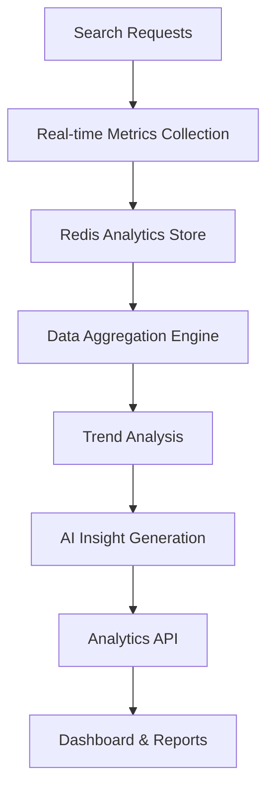

# Analytics & Insights

Comprehensive Analytics API Documentation

Altus 4 provides powerful analytics capabilities to help you understand search patterns, optimize performance, and gain insights into your data usage. The analytics API offers real-time metrics, historical trends, and AI-generated insights.

## Analytics Overview

### Analytics Architecture



### Available Metrics

- **Search Performance** - Response times, success rates, error patterns
- **Usage Analytics** - Search volume, popular queries, user patterns
- **Database Health** - Connection status, query performance, index utilization
- **AI Insights** - Query categorization, trend analysis, optimization suggestions
- **Business Intelligence** - User engagement, feature adoption, growth metrics

## Analytics Endpoints

### Dashboard Overview

Get a comprehensive dashboard view of your search analytics.

**Endpoint**: `GET /api/analytics/dashboard`

**Query Parameters**:

- `period` - Time period: `hour`, `day`, `week`, `month` (default: `day`)
- `databases` - Comma-separated database IDs to filter
- `timezone` - Timezone for date aggregation (default: `UTC`)

**Headers**:

```http
Authorization: Bearer <YOUR_API_KEY>
```

**Response**:

```json
{
  "success": true,
  "data": {
    "dashboard": {
      "period": "day",
      "dateRange": {
        "from": "2024-01-15T00:00:00.000Z",
        "to": "2024-01-15T23:59:59.000Z"
      },
      "overview": {
        "totalSearches": 1250,
        "totalResults": 45670,
        "uniqueQueries": 320,
        "averageResponseTime": 234,
        "cacheHitRate": 0.65,
        "successRate": 0.98
      },
      "searchVolume": [
        {
          "timestamp": "2024-01-15T00:00:00.000Z",
          "searches": 45,
          "results": 1834,
          "averageResponseTime": 198
        }
      ],
      "topQueries": [
        {
          "query": "database optimization",
          "count": 89,
          "averageResults": 67,
          "averageResponseTime": 245
        }
      ],
      "searchModes": {
        "natural": {
          "count": 750,
          "percentage": 60.0,
          "averageResponseTime": 210
        },
        "semantic": {
          "count": 350,
          "percentage": 28.0,
          "averageResponseTime": 320
        },
        "boolean": {
          "count": 150,
          "percentage": 12.0,
          "averageResponseTime": 180
        }
      },
      "databaseActivity": [
        {
          "databaseId": "db_abc123",
          "name": "Production DB",
          "searches": 890,
          "results": 32400,
          "averageResponseTime": 220,
          "healthScore": 0.95
        }
      ],
      "aiInsights": {
        "topCategories": ["Performance", "Optimization", "MySQL"],
        "emergingTopics": ["mysql 8.0", "indexing strategies"],
        "queryComplexityTrend": "increasing",
        "recommendations": [
          {
            "type": "performance",
            "message": "Consider adding FULLTEXT index on articles.content",
            "impact": "high"
          }
        ]
      }
    }
  }
}
```

### Search Trends

Get detailed search trend analysis over time.

**Endpoint**: `GET /api/analytics/trends`

**Query Parameters**:

- `period` - `hour`, `day`, `week`, `month` (default: `week`)
- `limit` - Number of data points (default: 100)
- `databases` - Filter by specific databases
- `groupBy` - Group results by: `query`, `category`, `database`

**Response**:

```json
{
  "success": true,
  "data": {
    "trends": {
      "period": "week",
      "totalDataPoints": 168,
      "dateRange": {
        "from": "2024-01-08T00:00:00.000Z",
        "to": "2024-01-15T23:59:59.000Z"
      },
      "searchVolume": {
        "timeline": [
          {
            "timestamp": "2024-01-08T00:00:00.000Z",
            "searches": 234,
            "uniqueQueries": 89,
            "averageResponseTime": 245
          }
        ],
        "growth": {
          "searches": 15.2,
          "uniqueQueries": 8.7,
          "responseTime": -5.3
        }
      },
      "queryCategories": [
        {
          "category": "Performance",
          "count": 456,
          "growth": 23.1,
          "topQueries": [
            "database optimization",
            "query performance",
            "index tuning"
          ]
        }
      ],
      "searchModeEvolution": [
        {
          "date": "2024-01-08",
          "natural": 65.2,
          "semantic": 22.8,
          "boolean": 12.0
        }
      ],
      "emergingQueries": [
        {
          "query": "mysql 8.0 optimization",
          "count": 45,
          "growthRate": 156.7,
          "firstSeen": "2024-01-10T00:00:00.000Z"
        }
      ],
      "insights": {
        "trendingSeason": "Q1 optimization focus",
        "peakHours": ["09:00-11:00", "14:00-16:00"],
        "weekdayPattern": "Higher volume on Tuesday-Thursday",
        "userBehavior": "Increasing preference for semantic search"
      }
    }
  }
}
```

### Performance Metrics

Get detailed performance analytics including response times, error rates, and resource utilization.

**Endpoint**: `GET /api/analytics/performance`

**Query Parameters**:

- `period` - Time period for analysis
- `breakdown` - Breakdown by: `endpoint`, `database`, `searchMode`
- `includeErrors` - Include error analysis (default: true)

**Response**:

```json
{
  "success": true,
  "data": {
    "performance": {
      "overview": {
        "averageResponseTime": 234,
        "p50ResponseTime": 198,
        "p95ResponseTime": 456,
        "p99ResponseTime": 892,
        "successRate": 0.982,
        "errorRate": 0.018,
        "cacheHitRate": 0.651
      },
      "endpoints": [
        {
          "endpoint": "/api/search",
          "totalRequests": 1250,
          "averageResponseTime": 267,
          "successRate": 0.981,
          "errorTypes": {
            "timeout": 12,
            "database_error": 8,
            "validation_error": 3
          }
        }
      ],
      "databases": [
        {
          "databaseId": "db_abc123",
          "name": "Production DB",
          "queries": 890,
          "averageResponseTime": 189,
          "slowQueries": 23,
          "connectionHealth": {
            "activeConnections": 5,
            "maxConnections": 10,
            "connectionUtilization": 0.5
          }
        }
      ],
      "searchModes": [
        {
          "mode": "semantic",
          "count": 350,
          "averageResponseTime": 456,
          "aiProcessingTime": 234,
          "cacheHitRate": 0.42
        }
      ],
      "resourceUtilization": {
        "cpu": {
          "average": 35.2,
          "peak": 67.8,
          "trend": "stable"
        },
        "memory": {
          "average": 1240.5,
          "peak": 1890.2,
          "trend": "increasing"
        },
        "redis": {
          "memoryUsage": 234.5,
          "hitRate": 0.851,
          "operationsPerSecond": 1250
        }
      }
    }
  }
}
```

### Popular Queries

Get the most popular search queries with detailed analytics.

**Endpoint**: `GET /api/analytics/popular-queries`

**Query Parameters**:

- `limit` - Number of queries to return (default: 50)
- `period` - Time period for popularity calculation
- `minCount` - Minimum search count to include
- `category` - Filter by query category

**Response**:

```json
{
  "success": true,
  "data": {
    "popularQueries": [
      {
        "query": "database performance optimization",
        "count": 189,
        "uniqueUsers": 67,
        "averageResults": 45,
        "averageResponseTime": 234,
        "successRate": 0.98,
        "category": "Performance",
        "relatedQueries": [
          "mysql optimization",
          "query tuning",
          "index optimization"
        ],
        "trending": {
          "direction": "up",
          "growth": 23.5
        },
        "timeDistribution": [
          {
            "hour": 9,
            "count": 23
          }
        ]
      }
    ],
    "categories": [
      {
        "name": "Performance",
        "queryCount": 456,
        "totalSearches": 1234,
        "averageResultsPerQuery": 67
      }
    ],
    "insights": {
      "topTrends": ["mysql 8.0", "performance optimization", "indexing"],
      "seasonalPatterns": "Q1 shows 40% increase in optimization queries",
      "userSegments": {
        "power_users": {
          "percentage": 15,
          "averageQueriesPerDay": 12
        },
        "casual_users": {
          "percentage": 85,
          "averageQueriesPerDay": 2
        }
      }
    }
  }
}
```

### AI-Generated Insights

Get AI-powered insights and recommendations based on your search patterns.

**Endpoint**: `GET /api/analytics/insights`

**Query Parameters**:

- `type` - Insight type: `performance`, `usage`, `optimization`, `trends`
- `databases` - Filter by specific databases
- `includeRecommendations` - Include actionable recommendations

**Response**:

```json
{
  "success": true,
  "data": {
    "insights": {
      "generatedAt": "2024-01-15T10:30:00.000Z",
      "analysisperiod": "last_7_days",
      "performanceInsights": [
        {
          "type": "slow_queries",
          "severity": "medium",
          "title": "Slow Query Detection",
          "description": "18% of searches on 'articles' table exceed 500ms response time",
          "impact": "User experience degradation",
          "recommendation": {
            "action": "Add FULLTEXT index on articles.content column",
            "effort": "low",
            "expectedImprovement": "65% faster searches"
          },
          "affectedQueries": [
            "content optimization",
            "article search",
            "documentation search"
          ]
        }
      ],
      "usageInsights": [
        {
          "type": "search_pattern",
          "title": "Semantic Search Adoption",
          "description": "Semantic search usage increased by 45% this week",
          "trend": "upward",
          "significance": "high",
          "implication": "Users prefer AI-enhanced search results",
          "recommendation": {
            "action": "Promote semantic search features in documentation",
            "effort": "low"
          }
        }
      ],
      "optimizationInsights": [
        {
          "type": "database_optimization",
          "databaseId": "db_abc123",
          "title": "Index Optimization Opportunity",
          "impact": "high",
          "details": {
            "currentState": "3 tables without FULLTEXT indexes",
            "potentialImprovement": "40-60% query performance boost",
            "estimatedEffort": "30 minutes setup time"
          },
          "recommendations": [
            {
              "table": "posts",
              "action": "CREATE FULLTEXT INDEX idx_posts_search ON posts(title, body)",
              "benefit": "Improved search on posts table"
            }
          ]
        }
      ],
      "trendInsights": [
        {
          "type": "emerging_topics",
          "title": "Growing Interest in MySQL 8.0 Features",
          "description": "40% increase in queries related to MySQL 8.0 optimization",
          "trend": "strong_upward",
          "timeline": "last_2_weeks",
          "relatedQueries": [
            "mysql 8.0 performance",
            "window functions mysql",
            "cte mysql 8.0"
          ],
          "businessImplication": "Users are modernizing their MySQL infrastructure"
        }
      ],
      "summary": {
        "keyMetrics": {
          "totalSearches": 1250,
          "growthRate": 15.2,
          "userSatisfaction": 0.87
        },
        "topRecommendations": [
          "Add FULLTEXT indexes to improve search performance",
          "Promote semantic search capabilities",
          "Create content about MySQL 8.0 optimization"
        ],
        "healthScore": 0.85,
        "nextReview": "2024-01-22T10:30:00.000Z"
      }
    }
  }
}
```

### System Overview

Get comprehensive system-wide analytics and health metrics.

**Endpoint**: `GET /api/analytics/overview`

**Response**:

```json
{
  "success": true,
  "data": {
    "overview": {
      "timeframe": "last_30_days",
      "systemHealth": {
        "overall": "healthy",
        "score": 0.92,
        "uptime": 99.8,
        "lastIncident": "2024-01-10T15:30:00.000Z"
      },
      "usage": {
        "totalSearches": 45670,
        "totalUsers": 234,
        "totalDatabases": 12,
        "dataProcessed": "125.6GB",
        "cacheUtilization": 0.73
      },
      "growth": {
        "searches": {
          "value": 23.5,
          "trend": "up",
          "period": "month_over_month"
        },
        "users": {
          "value": 15.2,
          "trend": "up",
          "period": "month_over_month"
        },
        "databases": {
          "value": 8.7,
          "trend": "up",
          "period": "month_over_month"
        }
      },
      "features": {
        "searchModes": {
          "natural": 0.605,
          "semantic": 0.285,
          "boolean": 0.11
        },
        "aiUtilization": 0.67,
        "cacheEfficiency": 0.851
      },
      "performance": {
        "averageResponseTime": 198,
        "p95ResponseTime": 456,
        "errorRate": 0.012,
        "throughput": 125.5
      }
    }
  }
}
```

### User Activity Metrics

Get detailed user activity and engagement metrics.

**Endpoint**: `GET /api/analytics/user-activity`

**Query Parameters**:

- `segment` - User segment: `all`, `active`, `power`, `casual`
- `period` - Analysis period
- `includeDetails` - Include detailed user breakdown

**Response**:

```json
{
  "success": true,
  "data": {
    "userActivity": {
      "totalUsers": 234,
      "activeUsers": 189,
      "newUsers": 23,
      "segments": {
        "power_users": {
          "count": 35,
          "percentage": 15.0,
          "averageSearchesPerDay": 15.2,
          "averageSessionDuration": 1240,
          "features": {
            "semanticSearchUsage": 0.78,
            "advancedFiltersUsage": 0.65
          }
        },
        "regular_users": {
          "count": 154,
          "percentage": 65.8,
          "averageSearchesPerDay": 4.3,
          "averageSessionDuration": 340
        },
        "casual_users": {
          "count": 45,
          "percentage": 19.2,
          "averageSearchesPerDay": 1.2,
          "averageSessionDuration": 120
        }
      },
      "engagement": {
        "dailyActiveUsers": 89,
        "weeklyActiveUsers": 156,
        "monthlyActiveUsers": 234,
        "retention": {
          "day1": 0.85,
          "day7": 0.67,
          "day30": 0.45
        },
        "sessionMetrics": {
          "averageDuration": 450,
          "searchesPerSession": 3.2,
          "bounceRate": 0.23
        }
      },
      "topUserJourneys": [
        {
          "pattern": "search -> refine -> export",
          "frequency": 0.34,
          "description": "Users search, refine results, then export data"
        }
      ]
    }
  }
}
```

## Custom Analytics

### Create Custom Metrics

Define custom metrics for tracking specific KPIs.

**Endpoint**: `POST /api/analytics/custom-metrics`

**Request Body**:

```json
{
  "name": "Conversion Rate",
  "description": "Rate of searches leading to successful results",
  "query": {
    "aggregation": "ratio",
    "numerator": "successful_searches",
    "denominator": "total_searches"
  },
  "schedule": "daily",
  "alerts": {
    "enabled": true,
    "threshold": 0.85,
    "comparison": "below"
  }
}
```

### Export Analytics Data

Export analytics data in various formats for external analysis.

**Endpoint**: `GET /api/analytics/export`

**Query Parameters**:

- `format` - Export format: `csv`, `json`, `xlsx`
- `metrics` - Comma-separated list of metrics to include
- `dateRange` - Date range for export
- `granularity` - Data granularity: `hour`, `day`, `week`

**Response**: File download or structured data based on format

## Code Examples

### JavaScript Analytics Client

```javascript
class Altus4Analytics {
  constructor(apiKey) {
    this.apiKey = apiKey;
    this.baseUrl = 'https://api.altus4.dev';
    this.headers = {
      Authorization: `Bearer ${apiKey}`,
      'Content-Type': 'application/json',
    };
  }

  async getDashboard(period = 'day', databases = null) {
    const params = new URLSearchParams({ period });
    if (databases) params.append('databases', databases.join(','));

    const response = await fetch(
      `${this.baseUrl}/api/analytics/dashboard?${params}`,
      { headers: this.headers }
    );

    return await response.json();
  }

  async getSearchTrends(options = {}) {
    const params = new URLSearchParams({
      period: options.period || 'week',
      limit: options.limit || 100,
      ...options,
    });

    const response = await fetch(
      `${this.baseUrl}/api/analytics/trends?${params}`,
      { headers: this.headers }
    );

    return await response.json();
  }

  async getPopularQueries(limit = 50, category = null) {
    const params = new URLSearchParams({ limit });
    if (category) params.append('category', category);

    const response = await fetch(
      `${this.baseUrl}/api/analytics/popular-queries?${params}`,
      { headers: this.headers }
    );

    return await response.json();
  }

  async getInsights(type = 'all') {
    const params = new URLSearchParams({ type });

    const response = await fetch(
      `${this.baseUrl}/api/analytics/insights?${params}`,
      { headers: this.headers }
    );

    return await response.json();
  }

  async getPerformanceMetrics(period = 'day') {
    const params = new URLSearchParams({
      period,
      breakdown: 'endpoint,database,searchMode',
      includeErrors: true,
    });

    const response = await fetch(
      `${this.baseUrl}/api/analytics/performance?${params}`,
      { headers: this.headers }
    );

    return await response.json();
  }
}

// Usage
const analytics = new Altus4Analytics('altus4_sk_live_abc123...');

// Get dashboard overview
const dashboard = await analytics.getDashboard('week', ['db_abc123']);
console.log('Total searches:', dashboard.data.dashboard.overview.totalSearches);

// Get trending searches
const trends = await analytics.getSearchTrends({
  period: 'month',
  groupBy: 'category',
});

// Get AI insights
const insights = await analytics.getInsights('performance');
insights.data.insights.performanceInsights.forEach(insight => {
  console.log(`${insight.title}: ${insight.recommendation.action}`);
});

// Monitor performance
const performance = await analytics.getPerformanceMetrics('day');
console.log(
  'Average response time:',
  performance.data.performance.overview.averageResponseTime
);
```

### Python Analytics Dashboard

```python
import requests
import pandas as pd
import matplotlib.pyplot as plt
from datetime import datetime, timedelta

class Altus4AnalyticsDashboard:
    def __init__(self, api_key):
        self.api_key = api_key
        self.base_url = 'https://api.altus4.dev'
        self.headers = {'Authorization': f'Bearer {api_key}'}

    def get_dashboard_data(self, period='week'):
        response = requests.get(
            f'{self.base_url}/api/analytics/dashboard',
            headers=self.headers,
            params={'period': period}
        )
        return response.json()['data']['dashboard']

    def get_search_trends(self, period='month', limit=100):
        response = requests.get(
            f'{self.base_url}/api/analytics/trends',
            headers=self.headers,
            params={'period': period, 'limit': limit}
        )
        return response.json()['data']['trends']

    def get_performance_metrics(self, period='day'):
        response = requests.get(
            f'{self.base_url}/api/analytics/performance',
            headers=self.headers,
            params={'period': period, 'breakdown': 'endpoint,database'}
        )
        return response.json()['data']['performance']

    def generate_report(self):
        # Get dashboard data
        dashboard = self.get_dashboard_data('week')
        trends = self.get_search_trends('month')
        performance = self.get_performance_metrics('week')

        # Create visualizations
        self._plot_search_volume(trends['searchVolume']['timeline'])
        self._plot_response_times(performance['endpoints'])
        self._plot_popular_queries(dashboard['topQueries'])

        return {
            'total_searches': dashboard['overview']['totalSearches'],
            'average_response_time': performance['overview']['averageResponseTime'],
            'success_rate': performance['overview']['successRate'],
            'cache_hit_rate': dashboard['overview']['cacheHitRate']
        }

    def _plot_search_volume(self, timeline):
        df = pd.DataFrame(timeline)
        df['timestamp'] = pd.to_datetime(df['timestamp'])

        plt.figure(figsize=(12, 6))
        plt.plot(df['timestamp'], df['searches'], marker='o')
        plt.title('Search Volume Over Time')
        plt.xlabel('Date')
        plt.ylabel('Number of Searches')
        plt.xticks(rotation=45)
        plt.tight_layout()
        plt.show()

    def _plot_response_times(self, endpoints):
        endpoints_df = pd.DataFrame(endpoints)

        plt.figure(figsize=(10, 6))
        plt.bar(endpoints_df['endpoint'], endpoints_df['averageResponseTime'])
        plt.title('Average Response Time by Endpoint')
        plt.xlabel('Endpoint')
        plt.ylabel('Response Time (ms)')
        plt.xticks(rotation=45)
        plt.tight_layout()
        plt.show()

    def _plot_popular_queries(self, queries):
        queries_df = pd.DataFrame(queries)

        plt.figure(figsize=(12, 8))
        plt.barh(queries_df['query'], queries_df['count'])
        plt.title('Most Popular Search Queries')
        plt.xlabel('Search Count')
        plt.tight_layout()
        plt.show()

# Usage
dashboard = Altus4AnalyticsDashboard('altus4_sk_live_abc123...')

# Generate comprehensive report
report = dashboard.generate_report()
print(f"Weekly Report:")
print(f"Total Searches: {report['total_searches']:,}")
print(f"Avg Response Time: {report['average_response_time']}ms")
print(f"Success Rate: {report['success_rate']:.1%}")
print(f"Cache Hit Rate: {report['cache_hit_rate']:.1%}")
```

## Analytics Best Practices

### Performance Monitoring

1. **Set Baselines**: Establish performance baselines for response times and success rates
2. **Monitor Trends**: Track week-over-week and month-over-month changes
3. **Alert Thresholds**: Set up alerts for degraded performance
4. **Regular Reviews**: Schedule weekly analytics reviews

### Data-Driven Optimization

1. **Query Analysis**: Regularly review popular queries and optimize accordingly
2. **Database Performance**: Monitor database-specific metrics and optimize slow queries
3. **User Behavior**: Understand user patterns to improve search experience
4. **A/B Testing**: Use analytics to measure impact of search improvements

### Reporting Strategy

1. **Stakeholder Dashboards**: Create role-specific analytics dashboards
2. **Automated Reports**: Set up scheduled reports for key metrics
3. **Historical Analysis**: Maintain historical data for trend analysis
4. **Data Export**: Regularly export data for deeper analysis

---

**Next Steps**: [Error Handling](./errors.md) | [Rate Limiting](./rate-limiting.md)
