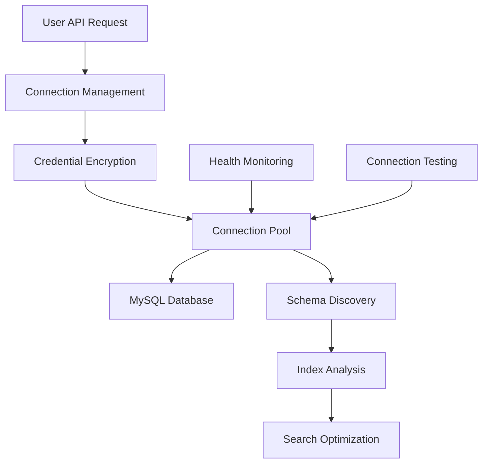

# Database Management

Comprehensive Database Connection Management

Altus 4 allows you to securely connect and manage multiple MySQL databases, providing schema discovery, connection health monitoring, and full-text search index optimization.

## Database Overview

### Connection Architecture



### Security Features

- **Credential Encryption** - All database credentials encrypted at rest
- **Connection Pooling** - Efficient connection management with configurable limits
- **Access Control** - Database connections scoped to user accounts
- **SSL Support** - Secure connections with SSL/TLS encryption
- **Network Security** - IP allowlisting and VPC support

## Database Endpoints

### Add Database Connection

Connect a new MySQL database to your Altus 4 account.

**Endpoint**: `POST /api/v1/databases`

**Headers**:

```http
Authorization: Bearer <YOUR_JWT_TOKEN>
Content-Type: application/json
```

**Request Body**:

```json
{
  "name": "Production Database",
  "host": "db.example.com",
  "port": 3306,
  "database": "app_production",
  "username": "altus4_user",
  "password": "secure_password_123",
  "ssl": false
}
```

**Request Parameters**:

| Parameter  | Type    | Required | Description                                  |
| ---------- | ------- | -------- | -------------------------------------------- |
| `name`     | string  | Yes      | Friendly name for the database (1-100 chars) |
| `host`     | string  | Yes      | Database server hostname or IP address       |
| `port`     | number  | No       | Port number (default: 3306)                  |
| `database` | string  | Yes      | Database name                                |
| `username` | string  | Yes      | MySQL username                               |
| `password` | string  | Yes      | MySQL password                               |
| `ssl`      | boolean | No       | Enable SSL/TLS (default: false)              |

**Response**:

```json
{
  "success": true,
  "data": {
    "id": "db_abc123def456",
    "name": "Production Database",
    "host": "db.example.com",
    "port": 3306,
    "database": "app_production",
    "username": "altus4_user",
    "ssl": false,
    "createdAt": "2024-01-15T10:30:00.000Z",
    "updatedAt": "2024-01-15T10:30:00.000Z"
  }
}
```

**cURL Example**:

```bash
curl -X POST http://localhost:3000/api/v1/databases \
  -H "Authorization: Bearer YOUR_JWT_TOKEN" \
  -H "Content-Type: application/json" \
  -d '{
    "name": "Production Database",
    "host": "db.example.com",
    "port": 3306,
    "database": "app_production",
    "username": "altus4_user",
    "password": "secure_password_123",
    "ssl": false
  }'
```

### List Database Connections

Retrieve all database connections associated with your account.

**Endpoint**: `GET /api/v1/databases`

**Query Parameters**:

No query parameters supported

**Headers**:

```http
Authorization: Bearer <YOUR_JWT_TOKEN>
```

**Response**:

```json
{
  "success": true,
  "data": {
    [
      {
        "id": "db_abc123def456",
        "name": "Production Database",
        "host": "db.example.com",
        "port": 3306,
        "database": "app_production",
        "username": "altus4_user",
        "ssl": false,
        "createdAt": "2024-01-15T09:30:00.000Z",
        "updatedAt": "2024-01-15T10:30:00.000Z"
      }
    ]
  }
}
```

### Get Database Details

Retrieve detailed information about a specific database connection.

**Endpoint**: `GET /api/v1/databases/:connectionId`

**Headers**:

```http
Authorization: Bearer <YOUR_JWT_TOKEN>
```

**Response**:

```json
{
  "success": true,
  "data": {
    "database": {
      "id": "db_abc123def456",
      "name": "Production Database",
      "host": "db.example.com",
      "port": 3306,
      "database": "app_production",
      "username": "altus4_user",
      "status": "connected",
      "ssl": {
        "enabled": true,
        "verified": true
      },
      "connectionOptions": {
        "connectionLimit": 10,
        "acquireTimeout": 60000,
        "timeout": 60000
      },
      "createdAt": "2024-01-15T09:30:00.000Z",
      "updatedAt": "2024-01-15T10:30:00.000Z",
      "lastTested": "2024-01-15T10:30:00.000Z",
      "connectionHealth": {
        "status": "healthy",
        "responseTime": 45,
        "activeConnections": 2,
        "maxConnections": 10,
        "uptime": 86400,
        "lastError": null
      },
      "searchCapabilities": {
        "fullTextSupported": true,
        "mysqlVersion": "8.0.32",
        "tablesWithIndexes": 3,
        "totalSearchableTables": 5,
        "indexOptimizations": [
          {
            "table": "articles",
            "recommendation": "Consider adding FULLTEXT index on content column"
          }
        ]
      },
      "usage": {
        "totalSearches": 1250,
        "totalResults": 45670,
        "averageResponseTime": 234,
        "lastSearchAt": "2024-01-15T10:25:00.000Z",
        "topQueries": [
          "optimization techniques",
          "performance tuning",
          "database indexing"
        ]
      }
    }
  }
}
```

### Update Database Connection

Update an existing database connection's settings.

**Endpoint**: `PUT /api/v1/databases/:connectionId`

**Headers**:

```http
Authorization: Bearer <YOUR_JWT_TOKEN>
Content-Type: application/json
```

**Request Body**:

```json
{
  "name": "Updated Production Database",
  "password": "new_secure_password_456",
  "connectionOptions": {
    "connectionLimit": 15,
    "timeout": 90000
  },
  "searchOptions": {
    "defaultSearchTables": ["articles", "posts", "documentation", "faqs"]
  }
}
```

**Response**:

```json
{
  "success": true,
  "data": {
    "database": {
      "id": "db_abc123def456",
      "name": "Updated Production Database",
      "updatedAt": "2024-01-15T11:00:00.000Z",
      "status": "connected"
    },
    "message": "Database connection updated successfully"
  }
}
```

### Remove Database Connection

Remove a database connection from your account.

**Endpoint**: `DELETE /api/v1/databases/:connectionId`

**Headers**:

```http
Authorization: Bearer <YOUR_JWT_TOKEN>
```

**Response**:

```json
{
  "success": true,
  "data": {
    "message": "Database connection removed successfully",
    "removedAt": "2024-01-15T11:00:00.000Z"
  }
}
```

**Note**: Removing a database connection will:

- Immediately close all active connections
- Clear cached search results for that database
- Remove the database from all saved searches
- Cannot be undone

## Database Testing & Health

### Test Database Connection

Test connectivity to a specific database.

**Endpoint**: `POST /api/v1/databases/:connectionId/test`

**Headers**:

```http
Authorization: Bearer <YOUR_JWT_TOKEN>
```

**Response**:

```json
{
  "success": true,
  "data": {
    "connected": true,
    "message": "Connection successful"
  }
}
```

**Error Response**:

```json
{
  "success": false,
  "error": {
    "code": "CONNECTION_FAILED",
    "message": "Unable to connect to database",
    "details": {
      "error": "Access denied for user 'altus4_user'@'%'",
      "errno": 1045,
      "sqlState": "28000"
    }
  }
}
```

### Get Connection Status

Get status of all database connections.

**Endpoint**: `GET /api/v1/databases/status`

**Headers**:

```http
Authorization: Bearer <YOUR_JWT_TOKEN>
```

**Response**:

```json
{
  "success": true,
  "data": {
    "db_abc123def456": true,
    "db_def456ghi789": false,
    "db_ghi789jkl012": true
  }
}
```

## Schema Discovery

### Get Database Schema

Discover the database schema including tables, columns, and indexes.

**Endpoint**: `GET /api/v1/databases/:connectionId/schema`

**Query Parameters**:

No query parameters supported

**Headers**:

```http
Authorization: Bearer <YOUR_JWT_TOKEN>
```

**Response**:

```json
{
  "success": true,
  "data": {
    "schema": {
      "database": "app_production",
      "version": "8.0.32",
      "characterSet": "utf8mb4",
      "collation": "utf8mb4_unicode_ci",
      "tables": [
        {
          "name": "articles",
          "engine": "InnoDB",
          "rowCount": 15420,
          "dataSize": "45.2MB",
          "indexSize": "12.8MB",
          "columns": [
            {
              "name": "id",
              "type": "int",
              "nullable": false,
              "key": "PRI",
              "default": null,
              "extra": "auto_increment"
            },
            {
              "name": "title",
              "type": "varchar(255)",
              "nullable": false,
              "key": "",
              "default": null,
              "extra": ""
            },
            {
              "name": "content",
              "type": "longtext",
              "nullable": true,
              "key": "",
              "default": null,
              "extra": ""
            },
            {
              "name": "created_at",
              "type": "timestamp",
              "nullable": false,
              "key": "",
              "default": "CURRENT_TIMESTAMP",
              "extra": ""
            }
          ],
          "indexes": [
            {
              "name": "PRIMARY",
              "type": "BTREE",
              "unique": true,
              "columns": ["id"]
            },
            {
              "name": "idx_title_content",
              "type": "FULLTEXT",
              "unique": false,
              "columns": ["title", "content"]
            },
            {
              "name": "idx_created_at",
              "type": "BTREE",
              "unique": false,
              "columns": ["created_at"]
            }
          ],
          "searchable": true,
          "fullTextColumns": ["title", "content"],
          "sampleData": [
            {
              "id": 1,
              "title": "Getting Started with MySQL",
              "content": "This is a comprehensive guide...",
              "created_at": "2024-01-15T10:30:00.000Z"
            }
          ]
        }
      ],
      "searchOptimizations": {
        "recommendedIndexes": [
          {
            "table": "posts",
            "columns": ["title", "body"],
            "type": "FULLTEXT",
            "reason": "Improve search performance on posts table",
            "estimatedImprovement": "65% faster searches"
          }
        ],
        "existingFullTextTables": ["articles"],
        "searchableColumns": 12,
        "totalTables": 8
      }
    },
    "meta": {
      "discoveredAt": "2024-01-15T10:30:00.000Z",
      "discoveryTime": 1250
    }
  }
}
```

**cURL Example**:

```bash
curl -X GET "http://localhost:3000/api/v1/databases/db_abc123def456/schema" \
  -H "Authorization: Bearer YOUR_JWT_TOKEN"
```

## Code Examples

### JavaScript/Node.js

```javascript
class Altus4DatabaseManager {
  constructor(apiKey) {
    this.apiKey = apiKey;
    this.baseUrl = 'https://api.altus4.dev';
    this.headers = {
      Authorization: `Bearer ${apiKey}`,
      'Content-Type': 'application/json',
    };
  }

  async addDatabase(config) {
    const response = await fetch(`${this.baseUrl}/api/v1/databases`, {
      method: 'POST',
      headers: this.headers,
      body: JSON.stringify(config),
    });

    if (!response.ok) {
      const error = await response.json();
      throw new Error(`Failed to add database: ${error.error.message}`);
    }

    return await response.json();
  }

  async listDatabases(options = {}) {
    const params = new URLSearchParams(options);
    const response = await fetch(`${this.baseUrl}/api/v1/databases?${params}`, {
      headers: this.headers,
    });

    return await response.json();
  }

  async testConnection(databaseId) {
    const response = await fetch(
      `${this.baseUrl}/api/v1/databases/${databaseId}/test`,
      {
        method: 'POST',
        headers: this.headers,
      }
    );

    const result = await response.json();
    return result.success;
  }

  async getSchema(databaseId, options = {}) {
    const params = new URLSearchParams(options);
    const response = await fetch(
      `${this.baseUrl}/api/v1/databases/${databaseId}/schema?${params}`,
      { headers: this.headers }
    );

    return await response.json();
  }

  async updateDatabase(databaseId, updates) {
    const response = await fetch(
      `${this.baseUrl}/api/v1/databases/${databaseId}`,
      {
        method: 'PUT',
        headers: this.headers,
        body: JSON.stringify(updates),
      }
    );

    return await response.json();
  }
}

// Usage
const dbManager = new Altus4DatabaseManager('altus4_sk_live_abc123...');

// Add a new database
const newDb = await dbManager.addDatabase({
  name: 'Production DB',
  host: 'db.example.com',
  database: 'myapp',
  username: 'user',
  password: 'password',
  ssl: { enabled: true },
});

// Test connection
const isConnected = await dbManager.testConnection(newDb.data.database.id);
console.log('Database connected:', isConnected);

// Get schema information
const schema = await dbManager.getSchema(newDb.data.database.id, {
  includeData: true,
  includeIndexes: true,
});

console.log('Found tables:', schema.data.schema.tables.length);
```

### Python

```python
import requests
import json

class Altus4DatabaseManager:
    def __init__(self, api_key):
        self.api_key = api_key
        self.base_url = 'https://api.altus4.dev'
        self.headers = {
            'Authorization': f'Bearer {api_key}',
            'Content-Type': 'application/json'
        }

    def add_database(self, config):
        """Add a new database connection"""
        response = requests.post(
            f'{self.base_url}/api/v1/databases',
            headers=self.headers,
            json=config
        )

        if not response.ok:
            error_data = response.json()
            raise Exception(f"Failed to add database: {error_data['error']['message']}")

        return response.json()

    def list_databases(self, **options):
        """List all database connections"""
        response = requests.get(
            f'{self.base_url}/api/v1/databases',
            headers=self.headers,
            params=options
        )
        return response.json()

    def test_connection(self, database_id):
        """Test database connection"""
        response = requests.post(
            f'{self.base_url}/api/v1/databases/{database_id}/test',
            headers=self.headers
        )

        result = response.json()
        return result.get('success', False)

    def get_schema(self, database_id, **options):
        """Get database schema information"""
        response = requests.get(
            f'{self.base_url}/api/v1/databases/{database_id}/schema',
            headers=self.headers,
            params=options
        )
        return response.json()

    def get_status(self, database_id):
        """Get database connection status"""
        response = requests.get(
            f'{self.base_url}/api/v1/databases/{database_id}/status',
            headers=self.headers
        )
        return response.json()

    def update_database(self, database_id, updates):
        """Update database connection"""
        response = requests.put(
            f'{self.base_url}/api/v1/databases/{database_id}',
            headers=self.headers,
            json=updates
        )
        return response.json()

    def remove_database(self, database_id):
        """Remove database connection"""
        response = requests.delete(
            f'{self.base_url}/api/v1/databases/{database_id}',
            headers=self.headers
        )
        return response.json()

# Usage example
db_manager = Altus4DatabaseManager('altus4_sk_live_abc123...')

# Add database with SSL
new_database = db_manager.add_database({
    'name': 'Production MySQL',
    'host': 'mysql.example.com',
    'port': 3306,
    'database': 'production_db',
    'username': 'altus4_user',
    'password': 'secure_password',
    'ssl': {
        'enabled': True,
        'rejectUnauthorized': True
    },
    'connectionOptions': {
        'connectionLimit': 10,
        'timeout': 60000
    }
})

database_id = new_database['data']['database']['id']
print(f"Database added with ID: {database_id}")

# Test the connection
if db_manager.test_connection(database_id):
    print("Connection test successful!")

    # Get schema information
    schema = db_manager.get_schema(
        database_id,
        includeData=True,
        includeIndexes=True
    )

    tables = schema['data']['schema']['tables']
    print(f"Found {len(tables)} tables:")

    for table in tables:
        print(f"- {table['name']} ({table['rowCount']} rows)")
        if table['searchable']:
            print(f"  Searchable columns: {', '.join(table['fullTextColumns'])}")

# Monitor connection health
status = db_manager.get_status(database_id)
health = status['data']['status']
print(f"Connection status: {health['overall']}")
print(f"Active connections: {health['connection']['activeConnections']}")
```

## Database Best Practices

### Security Recommendations

1. **Use Dedicated Users**: Create specific MySQL users for Altus 4 with minimal required permissions
2. **Enable SSL/TLS**: Always use encrypted connections in production
3. **Network Security**: Use VPC, private networks, or IP allowlisting
4. **Regular Rotation**: Rotate database passwords regularly
5. **Monitor Access**: Review connection logs and usage patterns

### Performance Optimization

1. **Connection Pooling**: Configure appropriate connection limits based on your database capacity
2. **Index Strategy**: Ensure FULLTEXT indexes exist on searchable columns
3. **Query Optimization**: Review slow query logs and optimize problematic queries
4. **Resource Monitoring**: Monitor database CPU, memory, and disk usage
5. **Schema Design**: Design tables with search performance in mind

### Recommended MySQL User Permissions

```sql
-- Create dedicated user for Altus 4
CREATE USER 'altus4_user'@'%' IDENTIFIED BY 'secure_password';

-- Grant minimal required permissions
GRANT SELECT ON your_database.* TO 'altus4_user'@'%';
GRANT SHOW VIEW ON your_database.* TO 'altus4_user'@'%';
GRANT SHOW DATABASES ON *.* TO 'altus4_user'@'%';

-- Optional: Grant CREATE permissions for automatic index creation
GRANT CREATE ON your_database.* TO 'altus4_user'@'%';
GRANT INDEX ON your_database.* TO 'altus4_user'@'%';

FLUSH PRIVILEGES;
```

---

**Next Steps**: [Analytics & Insights](./analytics.md) | [Error Handling](./errors.md)
