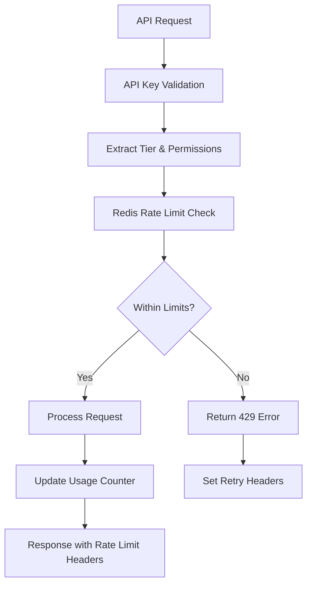

# Rate Limiting

Comprehensive Rate Limiting Guide

Altus 4 implements intelligent rate limiting to ensure fair usage and maintain service quality for all users. This guide covers rate limit tiers, monitoring, and optimization strategies.

## Rate Limiting Overview

### Rate Limiting Architecture



### Rate Limiting Strategy

- __Sliding Window__ - Uses Redis-based sliding window algorithm
- __Per-API Key__ - Individual rate limiting per API key
- __Tiered Limits__ - Different limits based on subscription tier
- __Graceful Degradation__ - Informative error responses with upgrade suggestions
- __Burst Handling__ - Short-term burst allowances within limits

## Rate Limit Tiers

### Tier Comparison

| Tier | Requests/Hour | Burst Limit | Block Duration | Concurrent Connections | AI Requests/Hour |
|------|---------------|-------------|----------------|----------------------|------------------|
| __Free__ | 1,000 | 50 | 5 minutes | 3 | 100 |
| __Pro__ | 10,000 | 200 | 5 minutes | 10 | 2,000 |
| __Enterprise__ | 100,000 | 500 | 1 minute | 50 | 20,000 |
| __Custom__ | Negotiable | Custom | 30 seconds | Unlimited | Custom |

### Authentication Endpoints

Special rate limits for authentication and security:

| Endpoint | Rate Limit | Duration | Notes |
|----------|------------|----------|--------|
| `POST /api/auth/register` | 5 per hour | Per IP | Prevents spam registration |
| `POST /api/auth/login` | 10 per hour | Per IP | Brute force protection |
| `POST /api/keys` | 20 per hour | Per API key | Prevents key abuse |
| `POST /api/keys/:id/regenerate` | 5 per hour | Per API key | Security measure |

## Rate Limit Headers

### Response Headers

All API responses include rate limiting information in headers:

```http
X-RateLimit-Limit: 1000
X-RateLimit-Remaining: 847
X-RateLimit-Reset: 2024-01-15T12:00:00Z
X-RateLimit-Tier: Pro
X-RateLimit-Window: 3600
```

### Header Descriptions

| Header | Description | Example |
|--------|-------------|---------|
| `X-RateLimit-Limit` | Maximum requests allowed in current window | `1000` |
| `X-RateLimit-Remaining` | Requests remaining in current window | `847` |
| `X-RateLimit-Reset` | When current window resets (ISO timestamp) | `2024-01-15T12:00:00Z` |
| `X-RateLimit-Tier` | Current subscription tier | `Pro` |
| `X-RateLimit-Window` | Window duration in seconds | `3600` |
| `X-RateLimit-Retry-After` | Seconds to wait before retrying (when blocked) | `45` |

## Rate Limit Exceeded Response

### Error Response Format

When rate limits are exceeded, you'll receive a `429 Too Many Requests` response:

```json
{
  "success": false,
  "error": {
    "code": "RATE_LIMIT_EXCEEDED",
    "message": "API rate limit exceeded. Try again in 45 seconds.",
    "details": {
      "limit": 1000,
      "remaining": 0,
      "resetTime": "2024-01-15T12:00:00.000Z",
      "retryAfter": 45,
      "tier": "Free",
      "windowStart": "2024-01-15T11:00:00.000Z",
      "upgradeMessage": "Upgrade to Pro or Enterprise for higher rate limits",
      "upgradeUrl": "https://altus4.dev/pricing"
    }
  },
  "meta": {
    "timestamp": "2024-01-15T11:30:45.000Z",
    "requestId": "req_abc123def456"
  }
}
```

### Response Headers on Rate Limit

```http
HTTP/1.1 429 Too Many Requests
X-RateLimit-Limit: 1000
X-RateLimit-Remaining: 0
X-RateLimit-Reset: 2024-01-15T12:00:00Z
X-RateLimit-Tier: Free
Retry-After: 45
```

## Rate Limit Monitoring

### Check Rate Limit Status

Get current rate limit status without consuming a request:

__Endpoint__: `GET /api/rate-limit/status`

__Headers__:

```http
Authorization: Bearer <YOUR_API_KEY>
```

__Response__:

```json
{
  "success": true,
  "data": {
    "rateLimit": {
      "tier": "Pro",
      "limits": {
        "requestsPerHour": 10000,
        "burstLimit": 200,
        "concurrentConnections": 10,
        "aiRequestsPerHour": 2000
      },
      "current": {
        "requests": 2345,
        "remaining": 7655,
        "percentUsed": 23.45,
        "windowStart": "2024-01-15T11:00:00.000Z",
        "windowEnd": "2024-01-15T12:00:00.000Z"
      },
      "usage": {
        "last24Hours": [
          {
            "hour": "2024-01-15T10:00:00.000Z",
            "requests": 156,
            "percentOfLimit": 1.56
          }
        ],
        "trends": {
          "averageHourlyUsage": 145,
          "peakHour": "2024-01-15T14:00:00.000Z",
          "peakUsage": 890
        }
      },
      "recommendations": [
        {
          "type": "usage_optimization",
          "message": "Consider caching frequently accessed data to reduce API calls",
          "impact": "medium"
        }
      ]
    }
  }
}
```

### Rate Limit Analytics

__Endpoint__: `GET /api/rate-limit/analytics`

__Query Parameters__:

- `period` - Analysis period: `hour`, `day`, `week` (default: `day`)
- `includeBreakdown` - Include endpoint-specific breakdown

__Response__:

```json
{
  "success": true,
  "data": {
    "analytics": {
      "period": "day",
      "summary": {
        "totalRequests": 5670,
        "limitHits": 3,
        "averageUsage": 0.567,
        "peakUsage": 0.89,
        "efficiency": 0.92
      },
      "timeline": [
        {
          "timestamp": "2024-01-15T10:00:00.000Z",
          "requests": 145,
          "remaining": 855,
          "percentUsed": 14.5
        }
      ],
      "endpointBreakdown": [
        {
          "endpoint": "/api/search",
          "requests": 4200,
          "percentOfTotal": 74.1,
          "averageResponseTime": 234
        }
      ],
      "limitViolations": [
        {
          "timestamp": "2024-01-15T14:30:00.000Z",
          "duration": 45,
          "reason": "Burst limit exceeded",
          "affectedRequests": 23
        }
      ]
    }
  }
}
```

## Rate Limit Management

### Best Practices

#### 1. Monitor Usage Proactively

```javascript
class RateLimitMonitor {
  constructor(apiKey) {
    this.apiKey = apiKey
    this.warningThreshold = 0.8 // 80% of limit
    this.client = new Altus4Client(apiKey)
  }

  async checkRateLimit() {
    try {
      const status = await this.client.makeRequest('/api/rate-limit/status')
      const { current, limits } = status.data.rateLimit

      const usagePercent = current.requests / limits.requestsPerHour

      if (usagePercent >= this.warningThreshold) {
        this.handleHighUsage(usagePercent, current, limits)
      }

      return {
        usage: usagePercent,
        remaining: current.remaining,
        resetTime: current.windowEnd
      }
    } catch (error) {
      console.error('Failed to check rate limit:', error)
      throw error
    }
  }

  handleHighUsage(usagePercent, current, limits) {
    console.warn(`Rate limit usage at ${(usagePercent * 100).toFixed(1)}%`)
    console.warn(`Remaining requests: ${current.remaining}`)

    // Implement throttling logic
    this.enableThrottling()
  }

  enableThrottling() {
    // Reduce request frequency
    // Implement request queuing
    // Cache more aggressively
  }
}

// Usage
const monitor = new RateLimitMonitor('altus4_sk_live_abc123...')
const status = await monitor.checkRateLimit()
console.log(`Current usage: ${(status.usage * 100).toFixed(1)}%`)
```

#### 2. Implement Request Queuing

```javascript
class RequestQueue {
  constructor(client, requestsPerMinute = 16) { // Safe rate for Free tier
    this.client = client
    this.queue = []
    this.processing = false
    this.interval = 60000 / requestsPerMinute // ms between requests
  }

  async enqueue(request) {
    return new Promise((resolve, reject) => {
      this.queue.push({
        request,
        resolve,
        reject
      })

      if (!this.processing) {
        this.processQueue()
      }
    })
  }

  async processQueue() {
    this.processing = true

    while (this.queue.length > 0) {
      const { request, resolve, reject } = this.queue.shift()

      try {
        const result = await this.client.makeRequest(request.endpoint, request.options)
        resolve(result)
      } catch (error) {
        if (error.isRateLimitError()) {
          // Re-queue the request
          this.queue.unshift({ request, resolve, reject })
          const retryAfter = error.getRetryAfter() || 60
          await this.sleep(retryAfter * 1000)
          continue
        }
        reject(error)
      }

      // Wait between requests
      if (this.queue.length > 0) {
        await this.sleep(this.interval)
      }
    }

    this.processing = false
  }

  sleep(ms) {
    return new Promise(resolve => setTimeout(resolve, ms))
  }
}

// Usage
const client = new Altus4Client('altus4_sk_live_abc123...')
const queue = new RequestQueue(client, 15) // 15 requests per minute

// Queue multiple requests
const promises = [
  queue.enqueue({ endpoint: '/api/search', options: { method: 'POST', body: {...} } }),
  queue.enqueue({ endpoint: '/api/databases', options: { method: 'GET' } }),
  queue.enqueue({ endpoint: '/api/analytics/dashboard', options: { method: 'GET' } })
]

const results = await Promise.all(promises)
```

#### 3. Intelligent Caching

```javascript
class CachedClient {
  constructor(apiKey, cacheOptions = {}) {
    this.client = new Altus4Client(apiKey)
    this.cache = new Map()
    this.defaultTTL = cacheOptions.defaultTTL || 300000 // 5 minutes
    this.maxCacheSize = cacheOptions.maxSize || 100
  }

  async cachedRequest(endpoint, options = {}, ttl = this.defaultTTL) {
    const cacheKey = this.generateCacheKey(endpoint, options)

    // Check cache first
    const cached = this.cache.get(cacheKey)
    if (cached && Date.now() < cached.expiry) {
      console.log('Cache hit for:', cacheKey)
      return cached.data
    }

    // Make request
    try {
      const result = await this.client.makeRequest(endpoint, options)

      // Cache the result
      this.cache.set(cacheKey, {
        data: result,
        expiry: Date.now() + ttl
      })

      // Cleanup cache if too large
      if (this.cache.size > this.maxCacheSize) {
        this.cleanupCache()
      }

      return result
    } catch (error) {
      // Serve stale cache on rate limit if available
      if (error.isRateLimitError() && cached) {
        console.log('Serving stale cache due to rate limit')
        return cached.data
      }
      throw error
    }
  }

  generateCacheKey(endpoint, options) {
    return `${endpoint}:${JSON.stringify(options)}`
  }

  cleanupCache() {
    const entries = Array.from(this.cache.entries())
    entries.sort((a, b) => a[1].expiry - b[1].expiry)

    // Remove oldest 10% of entries
    const removeCount = Math.floor(entries.length * 0.1)
    for (let i = 0; i < removeCount; i++) {
      this.cache.delete(entries[i][0])
    }
  }

  clearCache() {
    this.cache.clear()
  }
}

// Usage
const cachedClient = new CachedClient('altus4_sk_live_abc123...', {
  defaultTTL: 600000, // 10 minutes
  maxSize: 50
})

// Cached requests automatically
const dashboard = await cachedClient.cachedRequest('/api/analytics/dashboard')
const databases = await cachedClient.cachedRequest('/api/databases', {}, 1800000) // 30 min cache
```

### Python Rate Limit Handling

```python
import time
import asyncio
from typing import Dict, Optional, Callable
from dataclasses import dataclass
from collections import deque
import requests

@dataclass
class RateLimitInfo:
    limit: int
    remaining: int
    reset_time: str
    tier: str
    retry_after: Optional[int] = None

class RateLimitManager:
    def __init__(self, api_key: str, requests_per_minute: int = 16):
        self.api_key = api_key
        self.base_url = 'https://api.altus4.dev'
        self.requests_per_minute = requests_per_minute
        self.request_interval = 60.0 / requests_per_minute
        self.last_request_time = 0
        self.request_queue = deque()
        self.processing = False

    async def make_rate_limited_request(self, endpoint: str, method: str = 'GET', **kwargs) -> Dict:
        """Make a rate-limited API request"""

        # Check if we need to wait
        now = time.time()
        time_since_last = now - self.last_request_time

        if time_since_last < self.request_interval:
            wait_time = self.request_interval - time_since_last
            await asyncio.sleep(wait_time)

        headers = {
            'Authorization': f'Bearer {self.api_key}',
            'Content-Type': 'application/json'
        }

        try:
            response = requests.request(
                method,
                f'{self.base_url}{endpoint}',
                headers=headers,
                **kwargs
            )

            self.last_request_time = time.time()

            # Parse rate limit headers
            rate_limit = self._parse_rate_limit_headers(response.headers)

            if response.status_code == 429:
                # Handle rate limiting
                retry_after = rate_limit.retry_after or 60
                print(f"Rate limited. Waiting {retry_after} seconds...")
                await asyncio.sleep(retry_after)

                # Retry the request
                return await self.make_rate_limited_request(endpoint, method, **kwargs)

            response.raise_for_status()
            return response.json()

        except requests.RequestException as e:
            print(f"Request failed: {e}")
            raise

    def _parse_rate_limit_headers(self, headers) -> RateLimitInfo:
        """Parse rate limit information from response headers"""
        return RateLimitInfo(
            limit=int(headers.get('X-RateLimit-Limit', 0)),
            remaining=int(headers.get('X-RateLimit-Remaining', 0)),
            reset_time=headers.get('X-RateLimit-Reset', ''),
            tier=headers.get('X-RateLimit-Tier', ''),
            retry_after=int(headers.get('Retry-After', 0)) if 'Retry-After' in headers else None
        )

    async def get_rate_limit_status(self) -> RateLimitInfo:
        """Get current rate limit status"""
        data = await self.make_rate_limited_request('/api/rate-limit/status')
        rate_limit = data['data']['rateLimit']

        return RateLimitInfo(
            limit=rate_limit['limits']['requestsPerHour'],
            remaining=rate_limit['current']['remaining'],
            reset_time=rate_limit['current']['windowEnd'],
            tier=rate_limit['tier']
        )

# Usage example
async def main():
    manager = RateLimitManager('altus4_sk_live_abc123...', requests_per_minute=15)

    # Check current rate limit status
    status = await manager.get_rate_limit_status()
    print(f"Rate limit: {status.remaining}/{status.limit} remaining")

    # Make rate-limited requests
    results = []
    for i in range(10):
        try:
            result = await manager.make_rate_limited_request(
                '/api/search',
                'POST',
                json={'query': f'search query {i}', 'databases': ['db_abc123']}
            )
            results.append(result)
            print(f"Request {i+1} completed")
        except Exception as e:
            print(f"Request {i+1} failed: {e}")

if __name__ == "__main__":
    asyncio.run(main())
```

## Rate Limit Optimization Strategies

### 1. Request Batching

Group multiple operations into single API calls where possible:

```javascript
// Instead of multiple single searches
const results1 = await client.search('query1', ['db1'])
const results2 = await client.search('query2', ['db2'])

// Use batch search (if available)
const batchResults = await client.batchSearch([
  { query: 'query1', databases: ['db1'] },
  { query: 'query2', databases: ['db2'] }
])
```

### 2. Smart Caching Strategy

Implement tiered caching with different TTLs:

```javascript
const cacheConfig = {
  'analytics/dashboard': 300000,    // 5 minutes
  'databases': 1800000,             // 30 minutes
  'search': 60000,                  // 1 minute
  'popular-queries': 600000         // 10 minutes
}
```

### 3. Request Prioritization

Implement priority queues for different request types:

```javascript
class PriorityQueue {
  constructor() {
    this.high = []
    this.medium = []
    this.low = []
  }

  enqueue(request, priority = 'medium') {
    this[priority].push(request)
  }

  dequeue() {
    return this.high.shift() ||
           this.medium.shift() ||
           this.low.shift()
  }
}
```

### 4. Background Processing

Move non-urgent operations to background:

```javascript
// Urgent: User-initiated search
await client.search(userQuery, databases)

// Background: Analytics update
setTimeout(() => {
  client.updateAnalytics().catch(console.error)
}, 5000)
```

## Upgrading Rate Limits

### When to Upgrade

Consider upgrading when:

- Consistently hitting rate limits (>80% usage)
- Business-critical operations being delayed
- User experience impacted by throttling
- Growth projections exceed current tier

### Tier Migration

```javascript
const shouldUpgrade = await evaluateUpgradeNeed()
if (shouldUpgrade.recommended) {
  console.log(`Upgrade recommended: ${shouldUpgrade.reason}`)
  console.log(`Suggested tier: ${shouldUpgrade.suggestedTier}`)
  console.log(`Expected savings: ${shouldUpgrade.expectedSavings}ms/request`)
}
```

---

__This completes the comprehensive API documentation for Altus 4. All endpoints, authentication, error handling, and rate limiting are now thoroughly documented with practical examples and best practices.__
