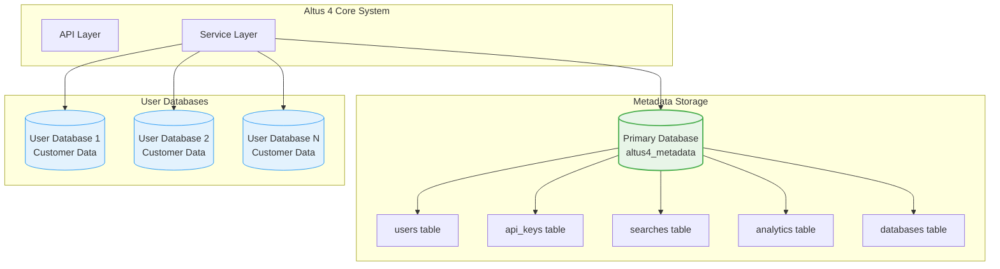
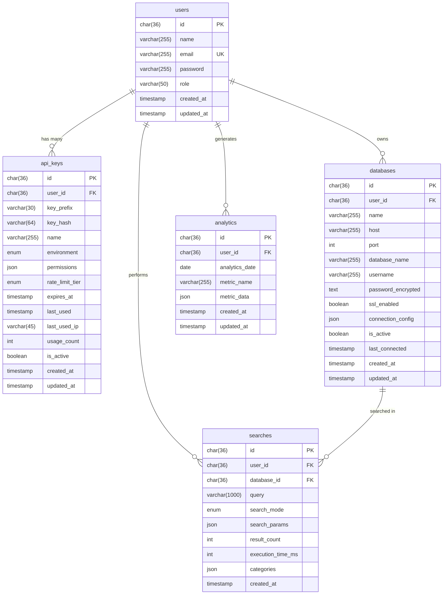

# Database Design & Architecture

Comprehensive Database Architecture Documentation

Altus 4 uses a sophisticated database architecture that supports both metadata storage and multi-tenant user database connections. This document covers the complete database design, schema architecture, migration system, and optimization strategies.

## Database Architecture Overview

### Dual Database Architecture

Altus 4 operates with a dual database architecture:



### Database Responsibilities

#### 1. __Primary Database (Metadata Storage)__

- __Purpose__: Store Altus 4 system metadata and configuration
- __Database__: `altus4_metadata`
- __Contents__: Users, API keys, search history, analytics, database connections
- __Management__: Fully managed by Altus 4 with migrations

#### 2. __User Databases (Search Targets)__

- __Purpose__: Customer databases that Altus 4 searches
- __Management__: Read-only access, customer-managed
- __Requirements__: MySQL 8.0+ with FULLTEXT indexes
- __Connection__: Secure connection pooling per database

## Primary Database Schema

### Core Tables Overview



### Table Specifications

#### 1. `users` Table

__Purpose__: Store user account information and authentication data

```sql
CREATE TABLE users (
  id CHAR(36) PRIMARY KEY,
  name VARCHAR(255) NOT NULL,
  email VARCHAR(255) NOT NULL UNIQUE,
  password VARCHAR(255) NOT NULL,  -- bcrypt hashed
  role VARCHAR(50) DEFAULT 'user', -- 'user' or 'admin'
  created_at TIMESTAMP DEFAULT CURRENT_TIMESTAMP,
  updated_at TIMESTAMP DEFAULT CURRENT_TIMESTAMP ON UPDATE CURRENT_TIMESTAMP,

  -- Indexes
  INDEX idx_email (email),
  INDEX idx_role (role),
  INDEX idx_created_at (created_at)
);
```

__Key Features:__

- __UUID Primary Key__: Globally unique identifiers
- __Email Uniqueness__: Enforced at database level
- __Password Security__: bcrypt hashed with salt rounds
- __Role-Based Access__: Simple role system (user/admin)
- __Audit Trail__: Created/updated timestamps

#### 2. `api_keys` Table

__Purpose__: Store API key metadata and usage tracking

```sql
CREATE TABLE api_keys (
  id CHAR(36) PRIMARY KEY,
  user_id CHAR(36) NOT NULL,
  key_prefix VARCHAR(30) NOT NULL,     -- 'altus4_sk_live_abc123'
  key_hash VARCHAR(64) NOT NULL,       -- SHA-256 hash of full key
  name VARCHAR(255) NOT NULL,          -- 'Production Server'
  environment ENUM('test', 'live') NOT NULL DEFAULT 'test',
  permissions JSON DEFAULT ('["search"]'), -- ["search", "analytics", "admin"]
  rate_limit_tier ENUM('free', 'pro', 'enterprise') DEFAULT 'free',
  rate_limit_custom JSON NULL,         -- Custom rate limits if needed
  expires_at TIMESTAMP NULL,           -- NULL = never expires
  last_used TIMESTAMP NULL,
  last_used_ip VARCHAR(45) NULL,       -- IPv4/IPv6 support
  usage_count INT DEFAULT 0,
  is_active BOOLEAN DEFAULT true,
  created_at TIMESTAMP DEFAULT CURRENT_TIMESTAMP,
  updated_at TIMESTAMP DEFAULT CURRENT_TIMESTAMP ON UPDATE CURRENT_TIMESTAMP,

  -- Indexes for performance
  INDEX idx_key_prefix (key_prefix),
  INDEX idx_key_hash (key_hash),
  INDEX idx_user_id (user_id),
  INDEX idx_environment (environment),
  INDEX idx_active_keys (is_active, expires_at),
  INDEX idx_last_used (last_used),

  -- Foreign key constraint
  FOREIGN KEY (user_id) REFERENCES users(id) ON DELETE CASCADE
);
```

__Key Features:__

- __Secure Storage__: Only hash stored, never full key
- __Prefix Indexing__: Fast lookup by key prefix
- __Tiered Permissions__: Granular permission system
- __Usage Tracking__: Monitor API key usage patterns
- __Environment Separation__: Test vs live key isolation
- __Expiration Support__: Optional key expiration

#### 3. `databases` Table

__Purpose__: Store user database connection configurations

```sql
CREATE TABLE databases (
  id CHAR(36) PRIMARY KEY,
  user_id CHAR(36) NOT NULL,
  name VARCHAR(255) NOT NULL,          -- User-friendly name
  host VARCHAR(255) NOT NULL,
  port INT NOT NULL DEFAULT 3306,
  database_name VARCHAR(255) NOT NULL,
  username VARCHAR(255) NOT NULL,
  password_encrypted TEXT NOT NULL,    -- AES-256 encrypted
  ssl_enabled BOOLEAN DEFAULT false,
  connection_config JSON NULL,         -- Additional connection options
  is_active BOOLEAN DEFAULT true,
  last_connected TIMESTAMP NULL,
  created_at TIMESTAMP DEFAULT CURRENT_TIMESTAMP,
  updated_at TIMESTAMP DEFAULT CURRENT_TIMESTAMP ON UPDATE CURRENT_TIMESTAMP,

  -- Indexes
  INDEX idx_user_id (user_id),
  INDEX idx_active (is_active),
  INDEX idx_last_connected (last_connected),
  UNIQUE KEY unique_user_database (user_id, host, port, database_name),

  -- Foreign key constraint
  FOREIGN KEY (user_id) REFERENCES users(id) ON DELETE CASCADE
);
```

__Key Features:__

- __Encrypted Credentials__: AES-256 encryption for passwords
- __Connection Pooling__: Support for connection pool configuration
- __SSL Support__: Secure database connections
- __Health Monitoring__: Track connection status and last usage
- __Uniqueness__: Prevent duplicate database connections per user

#### 4. `searches` Table

__Purpose__: Log search operations for analytics and debugging

```sql
CREATE TABLE searches (
  id CHAR(36) PRIMARY KEY,
  user_id CHAR(36) NOT NULL,
  database_id CHAR(36) NULL,           -- NULL for multi-database searches
  query VARCHAR(1000) NOT NULL,
  search_mode ENUM('natural', 'boolean', 'semantic') DEFAULT 'natural',
  search_params JSON NULL,             -- Additional search parameters
  result_count INT NOT NULL DEFAULT 0,
  execution_time_ms INT NOT NULL DEFAULT 0,
  categories JSON NULL,                -- AI-generated categories
  created_at TIMESTAMP DEFAULT CURRENT_TIMESTAMP,

  -- Indexes for analytics queries
  INDEX idx_user_id (user_id),
  INDEX idx_database_id (database_id),
  INDEX idx_search_mode (search_mode),
  INDEX idx_created_at (created_at),
  INDEX idx_execution_time (execution_time_ms),
  FULLTEXT INDEX ft_query (query),

  -- Foreign key constraints
  FOREIGN KEY (user_id) REFERENCES users(id) ON DELETE CASCADE,
  FOREIGN KEY (database_id) REFERENCES databases(id) ON DELETE SET NULL
);
```

__Key Features:__

- __Search Analytics__: Track all search operations
- __Performance Monitoring__: Execution time tracking
- __Query Analysis__: Full-text search on queries themselves
- __Categorization__: Store AI-generated result categories
- __Multi-Database Support__: Handle searches across multiple databases

#### 5. `analytics` Table

__Purpose__: Store aggregated analytics and metrics data

```sql
CREATE TABLE analytics (
  id CHAR(36) PRIMARY KEY,
  user_id CHAR(36) NOT NULL,
  analytics_date DATE NOT NULL,
  metric_name VARCHAR(255) NOT NULL,   -- 'daily_searches', 'popular_queries'
  metric_data JSON NOT NULL,           -- Flexible metric storage
  created_at TIMESTAMP DEFAULT CURRENT_TIMESTAMP,
  updated_at TIMESTAMP DEFAULT CURRENT_TIMESTAMP ON UPDATE CURRENT_TIMESTAMP,

  -- Indexes for analytics queries
  INDEX idx_user_id (user_id),
  INDEX idx_date (analytics_date),
  INDEX idx_metric_name (metric_name),
  UNIQUE KEY unique_user_date_metric (user_id, analytics_date, metric_name),

  -- Foreign key constraint
  FOREIGN KEY (user_id) REFERENCES users(id) ON DELETE CASCADE
);
```

__Key Features:__

- __Flexible Metrics__: JSON storage for various metric types
- __Time-Series Data__: Date-based analytics storage
- __Aggregation Support__: Pre-computed analytics for performance
- __Uniqueness__: Prevent duplicate metrics per user/date

## Migration System

### Migration Architecture

Altus 4 uses a SQL-based migration system with up/down scripts:

```
migrations/
├── 001_create_users_table.up.sql
├── 001_create_users_table.down.sql
├── 002_create_searches_table.up.sql
├── 002_create_searches_table.down.sql
├── 003_create_analytics_table.up.sql
├── 003_create_analytics_table.down.sql
├── 004_create_api_keys_table.up.sql
├── 004_create_api_keys_table.down.sql
├── 005_update_users_table_for_api_keys.up.sql
├── 005_update_users_table_for_api_keys.down.sql
└── README.txt
```

### Migration Management

#### Running Migrations

```bash
# Apply all pending migrations
npm run migrate

# Apply migrations explicitly
npm run migrate:up

# Rollback all migrations
npm run migrate:down

# Check migration status
npm run migrate:status
```

#### Migration Script

The migration system uses a bash script that:

1. __Loads Environment Variables__: From `.env` file
2. __Validates Database Connection__: Ensures database is accessible
3. __Tracks Migration State__: Uses a `migrations` table
4. __Applies Changes Sequentially__: In numerical order
5. __Handles Errors Gracefully__: Stops on first error

```bash
#!/bin/bash
# bin/migrate.sh

# Load environment variables
if [ -f .env ]; then
    export $(cat .env | grep -v '^#' | xargs)
fi

# Validate required variables
if [ -z "$DB_HOST" ] || [ -z "$DB_USERNAME" ] || [ -z "$DB_PASSWORD" ] || [ -z "$DB_DATABASE" ]; then
    echo "Error: Missing required database environment variables"
    exit 1
fi

# Create migrations tracking table
mysql -h "$DB_HOST" -u "$DB_USERNAME" -p"$DB_PASSWORD" "$DB_DATABASE" << EOF
CREATE TABLE IF NOT EXISTS migrations (
    id INT AUTO_INCREMENT PRIMARY KEY,
    filename VARCHAR(255) NOT NULL UNIQUE,
    applied_at TIMESTAMP DEFAULT CURRENT_TIMESTAMP
);
EOF

# Apply migrations based on command
case "$1" in
    "up")
        apply_migrations_up
        ;;
    "down")
        apply_migrations_down
        ;;
    "status")
        show_migration_status
        ;;
    *)
        echo "Usage: $0 {up|down|status}"
        exit 1
        ;;
esac
```

### Migration Best Practices

#### 1. __Atomic Migrations__

Each migration should be atomic and reversible:

```sql
-- 006_add_user_preferences.up.sql
START TRANSACTION;

ALTER TABLE users
ADD COLUMN preferences JSON NULL,
ADD COLUMN timezone VARCHAR(50) DEFAULT 'UTC';

CREATE INDEX idx_users_timezone ON users(timezone);

COMMIT;
```

```sql
-- 006_add_user_preferences.down.sql
START TRANSACTION;

DROP INDEX idx_users_timezone ON users;

ALTER TABLE users
DROP COLUMN preferences,
DROP COLUMN timezone;

COMMIT;
```

#### 2. __Data Migrations__

Handle data transformations carefully:

```sql
-- 007_migrate_search_data.up.sql
START TRANSACTION;

-- Add new column
ALTER TABLE searches ADD COLUMN search_metadata JSON NULL;

-- Migrate existing data
UPDATE searches
SET search_metadata = JSON_OBJECT(
    'legacy_params', search_params,
    'migrated_at', NOW()
)
WHERE search_params IS NOT NULL;

-- Remove old column after data migration
ALTER TABLE searches DROP COLUMN search_params;

COMMIT;
```

#### 3. __Index Management__

Create indexes concurrently when possible:

```sql
-- 008_add_performance_indexes.up.sql
-- Add indexes for better query performance
CREATE INDEX CONCURRENTLY idx_searches_user_created
ON searches(user_id, created_at);

CREATE INDEX CONCURRENTLY idx_api_keys_usage
ON api_keys(usage_count, last_used);
```

## User Database Requirements

### FULLTEXT Index Requirements

User databases must have FULLTEXT indexes for search functionality:

```sql
-- Example user database schema
CREATE TABLE articles (
    id INT PRIMARY KEY AUTO_INCREMENT,
    title VARCHAR(255) NOT NULL,
    content TEXT NOT NULL,
    author VARCHAR(100),
    published_at TIMESTAMP DEFAULT CURRENT_TIMESTAMP,

    -- Required: FULLTEXT index for search
    FULLTEXT KEY ft_title_content (title, content),
    FULLTEXT KEY ft_title (title),
    FULLTEXT KEY ft_content (content)
);

CREATE TABLE products (
    id INT PRIMARY KEY AUTO_INCREMENT,
    name VARCHAR(255) NOT NULL,
    description TEXT,
    category VARCHAR(100),
    price DECIMAL(10,2),

    -- Required: FULLTEXT index for search
    FULLTEXT KEY ft_name_description (name, description),
    FULLTEXT KEY ft_name (name)
);
```

### Schema Discovery

Altus 4 automatically discovers user database schemas:

```typescript
interface DiscoveredSchema {
  database: string
  tables: TableInfo[]
}

interface TableInfo {
  name: string
  columns: ColumnInfo[]
  fulltextIndexes: FullTextIndex[]
  estimatedRows: number
  lastAnalyzed: Date
}

interface FullTextIndex {
  name: string
  columns: string[]
  type: 'FULLTEXT'
  cardinality?: number
}
```

### Connection Requirements

#### 1. __User Permissions__

User database connections require specific permissions:

```sql
-- Create read-only user for Altus 4
CREATE USER 'altus4_search'@'%' IDENTIFIED BY 'secure_password';

-- Grant necessary permissions
GRANT SELECT ON your_database.* TO 'altus4_search'@'%';
GRANT SHOW VIEW ON your_database.* TO 'altus4_search'@'%';

-- For schema discovery
GRANT SELECT ON information_schema.* TO 'altus4_search'@'%';

FLUSH PRIVILEGES;
```

#### 2. __Connection Security__

- __SSL Encryption__: Recommended for production
- __IP Whitelisting__: Restrict access to Altus 4 servers
- __Connection Limits__: Configure appropriate connection limits
- __Timeout Settings__: Set reasonable timeout values

## Database Optimization

### 1. __Query Optimization__

#### FULLTEXT Search Optimization

```sql
-- Optimize FULLTEXT search performance
SET GLOBAL ft_min_word_len = 2;
SET GLOBAL innodb_ft_min_token_size = 2;

-- For boolean mode searches
SET GLOBAL ft_boolean_syntax = '+ -><()~*:""&|';

-- Restart MySQL to apply changes
```

#### Index Strategies

```sql
-- Composite indexes for common query patterns
CREATE INDEX idx_searches_user_date ON searches(user_id, created_at);
CREATE INDEX idx_api_keys_active_tier ON api_keys(is_active, rate_limit_tier);

-- Covering indexes for frequently accessed columns
CREATE INDEX idx_databases_user_active_name ON databases(user_id, is_active, name);
```

### 2. __Connection Pool Optimization__

```typescript
// Optimized connection pool configuration
const poolConfig = {
  connectionLimit: 10,        // Max connections per pool
  acquireTimeout: 60000,      // 60 seconds to get connection
  timeout: 60000,             // 60 seconds query timeout
  reconnect: true,            // Auto-reconnect on connection loss
  idleTimeout: 300000,        // 5 minutes idle timeout

  // SSL configuration
  ssl: {
    rejectUnauthorized: false,
    ca: fs.readFileSync('ca-cert.pem'),
    key: fs.readFileSync('client-key.pem'),
    cert: fs.readFileSync('client-cert.pem')
  }
}
```

### 3. __Performance Monitoring__

#### Query Performance Tracking

```sql
-- Enable slow query log
SET GLOBAL slow_query_log = 'ON';
SET GLOBAL long_query_time = 1; -- Log queries > 1 second

-- Monitor FULLTEXT search performance
SELECT
    table_schema,
    table_name,
    index_name,
    cardinality,
    pages
FROM information_schema.statistics
WHERE index_type = 'FULLTEXT';
```

#### Connection Monitoring

```typescript
// Monitor connection pool health
export class DatabaseService {
  async getPoolStats(databaseId: string): Promise<PoolStats> {
    const pool = this.pools.get(databaseId)
    if (!pool) throw new Error('Pool not found')

    return {
      totalConnections: pool.config.connectionLimit,
      activeConnections: pool._allConnections.length,
      idleConnections: pool._freeConnections.length,
      queuedRequests: pool._connectionQueue.length
    }
  }
}
```

## Backup and Recovery

### 1. __Backup Strategy__

#### Automated Backups

```bash
#!/bin/bash
# backup-database.sh

DB_NAME="altus4_metadata"
BACKUP_DIR="/backups/mysql"
DATE=$(date +%Y%m%d_%H%M%S)

# Create backup with compression
mysqldump \
  --host="$DB_HOST" \
  --user="$DB_USERNAME" \
  --password="$DB_PASSWORD" \
  --single-transaction \
  --routines \
  --triggers \
  --events \
  "$DB_NAME" | gzip > "$BACKUP_DIR/${DB_NAME}_${DATE}.sql.gz"

# Retain only last 30 days of backups
find "$BACKUP_DIR" -name "${DB_NAME}_*.sql.gz" -mtime +30 -delete
```

#### Point-in-Time Recovery

```ini
# Enable binary logging for point-in-time recovery
[mysqld]
log-bin=mysql-bin
binlog-format=ROW
expire_logs_days=7
```

### 2. __Disaster Recovery__

#### Recovery Procedures

```bash
# Restore from backup
gunzip < /backups/mysql/altus4_metadata_20240115_120000.sql.gz | \
mysql -h "$DB_HOST" -u "$DB_USERNAME" -p"$DB_PASSWORD" "$DB_NAME"

# Apply binary logs for point-in-time recovery
mysqlbinlog --start-datetime="2024-01-15 12:00:00" \
           --stop-datetime="2024-01-15 14:30:00" \
           mysql-bin.000001 | \
mysql -h "$DB_HOST" -u "$DB_USERNAME" -p"$DB_PASSWORD"
```

## Security Considerations

### 1. __Data Encryption__

#### At Rest Encryption

```sql
-- Enable encryption at rest
CREATE TABLE sensitive_data (
    id INT PRIMARY KEY,
    encrypted_data VARBINARY(255)
) ENCRYPTION='Y';
```

#### In Transit Encryption

```typescript
// SSL connection configuration
const sslConfig = {
  ssl: {
    ca: fs.readFileSync('ca-cert.pem'),
    key: fs.readFileSync('client-key.pem'),
    cert: fs.readFileSync('client-cert.pem'),
    rejectUnauthorized: true
  }
}
```

### 2. __Access Control__

#### Database User Privileges

```sql
-- Principle of least privilege
CREATE USER 'altus4_app'@'%' IDENTIFIED BY 'secure_password';

-- Grant only necessary permissions
GRANT SELECT, INSERT, UPDATE ON altus4_metadata.users TO 'altus4_app'@'%';
GRANT SELECT, INSERT, UPDATE, DELETE ON altus4_metadata.api_keys TO 'altus4_app'@'%';
GRANT SELECT, INSERT ON altus4_metadata.searches TO 'altus4_app'@'%';
GRANT SELECT, INSERT, UPDATE ON altus4_metadata.analytics TO 'altus4_app'@'%';

-- Read-only access to user databases
GRANT SELECT ON user_database.* TO 'altus4_search'@'%';
```

### 3. __Audit Logging__

```sql
-- Enable audit logging
INSTALL PLUGIN audit_log SONAME 'audit_log.so';
SET GLOBAL audit_log_policy = 'ALL';
SET GLOBAL audit_log_format = 'JSON';
```

## Related Documentation

- __[Service Layer Architecture](./services.md)__ - How services interact with databases
- __[Security Model](./security.md)__ - Comprehensive security architecture
- __[API Reference](../api/database.md)__ - Database management API endpoints
- __[Deployment Guide](../deployment/)__ - Production database setup

---

__The database architecture provides a solid foundation for Altus 4's multi-tenant search capabilities while maintaining security, performance, and scalability.__
