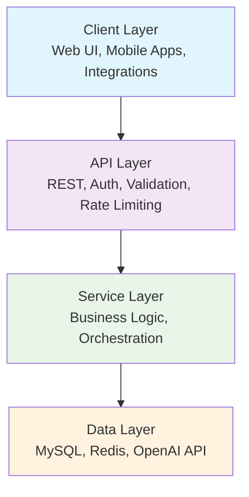
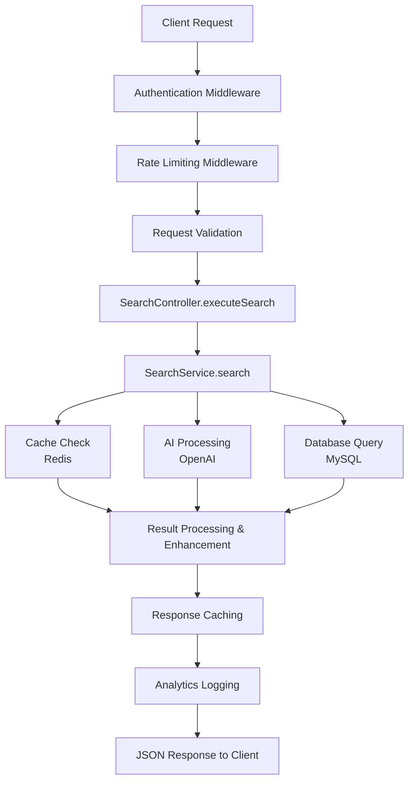
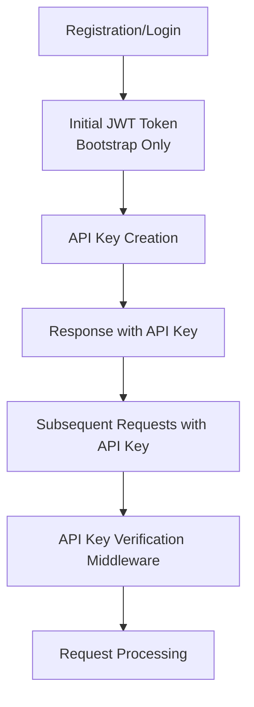
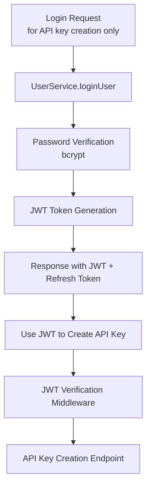
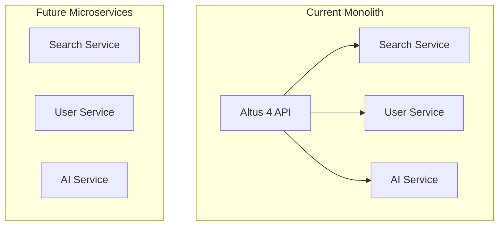

# System Architecture

AI-Enhanced MySQL Search Engine Architecture

::: info Sync Test
**Sync Test**: This documentation was updated on December 2024 to test automatic synchronization from `altus4/website` to `altus4/docs`.
:::

Altus 4 is built on a modern, scalable architecture that combines traditional database search with AI capabilities. This document covers the system design, patterns, and implementation details.

::: tip Quick Navigation

- [System Overview](#system-overview) - High-level architecture
- [Core Components](#core-components) - Detailed layer breakdown
- [Design Patterns](#design-patterns) - Implementation patterns
- [Data Flow](#data-flow) - Request processing flow
- [Security](#security-architecture) - Security implementation
- [Performance](#performance-architecture) - Performance optimization

:::

## System Overview

Altus 4 follows a **layered architecture** pattern optimized for scalability, maintainability, and testability:



### Architecture Principles

- **Layered Design**: Clear separation of concerns
- **🔌 Dependency Injection**: Loose coupling between components
- **Async Processing**: Non-blocking operations throughout
- **Event-Driven**: Analytics and monitoring via events
- **Security-First**: Authentication and authorization at every layer

## Core Components

### Client Layer

User-facing interfaces and integrations

| Component                    | Description              | Technology            |
| ---------------------------- | ------------------------ | --------------------- |
| **Web UI**                   | Primary user interface   | Vue.js, Tailwind CSS  |
| **Mobile Apps**              | iOS/Android applications | React Native (future) |
| **Third-party Integrations** | API consumers            | REST API clients      |

### 🔌 API Layer

Request handling and middleware pipeline

::: details API Layer Components

- **🌍 Express.js Server**: RESTful API endpoints with middleware pipeline
- **Authentication**: API key-based authentication with tiered rate limiting
- **Validation**: Zod schema validation for all endpoints
- **Rate Limiting**: Redis-backed rate limiting per API key tier
- **Error Handling**: Centralized error handling with structured responses
- **Request Logging**: Comprehensive logging with correlation IDs

:::

### Service Layer

Business logic and orchestration

| Service             | Purpose                  | Key Features                           |
| ------------------- | ------------------------ | -------------------------------------- |
| **SearchService**   | Search orchestration     | Multi-database, AI integration         |
| **DatabaseService** | MySQL operations         | Connection pooling, query optimization |
| **AIService**       | AI integration           | OpenAI API, semantic search            |
| **CacheService**    | Performance optimization | Redis caching, analytics               |
| **UserService**     | User management          | Authentication, profiles               |

### Data Layer

Storage and external services

::: code-group

```text [MySQL]
Primary data storage
- Full-text search indexes
- Relational data integrity
- Connection pooling
```

```text [Redis]
Caching & Analytics
- Search result caching
- Session storage
- Analytics data
```

```text [OpenAI API]
AI Processing
- Semantic search
- Query optimization
- Result categorization
```

:::

## Design Patterns

### 1. Dependency Injection

Constructor-based dependency injection for loose coupling

```typescript
export class SearchService {
  constructor(
    private databaseService: DatabaseService,
    private aiService: AIService,
    private cacheService: CacheService
  ) {}
}
```

::: tip Benefits

- **Improved Testability**: Easy mocking for unit tests
- **Flexible Composition**: Services can be easily swapped
- **Clear Dependencies**: Explicit dependency relationships

:::

### 2. Repository Pattern

Data access is abstracted through service interfaces:

```typescript
interface IUserService {
  getUserById(id: string): Promise<User>;
  createUser(userData: CreateUserRequest): Promise<User>;
}
```

### 3. Strategy Pattern

Different search modes implemented as strategies:

```typescript
type SearchMode = 'natural' | 'boolean' | 'semantic';

class SearchService {
  private getSearchStrategy(mode: SearchMode): SearchStrategy {
    switch (mode) {
      case 'natural':
        return new NaturalSearchStrategy();
      case 'boolean':
        return new BooleanSearchStrategy();
      case 'semantic':
        return new SemanticSearchStrategy();
    }
  }
}
```

### 4. Observer Pattern

Event-driven analytics and monitoring:

```typescript
class SearchService extends EventEmitter {
  async search(request: SearchRequest): Promise<SearchResponse> {
    this.emit('search:started', request);
    const result = await this.performSearch(request);
    this.emit('search:completed', { request, result });
    return result;
  }
}
```

## Data Flow

### Search Request Flow



### Authentication Flow



#### Legacy JWT Flow (Bootstrap Only)



## Security Architecture

### Authentication & Authorization

- **API Keys**: Long-lived credentials for B2B service integration
- **Tiered Permissions**: Scoped permissions per API key (search, analytics, admin)
- **Environment Separation**: Test and live API key environments
- **Role-based Access**: User roles for administrative access control

### Data Protection

- **Credential Encryption**: Database credentials encrypted at rest
- **SQL Injection Prevention**: Parameterized queries throughout
- **Input Sanitization**: All user inputs validated and sanitized
- **HTTPS Only**: TLS encryption for all API communications

### Rate Limiting

- **Tiered Limits**: Rate limits based on API key tier (free/pro/enterprise)
- **Per-API Key**: Individual rate limiting per API key
- **Sliding Window**: Redis-based sliding window rate limiting
- **Graceful Degradation**: Informative error responses with upgrade suggestions

## Performance Architecture

### Caching Strategy

- **Multi-level Caching**: L1 (in-memory) and L2 (Redis) caching
- **Cache Keys**: Deterministic cache key generation based on request parameters
- **TTL Management**: Different TTL values based on data volatility
- **Cache Invalidation**: Event-driven cache invalidation on data updates

### Database Optimization

- **Connection Pooling**: Efficient MySQL connection management
- **Full-text Indexes**: Optimized MySQL FULLTEXT indexes for search
- **Query Optimization**: Analyzed and optimized search queries
- **Read Replicas**: Support for read replica databases (future enhancement)

### Parallel Processing

- **Concurrent Searches**: Multiple database searches executed in parallel
- **Promise.allSettled**: Graceful handling of partial failures
- **Worker Threads**: CPU-intensive operations (future enhancement)

## Scalability Considerations

### Horizontal Scaling

- **Stateless Design**: No server-side session state
- **Load Balancer Ready**: Compatible with standard load balancers
- **Database Sharding**: Support for multiple database connections

### Vertical Scaling

- **Resource Monitoring**: CPU and memory usage tracking
- **Connection Pool Tuning**: Configurable database connection limits
- **Cache Size Management**: Redis memory usage optimization

### Microservices Migration Path

Current monolithic structure can be decomposed into microservices:



## Error Handling Architecture

### Error Categories

1. **Validation Errors**: Invalid request data (400)
2. **Authentication Errors**: Invalid or missing tokens (401)
3. **Authorization Errors**: Insufficient permissions (403)
4. **Not Found Errors**: Resource doesn't exist (404)
5. **Rate Limit Errors**: Too many requests (429)
6. **Service Errors**: External service failures (502/503)
7. **Internal Errors**: Unexpected application errors (500)

### Error Handling Strategy

```typescript
// Custom error class
class AppError extends Error {
  constructor(
    public code: string,
    public message: string,
    public statusCode: number = 500,
    public details?: any
  ) {
    super(message);
    this.name = 'AppError';
}

// Centralized error handler
export const errorHandler = (
  error: Error | AppError,
  req: Request,
  res: Response,
  next: NextFunction
): void => {
  const statusCode = error instanceof AppError ? error.statusCode : 500;
  const code = error instanceof AppError ? error.code : 'INTERNAL_ERROR';

  logger.error('Request failed:', { error, request: req.body });

  res.status(statusCode).json({
    success: false,
    error: {
      code,
      message: error.message,
      details: error instanceof AppError ? error.details : undefined,
    },
    meta: {
      timestamp: new Date().toISOString(),
      requestId: req.headers['x-request-id'],
    },
  });
};
```

```typescript
// Custom error class
class AppError extends Error {
  constructor(
    public code: string,
    public message: string,
    public statusCode: number = 500,
    public details?: any
  ) {
    super(message);
    this.name = 'AppError';
  }
}

// Centralized error handler
export const errorHandler = (
  error: Error | AppError,
  req: Request,
  res: Response,
  next: NextFunction
): void => {
  const statusCode = error instanceof AppError ? error.statusCode : 500;
  const code = error instanceof AppError ? error.code : 'INTERNAL_ERROR';

  logger.error('Request failed:', { error, request: req.body });

  res.status(statusCode).json({
    success: false,
    error: {
      code,
      message: error.message,
      details: error instanceof AppError ? error.details : undefined,
    },
    meta: {
      timestamp: new Date().toISOString(),
      requestId: req.headers['x-request-id'],
    },
  });
};
```

## Monitoring & Observability

### Logging Strategy

- **Structured Logging**: JSON-formatted logs with consistent fields
- **Log Levels**: Debug, info, warn, error with configurable levels
- **Correlation IDs**: Request tracing across service boundaries
- **Performance Metrics**: Response times and resource usage

### Health Checks

- **Liveness Probe**: `/health` - Basic application health
- **Readiness Probe**: `/health/ready` - Service dependencies health
- **Deep Health Checks**: Individual service component health

### Metrics Collection

```typescript
interface Metrics {
  requests: {
    total: number;
    successful: number;
    failed: number;
    averageResponseTime: number;
  };
  searches: {
    total: number;
    cacheHits: number;
    averageExecutionTime: number;
  };
  database: {
    activeConnections: number;
    queryCount: number;
    averageQueryTime: number;
  };
  cache: {
    hitRate: number;
    memoryUsage: number;
  };
}
```

## Configuration Management

### Environment-based Configuration

```typescript
interface Config {
  server: {
    port: number;
    environment: 'development' | 'production' | 'test';
  };
  database: {
    host: string;
    port: number;
    username: string;
    password: string;
    database: string;
    connectionLimit: number;
  };
  cache: {
    host: string;
    port: number;
    password?: string;
  };
  security: {
    jwtSecret: string;
    jwtExpiresIn: string;
    bcryptRounds: number;
  };
  ai: {
    openaiApiKey: string;
    model: string;
    maxTokens: number;
  };
}
```

### Configuration Validation

All configuration is validated at startup with detailed error messages for missing or invalid values.

## Future Architecture Enhancements

### Planned Improvements

1. **Event Sourcing**: Audit trail for all data changes
2. **CQRS**: Separate read/write models for better performance
3. **Message Queues**: Asynchronous processing for heavy operations
4. **Circuit Breakers**: Fault tolerance for external service calls
5. **GraphQL API**: Alternative API interface for flexible queries
6. **WebSocket Support**: Real-time search suggestions and results

### Technology Roadmap

- **Database**: Consider PostgreSQL for advanced full-text search features
- **Search Engine**: Evaluate Elasticsearch integration for complex queries
- **Containerization**: Docker and Kubernetes deployment
- **Monitoring**: Prometheus/Grafana observability stack

---

**This architecture provides a solid foundation for Altus 4's current needs while maintaining flexibility for future enhancements and scaling requirements.**
