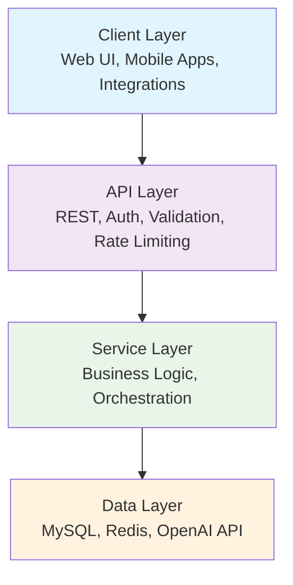
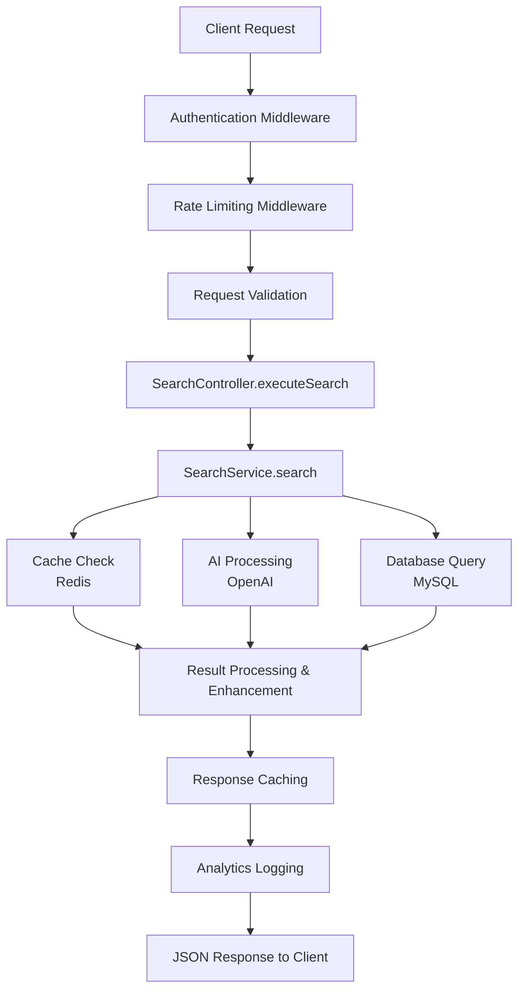
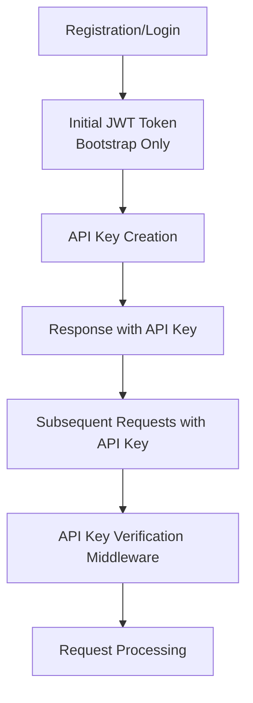
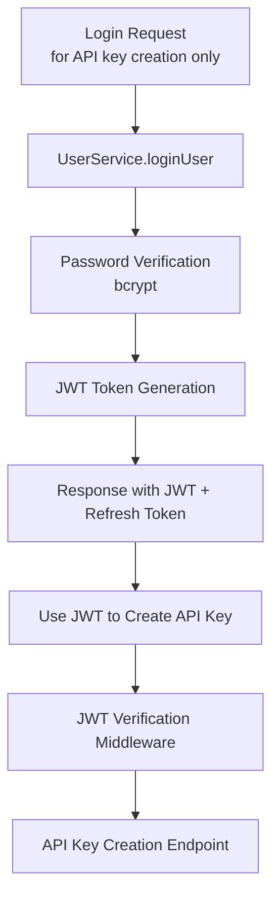
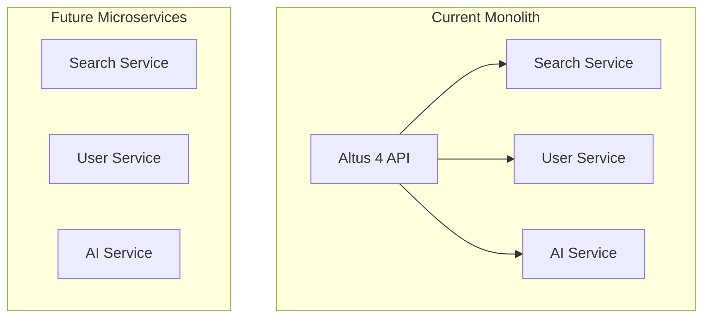

# System Architecture

AI-Enhanced MySQL Search Engine Architecture

::: info Sync Test
__Sync Test__: This documentation was updated on December 2024 to test automatic synchronization from `altus4/website` to `altus4/docs`.
:::

Altus 4 is built on a modern, scalable architecture that combines traditional database search with AI capabilities. This document covers the system design, patterns, and implementation details.

::: tip Quick Navigation

- [System Overview](#system-overview) - High-level architecture
- [Core Components](#core-components) - Detailed layer breakdown
- [Design Patterns](#design-patterns) - Implementation patterns
- [Data Flow](#data-flow) - Request processing flow
- [Security](#security-architecture) - Security implementation
- [Performance](#performance-architecture) - Performance optimization

:::

## System Overview

Altus 4 follows a __layered architecture__ pattern optimized for scalability, maintainability, and testability:



### Architecture Principles

- __Layered Design__: Clear separation of concerns
- __🔌 Dependency Injection__: Loose coupling between components
- __Async Processing__: Non-blocking operations throughout
- __Event-Driven__: Analytics and monitoring via events
- __Security-First__: Authentication and authorization at every layer

## Core Components

### Client Layer

User-facing interfaces and integrations

| Component                    | Description              | Technology            |
| ---------------------------- | ------------------------ | --------------------- |
| __Web UI__                   | Primary user interface   | Vue.js, Tailwind CSS  |
| __Mobile Apps__              | iOS/Android applications | React Native (future) |
| __Third-party Integrations__ | API consumers            | REST API clients      |

### 🔌 API Layer

Request handling and middleware pipeline

::: details API Layer Components

- __🌍 Express.js Server__: RESTful API endpoints with middleware pipeline
- __Authentication__: API key-based authentication with tiered rate limiting
- __Validation__: Zod schema validation for all endpoints
- __Rate Limiting__: Redis-backed rate limiting per API key tier
- __Error Handling__: Centralized error handling with structured responses
- __Request Logging__: Comprehensive logging with correlation IDs

:::

### Service Layer

Business logic and orchestration

| Service             | Purpose                  | Key Features                           |
| ------------------- | ------------------------ | -------------------------------------- |
| __SearchService__   | Search orchestration     | Multi-database, AI integration         |
| __DatabaseService__ | MySQL operations         | Connection pooling, query optimization |
| __AIService__       | AI integration           | OpenAI API, semantic search            |
| __CacheService__    | Performance optimization | Redis caching, analytics               |
| __UserService__     | User management          | Authentication, profiles               |

### Data Layer

Storage and external services

::: code-group

```text [MySQL]
Primary data storage
- Full-text search indexes
- Relational data integrity
- Connection pooling
```

```text [Redis]
Caching & Analytics
- Search result caching
- Session storage
- Analytics data
```

```text [OpenAI API]
AI Processing
- Semantic search
- Query optimization
- Result categorization
```

:::

## Design Patterns

### 1. Dependency Injection

Constructor-based dependency injection for loose coupling

```typescript
export class SearchService {
  constructor(
    private databaseService: DatabaseService,
    private aiService: AIService,
    private cacheService: CacheService
  ) {}
}
```

::: tip Benefits

- __Improved Testability__: Easy mocking for unit tests
- __Flexible Composition__: Services can be easily swapped
- __Clear Dependencies__: Explicit dependency relationships

:::

### 2. Repository Pattern

Data access is abstracted through service interfaces:

```typescript
interface IUserService {
  getUserById(id: string): Promise<User>
  createUser(userData: CreateUserRequest): Promise<User>
}
```

### 3. Strategy Pattern

Different search modes implemented as strategies:

```typescript
type SearchMode = 'natural' | 'boolean' | 'semantic'

class SearchService {
  private getSearchStrategy(mode: SearchMode): SearchStrategy {
    switch (mode) {
      case 'natural':
        return new NaturalSearchStrategy()
      case 'boolean':
        return new BooleanSearchStrategy()
      case 'semantic':
        return new SemanticSearchStrategy()
    }
  }
}
```

### 4. Observer Pattern

Event-driven analytics and monitoring:

```typescript
class SearchService extends EventEmitter {
  async search(request: SearchRequest): Promise<SearchResponse> {
    this.emit('search:started', request)
    const result = await this.performSearch(request)
    this.emit('search:completed', { request, result })
    return result
  }
}
```

## Data Flow

### Search Request Flow



### Authentication Flow



#### Legacy JWT Flow (Bootstrap Only)



## Security Architecture

### Authentication & Authorization

- __API Keys__: Long-lived credentials for B2B service integration
- __Tiered Permissions__: Scoped permissions per API key (search, analytics, admin)
- __Environment Separation__: Test and live API key environments
- __Role-based Access__: User roles for administrative access control

### Data Protection

- __Credential Encryption__: Database credentials encrypted at rest
- __SQL Injection Prevention__: Parameterized queries throughout
- __Input Sanitization__: All user inputs validated and sanitized
- __HTTPS Only__: TLS encryption for all API communications

### Rate Limiting

- __Tiered Limits__: Rate limits based on API key tier (free/pro/enterprise)
- __Per-API Key__: Individual rate limiting per API key
- __Sliding Window__: Redis-based sliding window rate limiting
- __Graceful Degradation__: Informative error responses with upgrade suggestions

## Performance Architecture

### Caching Strategy

- __Multi-level Caching__: L1 (in-memory) and L2 (Redis) caching
- __Cache Keys__: Deterministic cache key generation based on request parameters
- __TTL Management__: Different TTL values based on data volatility
- __Cache Invalidation__: Event-driven cache invalidation on data updates

### Database Optimization

- __Connection Pooling__: Efficient MySQL connection management
- __Full-text Indexes__: Optimized MySQL FULLTEXT indexes for search
- __Query Optimization__: Analyzed and optimized search queries
- __Read Replicas__: Support for read replica databases (future enhancement)

### Parallel Processing

- __Concurrent Searches__: Multiple database searches executed in parallel
- __Promise.allSettled__: Graceful handling of partial failures
- __Worker Threads__: CPU-intensive operations (future enhancement)

## Scalability Considerations

### Horizontal Scaling

- __Stateless Design__: No server-side session state
- __Load Balancer Ready__: Compatible with standard load balancers
- __Database Sharding__: Support for multiple database connections

### Vertical Scaling

- __Resource Monitoring__: CPU and memory usage tracking
- __Connection Pool Tuning__: Configurable database connection limits
- __Cache Size Management__: Redis memory usage optimization

### Microservices Migration Path

Current monolithic structure can be decomposed into microservices:



## Error Handling Architecture

### Error Categories

1. __Validation Errors__: Invalid request data (400)
2. __Authentication Errors__: Invalid or missing tokens (401)
3. __Authorization Errors__: Insufficient permissions (403)
4. __Not Found Errors__: Resource doesn't exist (404)
5. __Rate Limit Errors__: Too many requests (429)
6. __Service Errors__: External service failures (502/503)
7. __Internal Errors__: Unexpected application errors (500)

### Error Handling Strategy

```typescript
// Custom error class
class AppError extends Error {
  constructor(
    public code: string,
    public message: string,
    public statusCode: number = 500,
    public details?: any
  ) {
    super(message);
    this.name = 'AppError';
}

// Centralized error handler
export const errorHandler = (
  error: Error | AppError,
  req: Request,
  res: Response,
  next: NextFunction
): void => {
  const statusCode = error instanceof AppError ? error.statusCode : 500;
  const code = error instanceof AppError ? error.code : 'INTERNAL_ERROR';

  logger.error('Request failed:', { error, request: req.body });

  res.status(statusCode).json({
    success: false,
    error: {
      code,
      message: error.message,
      details: error instanceof AppError ? error.details : undefined,
    },
    meta: {
      timestamp: new Date().toISOString(),
      requestId: req.headers['x-request-id'],
    },
  });
};
```

```typescript
// Custom error class
class AppError extends Error {
  constructor(
    public code: string,
    public message: string,
    public statusCode: number = 500,
    public details?: any
  ) {
    super(message)
    this.name = 'AppError'
  }
}

// Centralized error handler
export const errorHandler = (
  error: Error | AppError,
  req: Request,
  res: Response,
  next: NextFunction
): void => {
  const statusCode = error instanceof AppError ? error.statusCode : 500
  const code = error instanceof AppError ? error.code : 'INTERNAL_ERROR'

  logger.error('Request failed:', { error, request: req.body })

  res.status(statusCode).json({
    success: false,
    error: {
      code,
      message: error.message,
      details: error instanceof AppError ? error.details : undefined,
    },
    meta: {
      timestamp: new Date().toISOString(),
      requestId: req.headers['x-request-id'],
    },
  })
}
```

## Monitoring & Observability

### Logging Strategy

- __Structured Logging__: JSON-formatted logs with consistent fields
- __Log Levels__: Debug, info, warn, error with configurable levels
- __Correlation IDs__: Request tracing across service boundaries
- __Performance Metrics__: Response times and resource usage

### Health Checks

- __Liveness Probe__: `/health` - Basic application health
- __Readiness Probe__: `/health/ready` - Service dependencies health
- __Deep Health Checks__: Individual service component health

### Metrics Collection

```typescript
interface Metrics {
  requests: {
    total: number
    successful: number
    failed: number
    averageResponseTime: number
  }
  searches: {
    total: number
    cacheHits: number
    averageExecutionTime: number
  }
  database: {
    activeConnections: number
    queryCount: number
    averageQueryTime: number
  }
  cache: {
    hitRate: number
    memoryUsage: number
  }
}
```

## Configuration Management

### Environment-based Configuration

```typescript
interface Config {
  server: {
    port: number
    environment: 'development' | 'production' | 'test'
  }
  database: {
    host: string
    port: number
    username: string
    password: string
    database: string
    connectionLimit: number
  }
  cache: {
    host: string
    port: number
    password?: string
  }
  security: {
    jwtSecret: string
    jwtExpiresIn: string
    bcryptRounds: number
  }
  ai: {
    openaiApiKey: string
    model: string
    maxTokens: number
  }
}
```

### Configuration Validation

All configuration is validated at startup with detailed error messages for missing or invalid values.

## Future Architecture Enhancements

### Planned Improvements

1. __Event Sourcing__: Audit trail for all data changes
2. __CQRS__: Separate read/write models for better performance
3. __Message Queues__: Asynchronous processing for heavy operations
4. __Circuit Breakers__: Fault tolerance for external service calls
5. __GraphQL API__: Alternative API interface for flexible queries
6. __WebSocket Support__: Real-time search suggestions and results

### Technology Roadmap

- __Database__: Consider PostgreSQL for advanced full-text search features
- __Search Engine__: Evaluate Elasticsearch integration for complex queries
- __Containerization__: Docker and Kubernetes deployment
- __Monitoring__: Prometheus/Grafana observability stack

---

__This architecture provides a solid foundation for Altus 4's current needs while maintaining flexibility for future enhancements and scaling requirements.__
