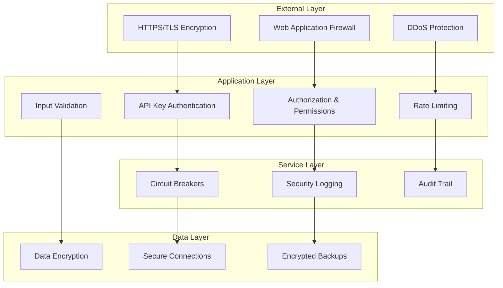

# Security Model & Architecture

Comprehensive Security Architecture Documentation

Altus 4 implements a multi-layered security architecture designed to protect user data, ensure secure API access, and maintain system integrity. This document covers all aspects of the security model from authentication to data encryption.

## Security Architecture Overview

### Defense in Depth Strategy

Altus 4 employs a defense-in-depth security strategy with multiple layers of protection:



### Security Principles

1. **Zero Trust Architecture** - Never trust, always verify
2. **Principle of Least Privilege** - Minimal necessary permissions
3. **Defense in Depth** - Multiple security layers
4. **Fail Secure** - Secure defaults and failure modes
5. **Security by Design** - Built-in security from the ground up

## Authentication System

### API Key Authentication

Altus 4 uses API key-based authentication for B2B service integration, replacing traditional session-based authentication.

#### API Key Format

```text
altus4_sk_{environment}_{random_string}

Examples:
- altus4_sk_live_abc123def456ghi789jkl012mno345pqr678
- altus4_sk_test_xyz789abc123def456ghi789jkl012mno345
```

#### Key Generation Process

```typescript
export class ApiKeyService {
  async generateApiKey(environment: 'test' | 'live'): Promise<string> {
    // 1. Generate cryptographically secure random bytes
    const randomBytes = crypto.randomBytes(32);
    const randomString = randomBytes.toString('hex');

    // 2. Create formatted API key
    const apiKey = `altus4_sk_${environment}_${randomString}`;

    // 3. Generate prefix for fast lookup
    const prefix = apiKey.substring(0, 20); // "altus4_sk_live_abc12"

    // 4. Hash full key for secure storage
    const keyHash = crypto.createHash('sha256').update(apiKey).digest('hex');

    // 5. Store only hash and prefix in database
    await this.storeApiKey({
      prefix,
      keyHash,
      environment,
      // ... other metadata
    });

    return apiKey; // Return only once to user
  }
}
```

#### Key Validation Process

```typescript
export class ApiKeyService {
  async validateApiKey(providedKey: string): Promise<ValidationResult | null> {
    try {
      // 1. Validate key format
      if (!providedKey.startsWith('altus4_sk_')) {
        return null;
      }

      // 2. Extract prefix for fast lookup
      const prefix = providedKey.substring(0, 20);

      // 3. Hash provided key
      const providedHash = crypto.createHash('sha256').update(providedKey).digest('hex');

      // 4. Look up key by prefix (indexed lookup)
      const storedKey = await this.getKeyByPrefix(prefix);
      if (!storedKey) return null;

      // 5. Constant-time hash comparison
      const isValid = crypto.timingSafeEqual(
        Buffer.from(storedKey.keyHash, 'hex'),
        Buffer.from(providedHash, 'hex')
      );

      if (!isValid) return null;

      // 6. Check key status and expiration
      if (!storedKey.isActive || this.isExpired(storedKey)) {
        return null;
      }

      // 7. Return validation result with user context
      return {
        apiKey: storedKey,
        user: await this.getUserById(storedKey.userId),
      };
    } catch (error) {
      this.logger.error('API key validation error:', error);
      return null;
    }
  }
}
```

#### Security Features

1. **Secure Generation**: Cryptographically secure random number generation
2. **Hash Storage**: Only SHA-256 hashes stored, never plaintext keys
3. **Prefix Indexing**: Fast lookup without exposing full keys
4. **Timing Attack Protection**: Constant-time comparisons
5. **Environment Separation**: Test vs live key isolation
6. **Expiration Support**: Optional key expiration dates
7. **Usage Tracking**: Monitor for suspicious activity

### Authentication Middleware

```typescript
export const authenticateApiKey = async (
  req: ApiKeyAuthenticatedRequest,
  res: Response,
  next: NextFunction
): Promise<void> => {
  try {
    // 1. Extract API key from Authorization header
    const authHeader = req.headers.authorization;
    if (!authHeader?.startsWith('Bearer ')) {
      return res.status(401).json({
        success: false,
        error: { code: 'NO_API_KEY', message: 'Authorization header missing' },
      });
    }

    const apiKey = authHeader.substring(7); // Remove "Bearer "

    // 2. Validate API key
    const validation = await apiKeyService.validateApiKey(apiKey);
    if (!validation) {
      return res.status(401).json({
        success: false,
        error: {
          code: 'INVALID_API_KEY',
          message: 'Invalid or expired API key',
        },
      });
    }

    // 3. Add user context to request
    req.user = validation.user;
    req.apiKey = validation.apiKey;

    // 4. Update usage tracking (async)
    apiKeyService
      .trackUsage(validation.apiKey.id, req.method, req.path)
      .catch(error => logger.warn('Usage tracking failed:', error));

    next();
  } catch (error) {
    logger.error('Authentication middleware error:', error);
    res.status(500).json({
      success: false,
      error: { code: 'AUTH_ERROR', message: 'Authentication failed' },
    });
  }
};
```

## Authorization System

### Permission-Based Access Control

Altus 4 uses a flexible permission-based authorization system:

#### Permission Model

```typescript
interface ApiKey {
  id: string;
  userId: string;
  permissions: Permission[];
  rateLimitTier: 'free' | 'pro' | 'enterprise';
  environment: 'test' | 'live';
}

type Permission =
  | 'search' // Execute searches
  | 'analytics' // Access analytics data
  | 'database:read' // View database connections
  | 'database:write' // Manage database connections
  | 'keys:read' // View API keys
  | 'keys:write' // Manage API keys
  | 'admin'; // Administrative access
```

#### Permission Enforcement

```typescript
export const requirePermission = (permission: string) => {
  return (req: ApiKeyAuthenticatedRequest, res: Response, next: NextFunction): void => {
    if (!req.apiKey) {
      return res.status(401).json({
        success: false,
        error: { code: 'UNAUTHORIZED', message: 'Authentication required' },
      });
    }

    // Check if user has required permission
    const hasPermission =
      req.apiKey.permissions.includes(permission) || req.apiKey.permissions.includes('admin');

    if (!hasPermission) {
      return res.status(403).json({
        success: false,
        error: {
          code: 'INSUFFICIENT_PERMISSIONS',
          message: `Permission '${permission}' required`,
          details: {
            required: permission,
            available: req.apiKey.permissions,
          },
        },
      });
    }

    next();
  };
};
```

#### Role-Based Access Control

```typescript
export const requireRole = (role: 'admin' | 'user') => {
  return (req: ApiKeyAuthenticatedRequest, res: Response, next: NextFunction): void => {
    if (!req.user) {
      return res.status(401).json({
        success: false,
        error: { code: 'UNAUTHORIZED', message: 'Authentication required' },
      });
    }

    // Admin role has access to everything
    if (req.user.role === 'admin') {
      return next();
    }

    // Check specific role requirement
    if (req.user.role !== role) {
      return res.status(403).json({
        success: false,
        error: {
          code: 'FORBIDDEN',
          message: `${role} role required`,
          details: { required: role, current: req.user.role },
        },
      });
    }

    next();
  };
};
```

### Resource-Level Authorization

```typescript
export class DatabaseService {
  async getUserDatabase(userId: string, databaseId: string): Promise<Database | null> {
    // Ensure user can only access their own databases
    const database = await this.databaseRepository.findOne({
      id: databaseId,
      userId: userId, // Critical: filter by user ID
    });

    if (!database) {
      throw new AppError('Database not found or access denied', 404, 'DATABASE_NOT_FOUND');
    }

    return database;
  }
}
```

## Rate Limiting & Abuse Prevention

### Tiered Rate Limiting

Rate limits are enforced based on API key tiers:

```typescript
interface RateLimitTier {
  name: 'free' | 'pro' | 'enterprise';
  requestsPerHour: number;
  requestsPerMinute: number;
  burstLimit: number;
  blockDuration: number; // seconds
}

const RATE_LIMIT_TIERS: Record<string, RateLimitTier> = {
  free: {
    name: 'free',
    requestsPerHour: 1000,
    requestsPerMinute: 50,
    burstLimit: 10,
    blockDuration: 300, // 5 minutes
  },
  pro: {
    name: 'pro',
    requestsPerHour: 10000,
    requestsPerMinute: 500,
    burstLimit: 50,
    blockDuration: 60, // 1 minute
  },
  enterprise: {
    name: 'enterprise',
    requestsPerHour: 100000,
    requestsPerMinute: 5000,
    burstLimit: 200,
    blockDuration: 30, // 30 seconds
  },
};
```

### Rate Limiting Implementation

```typescript
export class RateLimiter {
  private redis: Redis;

  async checkRateLimit(apiKeyId: string, tier: string): Promise<RateLimitResult> {
    const limits = RATE_LIMIT_TIERS[tier];
    const now = Date.now();
    const hourWindow = Math.floor(now / (60 * 60 * 1000));
    const minuteWindow = Math.floor(now / (60 * 1000));

    // Use Redis pipeline for atomic operations
    const pipeline = this.redis.pipeline();

    // Check hourly limit
    const hourKey = `rate_limit:${apiKeyId}:hour:${hourWindow}`;
    pipeline.incr(hourKey);
    pipeline.expire(hourKey, 3600);

    // Check minute limit
    const minuteKey = `rate_limit:${apiKeyId}:minute:${minuteWindow}`;
    pipeline.incr(minuteKey);
    pipeline.expire(minuteKey, 60);

    const results = await pipeline.exec();
    const hourlyCount = results[0][1] as number;
    const minuteCount = results[2][1] as number;

    // Check limits
    if (hourlyCount > limits.requestsPerHour) {
      return {
        allowed: false,
        reason: 'hourly_limit_exceeded',
        resetTime: new Date((hourWindow + 1) * 60 * 60 * 1000),
        remaining: 0,
      };
    }

    if (minuteCount > limits.requestsPerMinute) {
      return {
        allowed: false,
        reason: 'minute_limit_exceeded',
        resetTime: new Date((minuteWindow + 1) * 60 * 1000),
        remaining: 0,
      };
    }

    return {
      allowed: true,
      remaining: Math.min(
        limits.requestsPerHour - hourlyCount,
        limits.requestsPerMinute - minuteCount
      ),
    };
  }
}
```

### Abuse Detection

```typescript
export class AbuseDetector {
  async detectSuspiciousActivity(apiKeyId: string, request: Request): Promise<boolean> {
    const suspicious = await Promise.all([
      this.checkRapidFireRequests(apiKeyId),
      this.checkUnusualQueryPatterns(request.body?.query),
      this.checkIPReputation(request.ip),
      this.checkUserAgentAnomalies(request.headers['user-agent']),
    ]);

    return suspicious.some(Boolean);
  }

  private async checkRapidFireRequests(apiKeyId: string): Promise<boolean> {
    const key = `abuse:rapid_fire:${apiKeyId}`;
    const count = await this.redis.incr(key);
    await this.redis.expire(key, 10); // 10 second window

    return count > 50; // More than 50 requests in 10 seconds
  }

  private async checkUnusualQueryPatterns(query?: string): Promise<boolean> {
    if (!query) return false;

    // Check for SQL injection attempts
    const sqlInjectionPatterns = [
      /union\s+select/i,
      /drop\s+table/i,
      /delete\s+from/i,
      /insert\s+into/i,
      /update\s+set/i,
    ];

    return sqlInjectionPatterns.some(pattern => pattern.test(query));
  }
}
```

## Data Protection

### Encryption at Rest

#### Database Credential Encryption

```typescript
export class EncryptionService {
  private readonly algorithm = 'aes-256-gcm';
  private readonly keyDerivation = 'pbkdf2';

  async encryptCredentials(credentials: DatabaseCredentials): Promise<EncryptedCredentials> {
    // Generate random salt and IV
    const salt = crypto.randomBytes(32);
    const iv = crypto.randomBytes(16);

    // Derive encryption key from master key + salt
    const key = crypto.pbkdf2Sync(
      process.env.ENCRYPTION_KEY!,
      salt,
      100000, // iterations
      32, // key length
      'sha256'
    );

    // Encrypt credentials
    const cipher = crypto.createCipher(this.algorithm, key, iv);
    const encrypted = Buffer.concat([
      cipher.update(JSON.stringify(credentials), 'utf8'),
      cipher.final(),
    ]);

    const authTag = cipher.getAuthTag();

    return {
      encryptedData: encrypted.toString('base64'),
      salt: salt.toString('base64'),
      iv: iv.toString('base64'),
      authTag: authTag.toString('base64'),
      algorithm: this.algorithm,
    };
  }

  async decryptCredentials(encrypted: EncryptedCredentials): Promise<DatabaseCredentials> {
    // Reconstruct encryption key
    const salt = Buffer.from(encrypted.salt, 'base64');
    const key = crypto.pbkdf2Sync(process.env.ENCRYPTION_KEY!, salt, 100000, 32, 'sha256');

    // Decrypt credentials
    const iv = Buffer.from(encrypted.iv, 'base64');
    const authTag = Buffer.from(encrypted.authTag, 'base64');
    const encryptedData = Buffer.from(encrypted.encryptedData, 'base64');

    const decipher = crypto.createDecipher(encrypted.algorithm, key, iv);
    decipher.setAuthTag(authTag);

    const decrypted = Buffer.concat([decipher.update(encryptedData), decipher.final()]);

    return JSON.parse(decrypted.toString('utf8'));
  }
}
```

#### Sensitive Data Handling

```typescript
export class UserService {
  async createUser(userData: CreateUserRequest): Promise<User> {
    // Hash password with bcrypt
    const saltRounds = 12;
    const passwordHash = await bcrypt.hash(userData.password, saltRounds);

    // Never store plaintext passwords
    const user = await this.userRepository.create({
      ...userData,
      password: passwordHash, // Store only hash
      // Remove plaintext password from memory
      plainPassword: undefined,
    });

    // Remove sensitive data from response
    const { password, ...safeUser } = user;
    return safeUser as User;
  }

  async authenticateUser(email: string, password: string): Promise<AuthResult> {
    const user = await this.userRepository.findByEmail(email);
    if (!user) {
      // Prevent timing attacks - always hash even if user not found
      await bcrypt.hash(password, 12);
      throw new AppError('Invalid credentials', 401, 'INVALID_CREDENTIALS');
    }

    const isValid = await bcrypt.compare(password, user.password);
    if (!isValid) {
      throw new AppError('Invalid credentials', 401, 'INVALID_CREDENTIALS');
    }

    return { user: this.sanitizeUser(user) };
  }
}
```

### Encryption in Transit

#### HTTPS/TLS Configuration

```typescript
// Production HTTPS configuration
const httpsOptions = {
  key: fs.readFileSync('/path/to/private-key.pem'),
  cert: fs.readFileSync('/path/to/certificate.pem'),
  ca: fs.readFileSync('/path/to/ca-certificate.pem'),

  // Security settings
  secureProtocol: 'TLSv1_2_method',
  ciphers: [
    'ECDHE-RSA-AES128-GCM-SHA256',
    'ECDHE-RSA-AES256-GCM-SHA384',
    'ECDHE-RSA-AES128-SHA256',
    'ECDHE-RSA-AES256-SHA384',
  ].join(':'),
  honorCipherOrder: true,
};

const server = https.createServer(httpsOptions, app);
```

#### Database Connection Security

```typescript
// Secure MySQL connection configuration
const secureConnectionConfig = {
  host: process.env.DB_HOST,
  user: process.env.DB_USERNAME,
  password: process.env.DB_PASSWORD,
  database: process.env.DB_DATABASE,

  // SSL/TLS configuration
  ssl: {
    ca: fs.readFileSync('/path/to/ca-cert.pem'),
    key: fs.readFileSync('/path/to/client-key.pem'),
    cert: fs.readFileSync('/path/to/client-cert.pem'),
    rejectUnauthorized: true,
    verifyServerCertificate: true,
  },

  // Connection security
  connectTimeout: 60000,
  acquireTimeout: 60000,
  timeout: 60000,
};
```

## Input Validation & Sanitization

### Request Validation

```typescript
// Comprehensive input validation with Zod
const searchRequestSchema = z.object({
  query: z
    .string()
    .min(1, 'Query cannot be empty')
    .max(1000, 'Query too long')
    .refine(query => {
      // Prevent SQL injection patterns
      const dangerousPatterns = [
        /union\s+select/i,
        /drop\s+table/i,
        /delete\s+from/i,
        /insert\s+into/i,
      ];
      return !dangerousPatterns.some(pattern => pattern.test(query));
    }, 'Query contains potentially dangerous patterns'),

  databases: z.array(z.string().uuid()).max(10, 'Too many databases selected'),

  searchMode: z.enum(['natural', 'boolean', 'semantic']).default('natural'),

  limit: z
    .number()
    .min(1, 'Limit must be at least 1')
    .max(100, 'Limit cannot exceed 100')
    .default(20),

  offset: z.number().min(0, 'Offset cannot be negative').default(0),
});
```

### SQL Injection Prevention

```typescript
export class DatabaseService {
  async executeFullTextSearch(
    databaseId: string,
    query: string,
    tables: string[],
    limit: number,
    offset: number
  ): Promise<SearchResult[]> {
    // Always use parameterized queries
    const sanitizedTables = tables
      .filter(table => /^[a-zA-Z_][a-zA-Z0-9_]*$/.test(table)) // Validate table names
      .map(table => mysql.escapeId(table)); // Escape identifiers

    if (sanitizedTables.length === 0) {
      throw new AppError('No valid tables specified', 400, 'INVALID_TABLES');
    }

    // Build safe query with parameterized values
    const searchQueries = sanitizedTables.map(
      table => `
      SELECT *, '${table}' as source_table,
             MATCH(title, content) AGAINST(? IN NATURAL LANGUAGE MODE) as relevance
      FROM ${table}
      WHERE MATCH(title, content) AGAINST(? IN NATURAL LANGUAGE MODE)
    `
    );

    const unionQuery = `
      (${searchQueries.join(') UNION ALL (')})
      ORDER BY relevance DESC
      LIMIT ? OFFSET ?
    `;

    // Execute with parameterized values
    const params = [
      ...searchQueries.flatMap(() => [query, query]), // Two params per query
      limit,
      offset,
    ];

    const [results] = await this.executeQuery(databaseId, unionQuery, params);
    return results as SearchResult[];
  }
}
```

### XSS Prevention

```typescript
export class ResponseSanitizer {
  static sanitizeSearchResults(results: SearchResult[]): SearchResult[] {
    return results.map(result => ({
      ...result,
      // Sanitize text fields that might be displayed in UI
      title: this.sanitizeHtml(result.title),
      snippet: this.sanitizeHtml(result.snippet),
      data: this.sanitizeObject(result.data),
    }));
  }

  private static sanitizeHtml(text: string): string {
    if (!text) return text;

    return text
      .replace(/</g, '&lt;')
      .replace(/>/g, '&gt;')
      .replace(/"/g, '&quot;')
      .replace(/'/g, '&#x27;')
      .replace(/\//g, '&#x2F;');
  }

  private static sanitizeObject(obj: any): any {
    if (typeof obj === 'string') {
      return this.sanitizeHtml(obj);
    } else if (Array.isArray(obj)) {
      return obj.map(item => this.sanitizeObject(item));
    } else if (obj && typeof obj === 'object') {
      const sanitized: any = {};
      for (const [key, value] of Object.entries(obj)) {
        sanitized[key] = this.sanitizeObject(value);
      }
      return sanitized;
    }
    return obj;
  }
}
```

## Security Monitoring & Logging

### Security Event Logging

```typescript
export class SecurityLogger {
  private logger: Logger;

  constructor() {
    this.logger = winston.createLogger({
      level: 'info',
      format: winston.format.combine(
        winston.format.timestamp(),
        winston.format.errors({ stack: true }),
        winston.format.json()
      ),
      defaultMeta: { service: 'altus4-security' },
      transports: [
        new winston.transports.File({
          filename: 'logs/security.log',
          level: 'warn', // Only log security events
        }),
        new winston.transports.Console({
          format: winston.format.simple(),
        }),
      ],
    });
  }

  logAuthenticationAttempt(
    result: 'success' | 'failure',
    details: {
      apiKey?: string;
      ip: string;
      userAgent: string;
      endpoint: string;
    }
  ): void {
    this.logger.warn('Authentication attempt', {
      event: 'auth_attempt',
      result,
      ip: details.ip,
      userAgent: details.userAgent,
      endpoint: details.endpoint,
      apiKeyPrefix: details.apiKey?.substring(0, 20),
      timestamp: new Date().toISOString(),
    });
  }

  logSuspiciousActivity(type: string, details: any): void {
    this.logger.error('Suspicious activity detected', {
      event: 'suspicious_activity',
      type,
      details,
      timestamp: new Date().toISOString(),
    });
  }

  logRateLimitExceeded(apiKeyId: string, ip: string, tier: string): void {
    this.logger.warn('Rate limit exceeded', {
      event: 'rate_limit_exceeded',
      apiKeyId,
      ip,
      tier,
      timestamp: new Date().toISOString(),
    });
  }
}
```

### Audit Trail

```typescript
export class AuditLogger {
  async logDatabaseAccess(userId: string, databaseId: string, action: string): Promise<void> {
    await this.auditRepository.create({
      userId,
      resourceType: 'database',
      resourceId: databaseId,
      action,
      timestamp: new Date(),
      ip: this.getCurrentIP(),
      userAgent: this.getCurrentUserAgent(),
    });
  }

  async logApiKeyOperation(userId: string, keyId: string, operation: string): Promise<void> {
    await this.auditRepository.create({
      userId,
      resourceType: 'api_key',
      resourceId: keyId,
      action: operation,
      timestamp: new Date(),
      ip: this.getCurrentIP(),
      userAgent: this.getCurrentUserAgent(),
    });
  }
}
```

## Security Headers & Middleware

### Security Headers

```typescript
// Helmet.js security headers configuration
app.use(
  helmet({
    contentSecurityPolicy: {
      directives: {
        defaultSrc: ["'self'"],
        styleSrc: ["'self'", "'unsafe-inline'"],
        scriptSrc: ["'self'"],
        imgSrc: ["'self'", 'data:', 'https:'],
        connectSrc: ["'self'"],
        fontSrc: ["'self'"],
        objectSrc: ["'none'"],
        mediaSrc: ["'self'"],
        frameSrc: ["'none'"],
      },
    },
    crossOriginEmbedderPolicy: false,
    hsts: {
      maxAge: 31536000,
      includeSubDomains: true,
      preload: true,
    },
  })
);

// Additional security headers
app.use((req, res, next) => {
  res.setHeader('X-API-Version', '1.0');
  res.setHeader('X-Rate-Limit-Policy', 'tiered');
  res.setHeader('Strict-Transport-Security', 'max-age=31536000; includeSubDomains');
  next();
});
```

### CORS Configuration

```typescript
// Secure CORS configuration
app.use(
  cors({
    origin: (origin, callback) => {
      // Allow requests with no origin (mobile apps, etc.)
      if (!origin) return callback(null, true);

      // Check against allowed origins
      const allowedOrigins = process.env.ALLOWED_ORIGINS?.split(',') || [];
      if (allowedOrigins.includes(origin)) {
        return callback(null, true);
      }

      callback(new Error('Not allowed by CORS'));
    },
    credentials: true,
    methods: ['GET', 'POST', 'PUT', 'DELETE', 'OPTIONS'],
    allowedHeaders: ['Content-Type', 'Authorization', 'X-Requested-With'],
    exposedHeaders: ['X-RateLimit-Limit', 'X-RateLimit-Remaining', 'X-RateLimit-Reset'],
  })
);
```

## Incident Response

### Security Incident Detection

```typescript
export class IncidentDetector {
  async detectSecurityIncident(events: SecurityEvent[]): Promise<SecurityIncident | null> {
    // Multiple failed authentication attempts
    const failedAuths = events.filter(
      e => e.type === 'auth_failure' && e.timestamp > new Date(Date.now() - 5 * 60 * 1000) // Last 5 minutes
    );

    if (failedAuths.length > 10) {
      return {
        type: 'brute_force_attack',
        severity: 'high',
        description: 'Multiple failed authentication attempts detected',
        affectedResources: failedAuths.map(e => e.ip),
        recommendedActions: ['block_ip', 'notify_admin'],
      };
    }

    // Unusual API usage patterns
    const apiCalls = events.filter(e => e.type === 'api_call');
    if (this.detectAnomalousUsage(apiCalls)) {
      return {
        type: 'anomalous_usage',
        severity: 'medium',
        description: 'Unusual API usage patterns detected',
        recommendedActions: ['monitor', 'rate_limit'],
      };
    }

    return null;
  }
}
```

### Automated Response

```typescript
export class IncidentResponse {
  async handleSecurityIncident(incident: SecurityIncident): Promise<void> {
    // Log incident
    this.securityLogger.logIncident(incident);

    // Execute automated responses
    for (const action of incident.recommendedActions) {
      switch (action) {
        case 'block_ip':
          await this.blockSuspiciousIPs(incident.affectedResources);
          break;
        case 'rate_limit':
          await this.enforceStrictRateLimit(incident.affectedResources);
          break;
        case 'notify_admin':
          await this.notifyAdministrators(incident);
          break;
        case 'revoke_keys':
          await this.revokeCompromisedKeys(incident.affectedResources);
          break;
      }
    }
  }

  private async blockSuspiciousIPs(ips: string[]): Promise<void> {
    for (const ip of ips) {
      await this.redis.setex(`blocked_ip:${ip}`, 3600, 'security_incident');
    }
  }
}
```

## Security Best Practices

### Development Security

1. **Secure Coding Practices**
   - Input validation on all user inputs
   - Parameterized queries for database operations
   - Proper error handling without information disclosure
   - Secure random number generation

2. **Dependency Management**
   - Regular security audits with `npm audit`
   - Automated dependency updates
   - Vulnerability scanning in CI/CD pipeline

3. **Secret Management**
   - Environment variables for sensitive configuration
   - No hardcoded secrets in source code
   - Secret rotation procedures

### Deployment Security

1. **Infrastructure Security**
   - Network segmentation and firewalls
   - Regular security patches and updates
   - Intrusion detection systems
   - Encrypted storage and backups

2. **Monitoring and Alerting**
   - Real-time security monitoring
   - Automated incident response
   - Regular security assessments
   - Penetration testing

## Related Documentation

- **[API Authentication Guide](../api/authentication.md)** - API key setup and usage
- **[Database Security](./database.md#security-considerations)** - Database security measures
- **[Deployment Security](../deployment/production.md#security)** - Production security setup
- **[Rate Limiting](../api/rate-limiting.md)** - Rate limiting implementation

---

**Security is paramount in Altus 4's design, with multiple layers of protection ensuring data integrity, user privacy, and system reliability.**
