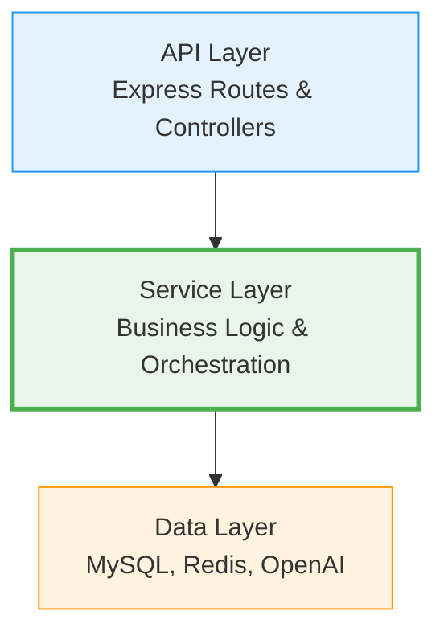
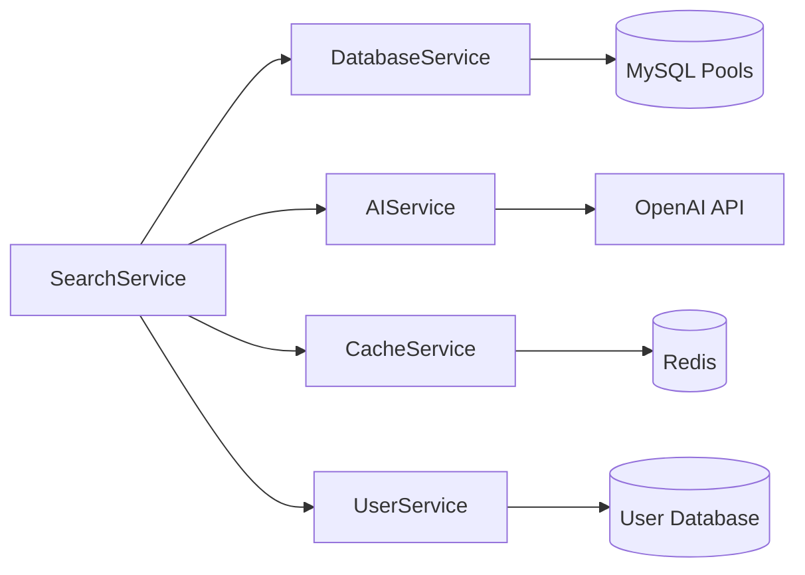
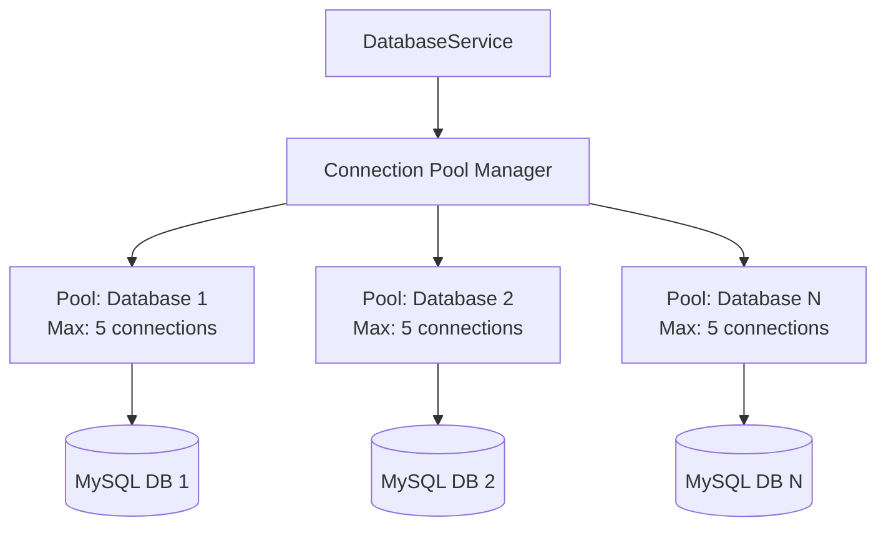
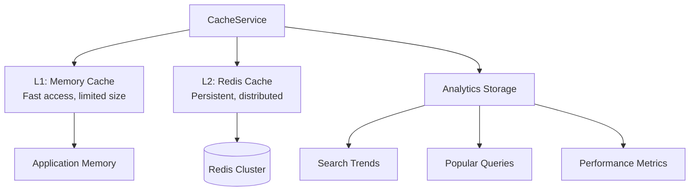
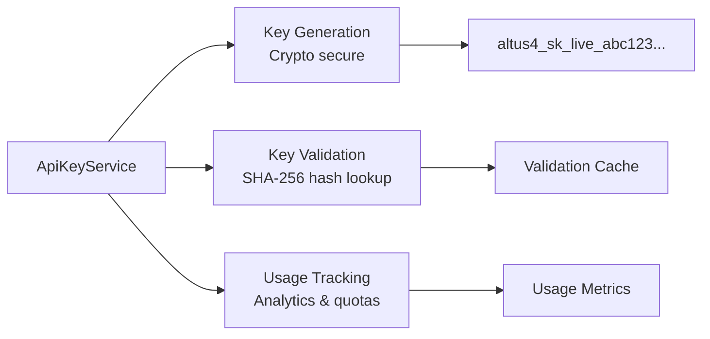

# Service Layer Architecture

Comprehensive Service Layer Design and Implementation

The service layer is the heart of Altus 4's architecture, implementing the core business logic and orchestrating interactions between different system components. This document provides detailed insights into the service architecture, design patterns, and implementation strategies.

## Architecture Overview

### Service Layer Position



The service layer sits between the API layer (controllers and routes) and the data layer (databases and external APIs), providing:

- **Business Logic Encapsulation** - Core application logic separated from HTTP concerns
- **Data Orchestration** - Coordination between multiple data sources
- **Transaction Management** - Ensuring data consistency across operations
- **Error Handling** - Centralized error processing and recovery
- **Caching Strategy** - Intelligent caching and performance optimization

## Service Architecture Patterns

### 1. Dependency Injection Pattern

All services use constructor-based dependency injection for loose coupling and testability:

```typescript
// Service Interface Definition
interface ISearchService {
  search(request: SearchRequest): Promise<SearchResponse>;
  getSuggestions(query: string): Promise<QuerySuggestion[]>;
}

// Service Implementation
export class SearchService implements ISearchService {
  constructor(
    private readonly databaseService: IDatabaseService,
    private readonly aiService: IAIService,
    private readonly cacheService: ICacheService,
    private readonly logger: ILogger
  ) {}

  async search(request: SearchRequest): Promise<SearchResponse> {
    // Implementation uses injected dependencies
  }
}
```

**Benefits:**

- **Testability**: Easy to mock dependencies in unit tests
- **Flexibility**: Can swap implementations without changing service code
- **Separation of Concerns**: Each dependency handles its specific domain
- **Configuration**: Dependencies can be configured externally

### 2. Service Orchestration Pattern

Complex operations are orchestrated across multiple services:

```typescript
export class SearchService {
  async search(request: SearchRequest): Promise<SearchResponse> {
    // 1. Check cache first
    const cached = await this.cacheService.get(cacheKey);
    if (cached) return cached;

    // 2. Process query with AI (if enabled)
    const processedQuery = await this.aiService.optimizeQuery(request.query);

    // 3. Execute searches across databases in parallel
    const searchPromises = request.databases.map(dbId =>
      this.databaseService.search(dbId, processedQuery)
    );
    const results = await Promise.allSettled(searchPromises);

    // 4. Aggregate and enhance results
    const aggregated = this.aggregateResults(results);
    const enhanced = await this.aiService.enhanceResults(aggregated);

    // 5. Cache and return
    await this.cacheService.set(cacheKey, enhanced);
    return enhanced;
  }
}
```

### 3. Circuit Breaker Pattern

Services implement circuit breakers for external dependencies:

```typescript
export class AIService {
  private circuitBreaker = new CircuitBreaker({
    failureThreshold: 5,
    resetTimeout: 30000,
  });

  async processQuery(query: string): Promise<ProcessedQuery> {
    return this.circuitBreaker.execute(async () => {
      return await this.openai.chat.completions.create({
        model: 'gpt-3.5-turbo',
        messages: [{ role: 'user', content: query }],
      });
    });
  }
}
```

## Core Services Deep Dive

### 1. SearchService - The Orchestrator

**Purpose**: Central coordinator for all search operations

**Key Responsibilities:**

- Multi-database search orchestration
- AI-powered query optimization
- Result aggregation and ranking
- Caching strategy implementation
- Analytics logging

**Architecture:**



**Key Methods:**

```typescript
class SearchService {
  // Core search orchestration
  async search(request: SearchRequest): Promise<SearchResponse>;

  // Search suggestions and autocomplete
  async getSuggestions(query: string): Promise<QuerySuggestion[]>;

  // Query performance analysis
  async analyzeQuery(query: string): Promise<QueryAnalysis>;

  // User search history and trends
  async getUserTrends(userId: string): Promise<TrendInsight[]>;
}
```

### 2. DatabaseService - Connection Manager

**Purpose**: MySQL database connection management and query execution

**Key Responsibilities:**

- Connection pool management per user database
- Secure credential storage and encryption
- Schema discovery and metadata extraction
- Query optimization and execution
- Health monitoring and reconnection

**Connection Pool Architecture:**



**Key Methods:**

```typescript
class DatabaseService {
  // Connection management
  async addConnection(config: DatabaseConfig): Promise<void>;
  async removeConnection(connectionId: string): Promise<void>;
  async testConnection(config: DatabaseConfig): Promise<boolean>;

  // Query execution
  async executeFullTextSearch(dbId: string, query: string): Promise<SearchResult[]>;
  async executeQuery(dbId: string, sql: string, params: any[]): Promise<any[]>;

  // Schema operations
  async discoverSchema(dbId: string): Promise<TableSchema[]>;
  async getTableInfo(dbId: string, tableName: string): Promise<TableInfo>;
}
```

### 3. AIService - Intelligence Layer

**Purpose**: OpenAI integration for semantic search and query optimization

**Key Responsibilities:**

- Query semantic analysis and optimization
- Search result categorization and enhancement
- Intelligent search suggestions
- Trend analysis and insights generation
- Fallback handling for AI unavailability

**AI Processing Pipeline:**


**Key Methods:**

```typescript
class AIService {
  // Query processing
  async processSearchQuery(query: string): Promise<ProcessedQuery>;
  async optimizeQuery(query: string): Promise<string>;

  // Result enhancement
  async categorizeResults(results: SearchResult[]): Promise<Category[]>;
  async enhanceResults(results: SearchResult[]): Promise<EnhancedResult[]>;

  // Suggestions and insights
  async getQuerySuggestions(query: string): Promise<QuerySuggestion[]>;
  async generateInsights(data: AnalyticsData): Promise<AIInsight[]>;
}
```

### 4. CacheService - Performance Layer

**Purpose**: Redis-based caching and analytics storage

**Key Responsibilities:**

- Multi-level caching (memory + Redis)
- Search result caching with intelligent TTL
- Analytics data aggregation and storage
- Popular queries and trending searches
- Cache invalidation and warming strategies

**Caching Architecture:**



**Key Methods:**

```typescript
class CacheService {
  // Basic caching operations
  async get<T>(key: string): Promise<T | null>;
  async set<T>(key: string, value: T, ttl?: number): Promise<void>;
  async del(key: string): Promise<void>;

  // Analytics operations
  async logSearchAnalytics(data: SearchAnalytics): Promise<void>;
  async getPopularQueries(limit?: number): Promise<string[]>;
  async getTrendingSearches(period: string): Promise<TrendData[]>;

  // Cache management
  async invalidatePattern(pattern: string): Promise<void>;
  async warmCache(keys: string[]): Promise<void>;
}
```

### 5. UserService - Identity Management

**Purpose**: User account management and authentication

**Key Responsibilities:**

- User registration and profile management
- Password hashing and authentication
- Role-based access control
- Account lifecycle operations
- Security audit logging

**Key Methods:**

```typescript
class UserService {
  // User management
  async createUser(userData: CreateUserRequest): Promise<User>;
  async getUserById(userId: string): Promise<User | null>;
  async updateUser(userId: string, updates: UserUpdates): Promise<User>;
  async deleteUser(userId: string): Promise<void>;

  // Authentication
  async authenticateUser(email: string, password: string): Promise<AuthResult>;
  async changePassword(userId: string, oldPassword: string, newPassword: string): Promise<void>;

  // Authorization
  async getUserPermissions(userId: string): Promise<Permission[]>;
  async hasPermission(userId: string, permission: string): Promise<boolean>;
}
```

### 6. ApiKeyService - API Authentication

**Purpose**: API key lifecycle management and validation

**Key Responsibilities:**

- Secure API key generation and storage
- API key validation and user context extraction
- Tiered rate limiting and permissions
- Usage tracking and analytics
- Key rotation and revocation

**API Key Architecture:**



**Key Methods:**

```typescript
class ApiKeyService {
  // Key lifecycle
  async createApiKey(userId: string, config: ApiKeyConfig): Promise<ApiKey>;
  async revokeApiKey(keyId: string): Promise<void>;
  async rotateApiKey(keyId: string): Promise<ApiKey>;

  // Validation and usage
  async validateApiKey(key: string): Promise<ValidationResult | null>;
  async trackUsage(keyId: string, operation: string): Promise<void>;
  async getUsageStats(keyId: string): Promise<UsageStats>;

  // Management
  async listApiKeys(userId: string): Promise<ApiKey[]>;
  async updateApiKey(keyId: string, updates: ApiKeyUpdates): Promise<ApiKey>;
}
```

## Service Communication Patterns

### 1. Synchronous Communication

Most service interactions are synchronous for consistency:

```typescript
export class SearchService {
  async search(request: SearchRequest): Promise<SearchResponse> {
    // Synchronous calls ensure data consistency
    const user = await this.userService.getUserById(request.userId);
    const databases = await this.databaseService.getUserDatabases(user.id);
    const results = await this.executeSearches(databases, request.query);

    return this.buildResponse(results);
  }
}
```

### 2. Asynchronous Operations

Non-critical operations are handled asynchronously:

```typescript
export class SearchService {
  async search(request: SearchRequest): Promise<SearchResponse> {
    const response = await this.executeSearch(request);

    // Fire-and-forget analytics logging
    this.logAnalytics(request, response).catch(error => {
      this.logger.warn('Analytics logging failed:', error);
    });

    return response;
  }
}
```

### 3. Event-Driven Communication

Some services use events for loose coupling:

```typescript
export class SearchService extends EventEmitter {
  async search(request: SearchRequest): Promise<SearchResponse> {
    const response = await this.executeSearch(request);

    // Emit event for other services to handle
    this.emit('search.completed', {
      userId: request.userId,
      query: request.query,
      resultCount: response.totalCount,
      executionTime: response.executionTime,
    });

    return response;
  }
}
```

## Error Handling Strategies

### 1. Service-Level Error Handling

Each service implements comprehensive error handling:

```typescript
export class DatabaseService {
  async executeQuery(dbId: string, sql: string): Promise<any[]> {
    try {
      const pool = await this.getConnectionPool(dbId);
      const [results] = await pool.execute(sql);
      return results as any[];
    } catch (error) {
      // Categorize and handle different error types
      if (error.code === 'ECONNREFUSED') {
        throw new DatabaseConnectionError('Database connection failed', dbId);
      } else if (error.code === 'ER_SYNTAX_ERROR') {
        throw new QuerySyntaxError('Invalid SQL syntax', sql);
      } else {
        this.logger.error('Unexpected database error:', error);
        throw new DatabaseError('Database operation failed');
      }
    }
  }
}
```

### 2. Graceful Degradation

Services implement fallback strategies:

```typescript
export class AIService {
  async enhanceResults(results: SearchResult[]): Promise<EnhancedResult[]> {
    try {
      // Try AI enhancement first
      return await this.openai.enhanceResults(results);
    } catch (error) {
      this.logger.warn('AI enhancement failed, using fallback:', error);

      // Fallback to basic enhancement
      return results.map(result => ({
        ...result,
        categories: this.basicCategorization(result),
        confidence: 0.5,
      }));
    }
  }
}
```

### 3. Circuit Breaker Implementation

Protect against cascading failures:

```typescript
export class CircuitBreaker {
  private failures = 0;
  private lastFailureTime?: Date;
  private state: 'CLOSED' | 'OPEN' | 'HALF_OPEN' = 'CLOSED';

  async execute<T>(operation: () => Promise<T>): Promise<T> {
    if (this.state === 'OPEN') {
      if (this.shouldAttemptReset()) {
        this.state = 'HALF_OPEN';
      } else {
        throw new CircuitBreakerOpenError('Circuit breaker is open');
      }
    }

    try {
      const result = await operation();
      this.onSuccess();
      return result;
    } catch (error) {
      this.onFailure();
      throw error;
    }
  }
}
```

## Performance Optimization

### 1. Connection Pooling

Efficient database connection management:

```typescript
export class DatabaseService {
  private pools = new Map<string, mysql.Pool>();

  private createPool(config: DatabaseConfig): mysql.Pool {
    return mysql.createPool({
      host: config.host,
      user: config.username,
      password: config.password,
      database: config.database,
      connectionLimit: 10,
      acquireTimeout: 60000,
      timeout: 60000,
      reconnect: true,
    });
  }
}
```

### 2. Intelligent Caching

Multi-level caching with appropriate TTLs:

```typescript
export class CacheService {
  async get<T>(key: string): Promise<T | null> {
    // L1: Check memory cache first
    if (this.memoryCache.has(key)) {
      return this.memoryCache.get(key);
    }

    // L2: Check Redis cache
    const redisValue = await this.redis.get(key);
    if (redisValue) {
      const parsed = JSON.parse(redisValue);
      this.memoryCache.set(key, parsed); // Populate L1 cache
      return parsed;
    }

    return null;
  }
}
```

### 3. Parallel Processing

Execute independent operations concurrently:

```typescript
export class SearchService {
  async search(request: SearchRequest): Promise<SearchResponse> {
    // Execute searches in parallel
    const searchPromises = request.databases.map(async dbId => {
      return this.databaseService.search(dbId, request.query);
    });

    const results = await Promise.allSettled(searchPromises);

    // Process successful results, log failures
    const successful = results
      .filter(result => result.status === 'fulfilled')
      .map(result => result.value);

    return this.aggregateResults(successful);
  }
}
```

## Testing Strategies

### 1. Unit Testing with Mocks

```typescript
describe('SearchService', () => {
  let searchService: SearchService;
  let mockDatabaseService: jest.Mocked<DatabaseService>;
  let mockAIService: jest.Mocked<AIService>;

  beforeEach(() => {
    mockDatabaseService = {
      search: jest.fn(),
      getUserDatabases: jest.fn(),
    } as any;

    mockAIService = {
      isAvailable: jest.fn(() => false),
      enhanceResults: jest.fn(),
    } as any;

    searchService = new SearchService(mockDatabaseService, mockAIService, mockCacheService);
  });

  it('should aggregate results from multiple databases', async () => {
    mockDatabaseService.search
      .mockResolvedValueOnce([{ id: '1', title: 'Result 1' }])
      .mockResolvedValueOnce([{ id: '2', title: 'Result 2' }]);

    const result = await searchService.search({
      query: 'test',
      databases: ['db1', 'db2'],
      userId: 'user1',
    });

    expect(result.results).toHaveLength(2);
    expect(mockDatabaseService.search).toHaveBeenCalledTimes(2);
  });
});
```

### 2. Integration Testing

```typescript
describe('SearchService Integration', () => {
  let searchService: SearchService;
  let testDatabase: TestDatabase;

  beforeAll(async () => {
    testDatabase = await setupTestDatabase();
    const databaseService = new DatabaseService();
    const aiService = new AIService();
    const cacheService = new CacheService();

    searchService = new SearchService(databaseService, aiService, cacheService);
  });

  it('should perform end-to-end search', async () => {
    await testDatabase.seed({
      articles: [{ id: 1, title: 'MySQL Performance', content: 'Optimization tips...' }],
    });

    const result = await searchService.search({
      query: 'MySQL',
      databases: [testDatabase.id],
      userId: 'test-user',
    });

    expect(result.results).toHaveLength(1);
    expect(result.results[0].title).toBe('MySQL Performance');
  });
});
```

## Monitoring and Observability

### 1. Service Metrics

```typescript
export class SearchService {
  private metrics = new MetricsCollector();

  async search(request: SearchRequest): Promise<SearchResponse> {
    const startTime = Date.now();

    try {
      const result = await this.executeSearch(request);

      this.metrics.histogram('search.duration', Date.now() - startTime);
      this.metrics.counter('search.success').increment();

      return result;
    } catch (error) {
      this.metrics.counter('search.error').increment();
      throw error;
    }
  }
}
```

### 2. Health Checks

```typescript
export class DatabaseService {
  async healthCheck(): Promise<HealthStatus> {
    const checks = await Promise.allSettled(
      Array.from(this.pools.entries()).map(async ([id, pool]) => {
        const connection = await pool.getConnection();
        await connection.ping();
        connection.release();
        return { id, status: 'healthy' };
      })
    );

    return {
      service: 'DatabaseService',
      status: checks.every(c => c.status === 'fulfilled') ? 'healthy' : 'degraded',
      checks: checks.map(c => (c.status === 'fulfilled' ? c.value : { error: c.reason })),
    };
  }
}
```

## Related Documentation

- **[Database Service](../services/database-service.md)** - Detailed DatabaseService documentation
- **[Search Service](../services/search-service.md)** - Comprehensive SearchService guide
- **[AI Service](../services/ai-service.md)** - AI integration patterns
- **[Cache Service](../services/cache-service.md)** - Caching strategies and implementation
- **[Testing Guide](../testing/)** - Service testing patterns and examples

---

**The service layer is the foundation of Altus 4's reliability and performance, implementing robust patterns for scalability, maintainability, and observability.**
