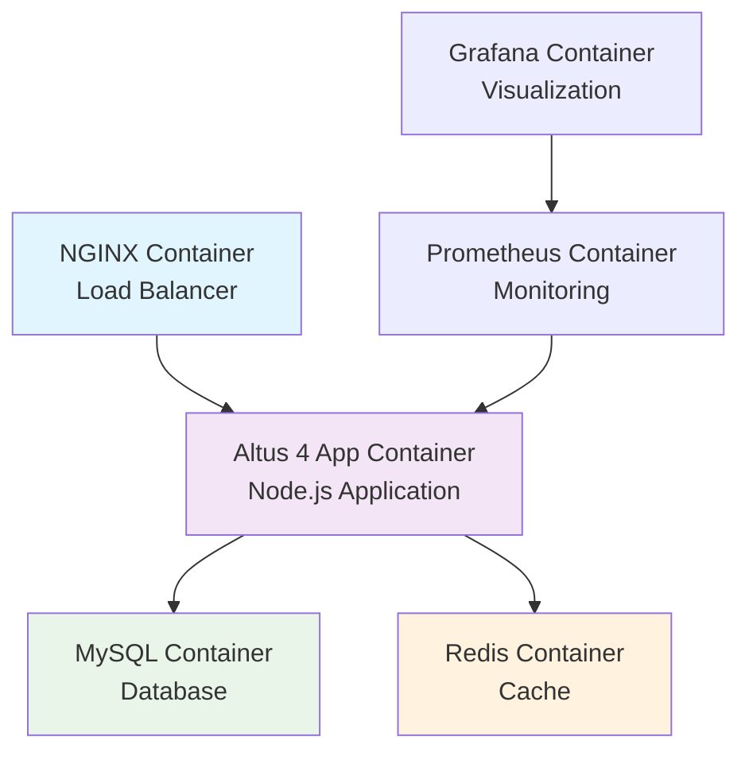

# Docker Deployment Guide

Comprehensive Docker Containerization and Deployment

This guide covers containerizing Altus 4 using Docker, orchestrating with Docker Compose, and deploying in production environments with container best practices for security, performance, and scalability.

## Docker Architecture Overview

### Container Architecture



### Container Benefits

- **Consistency**: Same environment across development, staging, and production
- **Isolation**: Each service runs in its own container
- **Scalability**: Easy horizontal scaling with container orchestration
- **Portability**: Deploy anywhere Docker is supported
- **Resource Efficiency**: Better resource utilization than VMs

## Dockerfile Configuration

### Multi-Stage Production Dockerfile

Create `Dockerfile` in the project root:

```dockerfile
# Build stage
FROM node:20-alpine AS builder

# Set working directory
WORKDIR /app

# Copy package files
COPY package*.json ./

# Install dependencies (including dev dependencies for building)
RUN npm ci --only=production --ignore-scripts && \
    npm cache clean --force

# Copy source code
COPY . .

# Build application
RUN npm run build

# Production stage
FROM node:20-alpine AS production

# Install security updates
RUN apk update && apk upgrade && \
    apk add --no-cache dumb-init && \
    addgroup -g 1001 -S altus4 && \
    adduser -S -D -H -u 1001 -s /sbin/nologin altus4

# Set working directory
WORKDIR /app

# Copy package files
COPY package*.json ./

# Install only production dependencies
RUN npm ci --only=production --ignore-scripts && \
    npm cache clean --force

# Copy built application from builder stage
COPY --from=builder /app/dist ./dist
COPY --from=builder /app/migrations ./migrations
COPY --from=builder /app/bin ./bin

# Create necessary directories
RUN mkdir -p /app/logs && \
    chown -R altus4:altus4 /app

# Health check
HEALTHCHECK --interval=30s --timeout=3s --start-period=5s --retries=3 \
    CMD node dist/healthcheck.js || exit 1

# Switch to non-root user
USER altus4

# Set environment variables
ENV NODE_ENV=production \
    PORT=3000 \
    LOG_LEVEL=info

# Expose port
EXPOSE 3000

# Use dumb-init to handle signals properly
ENTRYPOINT ["dumb-init", "--"]

# Start application
CMD ["node", "dist/index.js"]
```

### Optimized Development Dockerfile

Create `Dockerfile.dev` for development:

```dockerfile
FROM node:20-alpine

# Install development tools
RUN apk add --no-cache git curl

# Set working directory
WORKDIR /app

# Copy package files
COPY package*.json ./

# Install all dependencies
RUN npm install

# Copy source code
COPY . .

# Create development user
RUN addgroup -g 1001 -S altus4 && \
    adduser -S -D -H -u 1001 -s /sbin/nologin altus4 && \
    chown -R altus4:altus4 /app

USER altus4

# Expose port
EXPOSE 3000

# Start in development mode
CMD ["npm", "run", "dev"]
```

### .dockerignore Configuration

Create `.dockerignore`:

```
node_modules
npm-debug.log
.nyc_output
coverage
.git
.gitignore
README.md
.env*
.DS_Store
*.md
tests
docs
.github

# Development files
src
*.test.js
*.test.ts
jest.config.js
tsconfig.json

# Logs
logs
*.log

# Build artifacts
dist
build

# IDE
.vscode
.idea
```

## Docker Compose Configuration

### Production Docker Compose

Create `docker-compose.prod.yml`:

```yaml
version: '3.8'

services:
  # Application service
  app:
    build: 
      context: .
      dockerfile: Dockerfile
      target: production
    image: altus4/app:latest
    container_name: altus4_app
    restart: unless-stopped
    depends_on:
      mysql:
        condition: service_healthy
      redis:
        condition: service_healthy
    environment:
      - NODE_ENV=production
      - PORT=3000
      - DB_HOST=mysql
      - DB_PORT=3306
      - DB_USERNAME=altus4_user
      - DB_PASSWORD_FILE=/run/secrets/db_password
      - DB_DATABASE=altus4_production
      - REDIS_HOST=redis
      - REDIS_PORT=6379
      - REDIS_PASSWORD_FILE=/run/secrets/redis_password
      - JWT_SECRET_FILE=/run/secrets/jwt_secret
      - OPENAI_API_KEY_FILE=/run/secrets/openai_api_key
    secrets:
      - db_password
      - redis_password
      - jwt_secret
      - openai_api_key
    volumes:
      - app_logs:/app/logs
    networks:
      - altus4_network
    deploy:
      resources:
        limits:
          cpus: '2.0'
          memory: 2G
        reservations:
          cpus: '0.5'
          memory: 512M
    healthcheck:
      test: ["CMD", "curl", "-f", "http://localhost:3000/health"]
      interval: 30s
      timeout: 10s
      retries: 3
      start_period: 40s

  # MySQL database
  mysql:
    image: mysql:8.0
    container_name: altus4_mysql
    restart: unless-stopped
    environment:
      - MYSQL_ROOT_PASSWORD_FILE=/run/secrets/mysql_root_password
      - MYSQL_DATABASE=altus4_production
      - MYSQL_USER=altus4_user
      - MYSQL_PASSWORD_FILE=/run/secrets/db_password
    secrets:
      - mysql_root_password
      - db_password
    volumes:
      - mysql_data:/var/lib/mysql
      - mysql_config:/etc/mysql/conf.d
      - mysql_logs:/var/log/mysql
    networks:
      - altus4_network
    ports:
      - "3306:3306"
    deploy:
      resources:
        limits:
          cpus: '2.0'
          memory: 2G
        reservations:
          cpus: '0.5'
          memory: 1G
    healthcheck:
      test: ["CMD", "mysqladmin", "ping", "-h", "localhost", "-u", "root", "--password=$$(cat /run/secrets/mysql_root_password)"]
      interval: 30s
      timeout: 10s
      retries: 5
      start_period: 30s
    command: >
      --character-set-server=utf8mb4
      --collation-server=utf8mb4_unicode_ci
      --innodb-buffer-pool-size=1G
      --innodb-log-file-size=256M
      --max-connections=500
      --slow-query-log=1
      --long-query-time=2

  # Redis cache
  redis:
    image: redis:7-alpine
    container_name: altus4_redis
    restart: unless-stopped
    environment:
      - REDIS_PASSWORD_FILE=/run/secrets/redis_password
    secrets:
      - redis_password
    volumes:
      - redis_data:/data
      - redis_config:/usr/local/etc/redis
    networks:
      - altus4_network
    ports:
      - "6379:6379"
    deploy:
      resources:
        limits:
          cpus: '1.0'
          memory: 1G
        reservations:
          cpus: '0.25'
          memory: 256M
    healthcheck:
      test: ["CMD", "redis-cli", "--pass", "$$(cat /run/secrets/redis_password)", "ping"]
      interval: 30s
      timeout: 10s
      retries: 3
    command: >
      sh -c "redis-server --requirepass $$(cat /run/secrets/redis_password) 
             --maxmemory 512mb 
             --maxmemory-policy allkeys-lru 
             --save 900 1 
             --save 300 10"

  # NGINX load balancer
  nginx:
    image: nginx:alpine
    container_name: altus4_nginx
    restart: unless-stopped
    depends_on:
      - app
    ports:
      - "80:80"
      - "443:443"
    volumes:
      - nginx_config:/etc/nginx/conf.d
      - nginx_logs:/var/log/nginx
      - ssl_certs:/etc/ssl/certs
    networks:
      - altus4_network
    deploy:
      resources:
        limits:
          cpus: '1.0'
          memory: 512M
    healthcheck:
      test: ["CMD", "curl", "-f", "http://localhost/health"]
      interval: 30s
      timeout: 5s
      retries: 3

  # Prometheus monitoring
  prometheus:
    image: prom/prometheus:latest
    container_name: altus4_prometheus
    restart: unless-stopped
    command:
      - '--config.file=/etc/prometheus/prometheus.yml'
      - '--storage.tsdb.path=/prometheus'
      - '--web.console.libraries=/etc/prometheus/console_libraries'
      - '--web.console.templates=/etc/prometheus/consoles'
      - '--web.enable-lifecycle'
    volumes:
      - prometheus_config:/etc/prometheus
      - prometheus_data:/prometheus
    networks:
      - altus4_network
    ports:
      - "9090:9090"
    deploy:
      resources:
        limits:
          memory: 512M

  # Grafana visualization
  grafana:
    image: grafana/grafana:latest
    container_name: altus4_grafana
    restart: unless-stopped
    depends_on:
      - prometheus
    environment:
      - GF_SECURITY_ADMIN_PASSWORD_FILE=/run/secrets/grafana_admin_password
      - GF_USERS_ALLOW_SIGN_UP=false
    secrets:
      - grafana_admin_password
    volumes:
      - grafana_data:/var/lib/grafana
      - grafana_config:/etc/grafana
    networks:
      - altus4_network
    ports:
      - "3001:3000"
    deploy:
      resources:
        limits:
          memory: 512M

# Docker secrets for sensitive data
secrets:
  db_password:
    file: ./secrets/db_password.txt
  redis_password:
    file: ./secrets/redis_password.txt
  mysql_root_password:
    file: ./secrets/mysql_root_password.txt
  jwt_secret:
    file: ./secrets/jwt_secret.txt
  openai_api_key:
    file: ./secrets/openai_api_key.txt
  grafana_admin_password:
    file: ./secrets/grafana_admin_password.txt

# Named volumes for data persistence
volumes:
  mysql_data:
    driver: local
  mysql_config:
    driver: local
  mysql_logs:
    driver: local
  redis_data:
    driver: local
  redis_config:
    driver: local
  app_logs:
    driver: local
  nginx_config:
    driver: local
  nginx_logs:
    driver: local
  ssl_certs:
    driver: local
  prometheus_data:
    driver: local
  prometheus_config:
    driver: local
  grafana_data:
    driver: local
  grafana_config:
    driver: local

# Network for service communication
networks:
  altus4_network:
    driver: bridge
    ipam:
      config:
        - subnet: 172.20.0.0/16
```

### Development Docker Compose

Create `docker-compose.dev.yml`:

```yaml
version: '3.8'

services:
  app:
    build: 
      context: .
      dockerfile: Dockerfile.dev
    container_name: altus4_app_dev
    volumes:
      - .:/app
      - /app/node_modules
    ports:
      - "3000:3000"
      - "9229:9229"  # Debug port
    environment:
      - NODE_ENV=development
      - DEBUG=*
      - DB_HOST=mysql
      - REDIS_HOST=redis
    depends_on:
      - mysql
      - redis
    networks:
      - altus4_dev_network
    command: npm run dev

  mysql:
    image: mysql:8.0
    container_name: altus4_mysql_dev
    environment:
      - MYSQL_ROOT_PASSWORD=devpassword
      - MYSQL_DATABASE=altus4_development
      - MYSQL_USER=altus4_user
      - MYSQL_PASSWORD=devpassword
    ports:
      - "3306:3306"
    volumes:
      - mysql_dev_data:/var/lib/mysql
    networks:
      - altus4_dev_network

  redis:
    image: redis:7-alpine
    container_name: altus4_redis_dev
    ports:
      - "6379:6379"
    volumes:
      - redis_dev_data:/data
    networks:
      - altus4_dev_network

volumes:
  mysql_dev_data:
  redis_dev_data:

networks:
  altus4_dev_network:
    driver: bridge
```

## Configuration Files

### NGINX Configuration for Docker

Create `config/nginx/default.conf`:

```nginx
upstream altus4_app {
    server app:3000 max_fails=3 fail_timeout=30s;
}

server {
    listen 80;
    server_name localhost;

    # Health check
    location /health {
        proxy_pass http://altus4_app;
        proxy_set_header Host $host;
        proxy_set_header X-Real-IP $remote_addr;
        proxy_set_header X-Forwarded-For $proxy_add_x_forwarded_for;
        access_log off;
    }

    # API routes
    location /api/ {
        proxy_pass http://altus4_app;
        proxy_set_header Host $host;
        proxy_set_header X-Real-IP $remote_addr;
        proxy_set_header X-Forwarded-For $proxy_add_x_forwarded_for;
        proxy_set_header X-Forwarded-Proto $scheme;
        
        # Timeouts
        proxy_connect_timeout 60s;
        proxy_send_timeout 60s;
        proxy_read_timeout 60s;
        
        # Buffer settings
        proxy_buffer_size 4k;
        proxy_buffers 8 4k;
        proxy_busy_buffers_size 8k;
    }

    # Security headers
    add_header X-Frame-Options DENY;
    add_header X-Content-Type-Options nosniff;
    add_header X-XSS-Protection "1; mode=block";
}
```

### Prometheus Configuration

Create `config/prometheus/prometheus.yml`:

```yaml
global:
  scrape_interval: 15s
  evaluation_interval: 15s

scrape_configs:
  - job_name: 'altus4-app'
    static_configs:
      - targets: ['app:3000']
    metrics_path: '/metrics'
    scrape_interval: 30s

  - job_name: 'mysql-exporter'
    static_configs:
      - targets: ['mysql-exporter:9104']

  - job_name: 'redis-exporter'
    static_configs:
      - targets: ['redis-exporter:9121']

  - job_name: 'node-exporter'
    static_configs:
      - targets: ['node-exporter:9100']
```

### MySQL Configuration for Docker

Create `config/mysql/my.cnf`:

```ini
[mysqld]
# Character set
character-set-server = utf8mb4
collation-server = utf8mb4_unicode_ci

# Performance optimizations for containers
innodb_buffer_pool_size = 1G
innodb_log_file_size = 256M
innodb_flush_log_at_trx_commit = 2
innodb_flush_method = O_DIRECT

# Connection settings
max_connections = 500
thread_cache_size = 16

# Full-text search optimizations
ft_min_word_len = 2
innodb_ft_min_token_size = 2

# Logging
slow_query_log = 1
long_query_time = 2
general_log = 0

# Binary logging
log-bin = mysql-bin
binlog_format = ROW
expire_logs_days = 7

[mysql]
default-character-set = utf8mb4

[client]
default-character-set = utf8mb4
```

## Secrets Management

### Creating Docker Secrets

```bash
# Create secrets directory
mkdir -p secrets

# Generate secure passwords
openssl rand -base64 32 > secrets/db_password.txt
openssl rand -base64 32 > secrets/redis_password.txt
openssl rand -base64 32 > secrets/mysql_root_password.txt
openssl rand -base64 64 > secrets/jwt_secret.txt
openssl rand -base64 32 > secrets/grafana_admin_password.txt

# Add OpenAI API key
echo "your_openai_api_key_here" > secrets/openai_api_key.txt

# Set proper permissions
chmod 600 secrets/*

# Add to .gitignore
echo "secrets/" >> .gitignore
```

### Using Environment-Specific Secrets

Create `secrets/.env.prod`:

```bash
#!/bin/bash
# Production secrets setup script

# Database passwords
export DB_PASSWORD=$(cat secrets/db_password.txt)
export MYSQL_ROOT_PASSWORD=$(cat secrets/mysql_root_password.txt)

# Redis password
export REDIS_PASSWORD=$(cat secrets/redis_password.txt)

# JWT secret
export JWT_SECRET=$(cat secrets/jwt_secret.txt)

# OpenAI API key
export OPENAI_API_KEY=$(cat secrets/openai_api_key.txt)

# Grafana admin password
export GRAFANA_ADMIN_PASSWORD=$(cat secrets/grafana_admin_password.txt)
```

## Container Operations

### Building and Deployment

#### Development Environment

```bash
# Start development environment
docker-compose -f docker-compose.dev.yml up -d

# View logs
docker-compose -f docker-compose.dev.yml logs -f app

# Stop development environment
docker-compose -f docker-compose.dev.yml down
```

#### Production Deployment

```bash
# Build production images
docker-compose -f docker-compose.prod.yml build

# Start production services
docker-compose -f docker-compose.prod.yml up -d

# Check service health
docker-compose -f docker-compose.prod.yml ps

# View application logs
docker-compose -f docker-compose.prod.yml logs -f app

# Scale application service
docker-compose -f docker-compose.prod.yml up -d --scale app=3
```

### Container Management Scripts

#### Deployment Script

Create `scripts/docker-deploy.sh`:

```bash
#!/bin/bash
set -e

# Configuration
COMPOSE_FILE="docker-compose.prod.yml"
IMAGE_TAG=${1:-latest}

echo "Starting Altus 4 Docker deployment..."

# Pull latest images
echo "Pulling latest images..."
docker-compose -f $COMPOSE_FILE pull

# Build application image
echo "Building application image..."
docker-compose -f $COMPOSE_FILE build --no-cache app

# Run database migrations
echo "Running database migrations..."
docker-compose -f $COMPOSE_FILE run --rm app npm run migrate

# Start services
echo "Starting services..."
docker-compose -f $COMPOSE_FILE up -d

# Health check
echo "Performing health checks..."
sleep 30

if docker-compose -f $COMPOSE_FILE exec app curl -f http://localhost:3000/health; then
    echo "✅ Deployment successful!"
else
    echo "❌ Health check failed, rolling back..."
    docker-compose -f $COMPOSE_FILE down
    exit 1
fi

# Cleanup old images
echo "Cleaning up old images..."
docker image prune -f

echo "🎉 Deployment completed successfully!"
```

#### Backup Script

Create `scripts/docker-backup.sh`:

```bash
#!/bin/bash
set -e

BACKUP_DIR="/opt/backups/docker"
DATE=$(date +%Y%m%d_%H%M%S)

mkdir -p $BACKUP_DIR

echo "Starting backup process..."

# Backup MySQL data
echo "Backing up MySQL data..."
docker-compose -f docker-compose.prod.yml exec mysql \
    mysqldump --single-transaction --routines --triggers altus4_production \
    | gzip > $BACKUP_DIR/mysql_backup_$DATE.sql.gz

# Backup Redis data
echo "Backing up Redis data..."
docker-compose -f docker-compose.prod.yml exec redis \
    redis-cli --rdb /data/backup_$DATE.rdb
docker cp altus4_redis:/data/backup_$DATE.rdb $BACKUP_DIR/

# Backup application logs
echo "Backing up application logs..."
docker-compose -f docker-compose.prod.yml exec app \
    tar -czf /tmp/logs_backup_$DATE.tar.gz /app/logs
docker cp altus4_app:/tmp/logs_backup_$DATE.tar.gz $BACKUP_DIR/

# Cleanup old backups (keep 30 days)
find $BACKUP_DIR -type f -mtime +30 -delete

echo "✅ Backup completed successfully!"
```

## Performance Optimization

### Container Resource Limits

```yaml
# Resource optimization example
services:
  app:
    deploy:
      resources:
        limits:
          cpus: '2.0'
          memory: 2G
        reservations:
          cpus: '0.5'
          memory: 512M
      restart_policy:
        condition: on-failure
        delay: 5s
        max_attempts: 3
        window: 120s
```

### Multi-Stage Build Optimization

```dockerfile
# Optimized build with caching
FROM node:20-alpine AS dependencies
WORKDIR /app
COPY package*.json ./
RUN npm ci --only=production && npm cache clean --force

FROM node:20-alpine AS build
WORKDIR /app
COPY package*.json ./
RUN npm ci
COPY . .
RUN npm run build

FROM node:20-alpine AS production
RUN addgroup -g 1001 -S altus4 && adduser -S -D -H -u 1001 -s /sbin/nologin altus4
WORKDIR /app
COPY --from=dependencies /app/node_modules ./node_modules
COPY --from=build /app/dist ./dist
COPY package*.json ./
USER altus4
EXPOSE 3000
CMD ["node", "dist/index.js"]
```

## Security Best Practices

### Container Security

```yaml
# Security-hardened service
services:
  app:
    security_opt:
      - no-new-privileges:true
    cap_drop:
      - ALL
    cap_add:
      - CHOWN
      - DAC_OVERRIDE
      - SETUID
      - SETGID
    read_only: true
    tmpfs:
      - /tmp:noexec,nosuid,size=100m
    user: "1001:1001"
```

### Network Security

```yaml
networks:
  altus4_network:
    driver: bridge
    driver_opts:
      com.docker.network.bridge.name: altus4_br
    ipam:
      driver: default
      config:
        - subnet: 172.20.0.0/16
          gateway: 172.20.0.1
```

## Monitoring and Logging

### Docker Logging Configuration

```yaml
services:
  app:
    logging:
      driver: "json-file"
      options:
        max-size: "10m"
        max-file: "3"
        labels: "service=altus4,environment=production"
```

### Health Checks

```yaml
services:
  app:
    healthcheck:
      test: ["CMD", "curl", "-f", "http://localhost:3000/health"]
      interval: 30s
      timeout: 10s
      retries: 3
      start_period: 40s
```

## Troubleshooting

### Common Docker Issues

#### Container Won't Start

```bash
# Check container logs
docker-compose -f docker-compose.prod.yml logs app

# Check container status
docker-compose -f docker-compose.prod.yml ps

# Inspect container
docker inspect altus4_app
```

#### Database Connection Issues

```bash
# Test database connectivity
docker-compose -f docker-compose.prod.yml exec app \
    nc -zv mysql 3306

# Check MySQL logs
docker-compose -f docker-compose.prod.yml logs mysql

# Test database connection
docker-compose -f docker-compose.prod.yml exec mysql \
    mysql -u altus4_user -p altus4_production
```

#### Memory Issues

```bash
# Check memory usage
docker stats

# Check system resources
docker system df

# Cleanup unused resources
docker system prune -f
```

### Debugging in Production

```bash
# Execute shell in running container
docker-compose -f docker-compose.prod.yml exec app sh

# Check application metrics
docker-compose -f docker-compose.prod.yml exec app \
    curl http://localhost:3000/metrics

# Monitor resource usage
docker-compose -f docker-compose.prod.yml exec app \
    top -p 1
```

---

**This Docker deployment guide provides comprehensive containerization strategies for reliable, scalable, and secure Altus 4 deployments using modern container orchestration practices.**