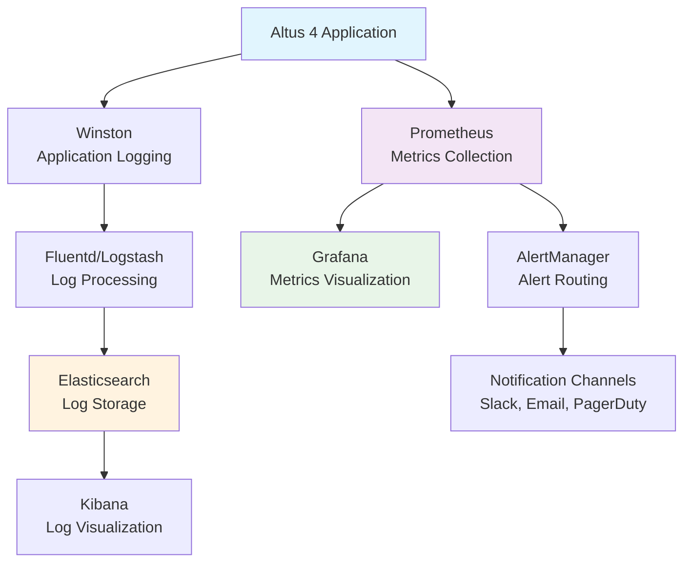

# Monitoring & Logging Guide

Comprehensive Observability and Monitoring Setup

This guide covers implementing comprehensive monitoring, logging, and alerting for Altus 4 in production environments. It includes metrics collection, log aggregation, performance monitoring, and proactive alerting strategies.

## Observability Architecture Overview

### Monitoring Stack



### Observability Components

| Component                  | Purpose                      | Technology        | Port  |
| -------------------------- | ---------------------------- | ----------------- | ----- |
| **Metrics Collection**     | Application & system metrics | Prometheus        | 9090  |
| **Metrics Visualization**  | Dashboards and graphs        | Grafana           | 3000  |
| **Log Aggregation**        | Centralized logging          | ELK Stack         | 9200  |
| **Application Monitoring** | APM and tracing              | Jaeger/Zipkin     | 16686 |
| **Alerting**               | Proactive notifications      | AlertManager      | 9093  |
| **Uptime Monitoring**      | External health checks       | Blackbox Exporter | 9115  |

## Application Metrics Integration

### Prometheus Metrics Setup

#### Custom Metrics Implementation

Create `src/utils/metrics.ts`:

```typescript
import client from 'prom-client';

// Create a Registry to register the metrics
const register = new client.Registry();

// Add default metrics
client.collectDefaultMetrics({ register });

// Custom metrics for Altus 4
export const httpRequestDuration = new client.Histogram({
  name: 'http_request_duration_seconds',
  help: 'Duration of HTTP requests in seconds',
  labelNames: ['method', 'route', 'status_code'],
  buckets: [0.1, 0.3, 0.5, 0.7, 1, 3, 5, 7, 10],
});

export const httpRequestsTotal = new client.Counter({
  name: 'http_requests_total',
  help: 'Total number of HTTP requests',
  labelNames: ['method', 'route', 'status_code'],
});

export const searchRequestsTotal = new client.Counter({
  name: 'search_requests_total',
  help: 'Total number of search requests',
  labelNames: ['search_mode', 'database_id', 'status'],
});

export const searchDuration = new client.Histogram({
  name: 'search_duration_seconds',
  help: 'Duration of search operations in seconds',
  labelNames: ['search_mode', 'database_id'],
  buckets: [0.1, 0.5, 1, 2, 5, 10, 30],
});

export const databaseConnectionsActive = new client.Gauge({
  name: 'database_connections_active',
  help: 'Number of active database connections',
  labelNames: ['database_id'],
});

export const databaseQueryDuration = new client.Histogram({
  name: 'database_query_duration_seconds',
  help: 'Duration of database queries in seconds',
  labelNames: ['database_id', 'query_type'],
  buckets: [0.01, 0.05, 0.1, 0.5, 1, 2, 5],
});

export const cacheHitRate = new client.Gauge({
  name: 'cache_hit_rate',
  help: 'Cache hit rate percentage',
  labelNames: ['cache_type'],
});

export const cacheOperations = new client.Counter({
  name: 'cache_operations_total',
  help: 'Total number of cache operations',
  labelNames: ['operation', 'cache_type', 'status'],
});

export const aiRequestsTotal = new client.Counter({
  name: 'ai_requests_total',
  help: 'Total number of AI service requests',
  labelNames: ['operation', 'model', 'status'],
});

export const aiRequestDuration = new client.Histogram({
  name: 'ai_request_duration_seconds',
  help: 'Duration of AI service requests in seconds',
  labelNames: ['operation', 'model'],
  buckets: [0.5, 1, 2, 5, 10, 30, 60],
});

export const userSessionsActive = new client.Gauge({
  name: 'user_sessions_active',
  help: 'Number of active user sessions',
});

export const apiKeyUsage = new client.Counter({
  name: 'api_key_usage_total',
  help: 'Total API key usage',
  labelNames: ['key_tier', 'endpoint', 'status'],
});

// Register all metrics
register.registerMetric(httpRequestDuration);
register.registerMetric(httpRequestsTotal);
register.registerMetric(searchRequestsTotal);
register.registerMetric(searchDuration);
register.registerMetric(databaseConnectionsActive);
register.registerMetric(databaseQueryDuration);
register.registerMetric(cacheHitRate);
register.registerMetric(cacheOperations);
register.registerMetric(aiRequestsTotal);
register.registerMetric(aiRequestDuration);
register.registerMetric(userSessionsActive);
register.registerMetric(apiKeyUsage);

export { register };
```

#### Metrics Middleware

Create `src/middleware/metrics.ts`:

```typescript
import { Request, Response, NextFunction } from 'express';
import { httpRequestDuration, httpRequestsTotal } from '../utils/metrics';

interface MetricsRequest extends Request {
  startTime?: number;
}

export const metricsMiddleware = (req: MetricsRequest, res: Response, next: NextFunction) => {
  req.startTime = Date.now();

  // Capture the end function
  const originalSend = res.send;

  res.send = function (data) {
    const duration = (Date.now() - (req.startTime || 0)) / 1000;
    const route = req.route ? req.route.path : req.path;

    // Record metrics
    httpRequestDuration.labels(req.method, route, res.statusCode.toString()).observe(duration);

    httpRequestsTotal.labels(req.method, route, res.statusCode.toString()).inc();

    return originalSend.call(this, data);
  };

  next();
};
```

#### Metrics Endpoint

Create `src/routes/metrics.ts`:

```typescript
import { Router } from 'express';
import { register } from '../utils/metrics';

const router = Router();

router.get('/metrics', async (req, res) => {
  try {
    res.set('Content-Type', register.contentType);
    res.end(await register.metrics());
  } catch (error) {
    res.status(500).end(error);
  }
});

export default router;
```

### Business Metrics Implementation

#### Search Metrics Integration

Update `src/services/SearchService.ts`:

```typescript
import { searchRequestsTotal, searchDuration } from '../utils/metrics';

export class SearchService {
  async search(query: SearchQuery): Promise<SearchResult[]> {
    const startTime = Date.now();
    const labels = {
      search_mode: query.mode,
      database_id: query.databases[0] || 'unknown',
    };

    try {
      const results = await this.performSearch(query);

      // Record success metrics
      searchRequestsTotal.labels(labels.search_mode, labels.database_id, 'success').inc();

      return results;
    } catch (error) {
      // Record failure metrics
      searchRequestsTotal.labels(labels.search_mode, labels.database_id, 'error').inc();
      throw error;
    } finally {
      // Record duration
      const duration = (Date.now() - startTime) / 1000;
      searchDuration.labels(labels.search_mode, labels.database_id).observe(duration);
    }
  }
}
```

## Prometheus Configuration

### Prometheus Setup

Create `config/prometheus/prometheus.yml`:

```yaml
global:
  scrape_interval: 15s
  evaluation_interval: 15s
  external_labels:
    cluster: 'altus4-production'
    replica: 'prometheus-1'

rule_files:
  - 'rules/*.yml'

scrape_configs:
  # Altus 4 application metrics
  - job_name: 'altus4-app'
    static_configs:
      - targets: ['localhost:3000']
    metrics_path: '/metrics'
    scrape_interval: 30s
    scrape_timeout: 10s
    honor_labels: true

  # Node exporter for system metrics
  - job_name: 'node-exporter'
    static_configs:
      - targets: ['localhost:9100']
    scrape_interval: 30s

  # MySQL exporter
  - job_name: 'mysql-exporter'
    static_configs:
      - targets: ['localhost:9104']
    scrape_interval: 30s

  # Redis exporter
  - job_name: 'redis-exporter'
    static_configs:
      - targets: ['localhost:9121']
    scrape_interval: 30s

  # NGINX exporter
  - job_name: 'nginx-exporter'
    static_configs:
      - targets: ['localhost:9113']
    scrape_interval: 30s

  # Blackbox exporter for endpoint monitoring
  - job_name: 'blackbox'
    metrics_path: /probe
    params:
      module: [http_2xx]
    static_configs:
      - targets:
          - https://api.yourdomain.com/health
          - https://api.yourdomain.com/api/search
    relabel_configs:
      - source_labels: [__address__]
        target_label: __param_target
      - source_labels: [__param_target]
        target_label: instance
      - target_label: __address__
        replacement: localhost:9115

alerting:
  alertmanagers:
    - static_configs:
        - targets:
            - localhost:9093

storage:
  tsdb:
    retention.time: 30d
    retention.size: 50GB
    wal-compression: true
```

### Alert Rules Configuration

Create `config/prometheus/rules/altus4-alerts.yml`:

```yaml
groups:
  - name: altus4-application
    interval: 30s
    rules:
      # High error rate
      - alert: HighErrorRate
        expr: (rate(http_requests_total{status_code=~"5.."}[5m]) / rate(http_requests_total[5m])) > 0.05
        for: 2m
        labels:
          severity: warning
          service: altus4
        annotations:
          summary: 'High error rate detected'
          description: 'Error rate is {{ $value | humanizePercentage }} for {{ $labels.instance }}'

      # High response time
      - alert: HighResponseTime
        expr: histogram_quantile(0.95, rate(http_request_duration_seconds_bucket[5m])) > 2
        for: 2m
        labels:
          severity: warning
          service: altus4
        annotations:
          summary: 'High response time detected'
          description: '95th percentile response time is {{ $value }}s for {{ $labels.instance }}'

      # Search service down
      - alert: SearchServiceDown
        expr: up{job="altus4-app"} == 0
        for: 1m
        labels:
          severity: critical
          service: altus4
        annotations:
          summary: 'Altus 4 application is down'
          description: 'The Altus 4 application has been down for more than 1 minute'

      # Database connection issues
      - alert: DatabaseConnectionHigh
        expr: database_connections_active > 80
        for: 5m
        labels:
          severity: warning
          service: database
        annotations:
          summary: 'High database connection usage'
          description: 'Database connection usage is {{ $value }} for {{ $labels.database_id }}'

      # Search performance degradation
      - alert: SearchPerformanceDegradation
        expr: histogram_quantile(0.95, rate(search_duration_seconds_bucket[10m])) > 10
        for: 5m
        labels:
          severity: warning
          service: search
        annotations:
          summary: 'Search performance degradation'
          description: '95th percentile search time is {{ $value }}s for {{ $labels.search_mode }}'

      # AI service issues
      - alert: AIServiceHighFailureRate
        expr: (rate(ai_requests_total{status="error"}[5m]) / rate(ai_requests_total[5m])) > 0.1
        for: 3m
        labels:
          severity: warning
          service: ai
        annotations:
          summary: 'AI service high failure rate'
          description: 'AI service failure rate is {{ $value | humanizePercentage }}'

      # Cache hit rate low
      - alert: CacheHitRateLow
        expr: cache_hit_rate < 0.5
        for: 5m
        labels:
          severity: warning
          service: cache
        annotations:
          summary: 'Low cache hit rate'
          description: 'Cache hit rate is {{ $value | humanizePercentage }} for {{ $labels.cache_type }}'

  - name: altus4-infrastructure
    interval: 30s
    rules:
      # High CPU usage
      - alert: HighCPUUsage
        expr: (100 - (avg by (instance) (rate(node_cpu_seconds_total{mode="idle"}[5m])) * 100)) > 80
        for: 5m
        labels:
          severity: warning
          service: infrastructure
        annotations:
          summary: 'High CPU usage'
          description: 'CPU usage is {{ $value }}% on {{ $labels.instance }}'

      # High memory usage
      - alert: HighMemoryUsage
        expr: (node_memory_MemTotal_bytes - node_memory_MemAvailable_bytes) / node_memory_MemTotal_bytes > 0.85
        for: 5m
        labels:
          severity: warning
          service: infrastructure
        annotations:
          summary: 'High memory usage'
          description: 'Memory usage is {{ $value | humanizePercentage }} on {{ $labels.instance }}'

      # Disk space low
      - alert: DiskSpaceLow
        expr: (node_filesystem_avail_bytes{fstype!~"tmpfs|fuse.lxcfs"} / node_filesystem_size_bytes{fstype!~"tmpfs|fuse.lxcfs"}) < 0.1
        for: 5m
        labels:
          severity: critical
          service: infrastructure
        annotations:
          summary: 'Low disk space'
          description: 'Disk space is {{ $value | humanizePercentage }} available on {{ $labels.instance }}'
```

## AlertManager Configuration

### AlertManager Setup

Create `config/alertmanager/alertmanager.yml`:

```yaml
global:
  smtp_smarthost: 'smtp.gmail.com:587'
  smtp_from: 'alerts@yourdomain.com'
  smtp_auth_username: 'alerts@yourdomain.com'
  smtp_auth_password: 'your-app-password'

route:
  group_by: ['alertname', 'cluster', 'service']
  group_wait: 10s
  group_interval: 10s
  repeat_interval: 12h
  receiver: 'web.hook.default'
  routes:
    # Critical alerts go to PagerDuty
    - match:
        severity: critical
      receiver: 'pagerduty'
      continue: true

    # Application alerts go to Slack
    - match:
        service: altus4
      receiver: 'slack-altus4'
      continue: true

    # Infrastructure alerts go to ops team
    - match:
        service: infrastructure
      receiver: 'ops-team'

receivers:
  - name: 'web.hook.default'
    webhook_configs:
      - url: 'http://localhost:5001/webhook'
        send_resolved: true

  - name: 'slack-altus4'
    slack_configs:
      - api_url: 'https://hooks.slack.com/services/YOUR/SLACK/WEBHOOK'
        channel: '#altus4-alerts'
        title: 'Altus 4 Alert'
        text: |
          {{ range .Alerts }}
          *Alert:* {{ .Annotations.summary }}
          *Description:* {{ .Annotations.description }}
          *Severity:* {{ .Labels.severity }}
          *Instance:* {{ .Labels.instance }}
          {{ end }}
        send_resolved: true

  - name: 'pagerduty'
    pagerduty_configs:
      - routing_key: 'your-pagerduty-integration-key'
        description: '{{ .GroupLabels.alertname }} - {{ .GroupLabels.cluster }}'
        severity: '{{ .CommonLabels.severity }}'

  - name: 'ops-team'
    email_configs:
      - to: 'ops-team@yourdomain.com'
        subject: '[ALERT] {{ .GroupLabels.alertname }}'
        body: |
          {{ range .Alerts }}
          Alert: {{ .Annotations.summary }}
          Description: {{ .Annotations.description }}
          Instance: {{ .Labels.instance }}
          Severity: {{ .Labels.severity }}
          {{ end }}
        send_resolved: true

inhibit_rules:
  - source_match:
      severity: 'critical'
    target_match:
      severity: 'warning'
    equal: ['alertname', 'cluster', 'service']
```

## Grafana Dashboards

### Main Application Dashboard

Create `config/grafana/dashboards/altus4-overview.json`:

```json
{
  "dashboard": {
    "id": null,
    "title": "Altus 4 Overview",
    "tags": ["altus4", "overview"],
    "timezone": "UTC",
    "panels": [
      {
        "id": 1,
        "title": "Request Rate",
        "type": "stat",
        "targets": [
          {
            "expr": "sum(rate(http_requests_total[5m]))",
            "legendFormat": "Requests/sec"
          }
        ],
        "fieldConfig": {
          "defaults": {
            "unit": "reqps"
          }
        }
      },
      {
        "id": 2,
        "title": "Response Time (95th percentile)",
        "type": "stat",
        "targets": [
          {
            "expr": "histogram_quantile(0.95, sum(rate(http_request_duration_seconds_bucket[5m])) by (le))",
            "legendFormat": "Response Time"
          }
        ],
        "fieldConfig": {
          "defaults": {
            "unit": "s"
          }
        }
      },
      {
        "id": 3,
        "title": "Error Rate",
        "type": "stat",
        "targets": [
          {
            "expr": "sum(rate(http_requests_total{status_code=~\"5..\"}[5m])) / sum(rate(http_requests_total[5m]))",
            "legendFormat": "Error Rate"
          }
        ],
        "fieldConfig": {
          "defaults": {
            "unit": "percentunit",
            "max": 1,
            "min": 0
          }
        }
      },
      {
        "id": 4,
        "title": "Request Volume",
        "type": "graph",
        "targets": [
          {
            "expr": "sum by (status_code) (rate(http_requests_total[5m]))",
            "legendFormat": "Status {{status_code}}"
          }
        ],
        "xAxis": {
          "show": true
        },
        "yAxes": [
          {
            "label": "Requests/sec",
            "min": 0
          }
        ]
      },
      {
        "id": 5,
        "title": "Search Performance",
        "type": "graph",
        "targets": [
          {
            "expr": "histogram_quantile(0.50, sum(rate(search_duration_seconds_bucket[5m])) by (le, search_mode))",
            "legendFormat": "{{search_mode}} - 50th"
          },
          {
            "expr": "histogram_quantile(0.95, sum(rate(search_duration_seconds_bucket[5m])) by (le, search_mode))",
            "legendFormat": "{{search_mode}} - 95th"
          }
        ],
        "yAxes": [
          {
            "label": "Duration (s)",
            "min": 0
          }
        ]
      },
      {
        "id": 6,
        "title": "Database Connections",
        "type": "graph",
        "targets": [
          {
            "expr": "database_connections_active",
            "legendFormat": "{{database_id}}"
          }
        ]
      }
    ],
    "time": {
      "from": "now-1h",
      "to": "now"
    },
    "refresh": "30s"
  }
}
```

## Structured Logging Implementation

### Winston Logger Configuration

Create `src/utils/logger.ts`:

```typescript
import winston from 'winston';
import path from 'path';

// Define log levels
const levels = {
  error: 0,
  warn: 1,
  info: 2,
  http: 3,
  debug: 4,
};

// Define colors for each level
const colors = {
  error: 'red',
  warn: 'yellow',
  info: 'green',
  http: 'magenta',
  debug: 'white',
};

winston.addColors(colors);

// Custom format for structured logging
const logFormat = winston.format.combine(
  winston.format.timestamp({ format: 'YYYY-MM-DD HH:mm:ss:ms' }),
  winston.format.errors({ stack: true }),
  winston.format.json(),
  winston.format.printf(info => {
    const { timestamp, level, message, ...extra } = info;

    const logObject = {
      timestamp,
      level,
      message,
      service: 'altus4',
      environment: process.env.NODE_ENV || 'development',
      ...extra,
    };

    // Add request ID if available
    if (info.requestId) {
      logObject.requestId = info.requestId;
    }

    // Add user ID if available
    if (info.userId) {
      logObject.userId = info.userId;
    }

    return JSON.stringify(logObject);
  })
);

// Create transports array
const transports = [
  // Console transport for development
  new winston.transports.Console({
    format: winston.format.combine(winston.format.colorize(), winston.format.simple()),
  }),

  // File transport for all logs
  new winston.transports.File({
    filename: path.join(process.cwd(), 'logs', 'combined.log'),
    format: logFormat,
  }),

  // Separate file for errors
  new winston.transports.File({
    filename: path.join(process.cwd(), 'logs', 'error.log'),
    level: 'error',
    format: logFormat,
  }),
];

// Add HTTP transport for centralized logging in production
if (process.env.NODE_ENV === 'production' && process.env.LOG_HTTP_URL) {
  transports.push(
    new winston.transports.Http({
      host: process.env.LOG_HTTP_HOST,
      port: parseInt(process.env.LOG_HTTP_PORT || '80'),
      path: process.env.LOG_HTTP_PATH || '/logs',
      format: logFormat,
    })
  );
}

// Create logger instance
const logger = winston.createLogger({
  level: process.env.LOG_LEVEL || 'info',
  levels,
  format: logFormat,
  transports,
  exitOnError: false,
});

// Add request context middleware
export const addRequestContext = (req: any, res: any, next: any) => {
  req.requestId =
    req.headers['x-request-id'] || `req_${Date.now()}_${Math.random().toString(36).substr(2, 9)}`;

  // Add request ID to response headers
  res.setHeader('X-Request-ID', req.requestId);

  next();
};

// Logger with context
export const createContextLogger = (context: Record<string, any>) => {
  return {
    error: (message: string, meta?: any) => logger.error(message, { ...context, ...meta }),
    warn: (message: string, meta?: any) => logger.warn(message, { ...context, ...meta }),
    info: (message: string, meta?: any) => logger.info(message, { ...context, ...meta }),
    http: (message: string, meta?: any) => logger.http(message, { ...context, ...meta }),
    debug: (message: string, meta?: any) => logger.debug(message, { ...context, ...meta }),
  };
};

export default logger;
```

### Request Logging Middleware

Create `src/middleware/requestLogger.ts`:

```typescript
import { Request, Response, NextFunction } from 'express';
import { createContextLogger } from '../utils/logger';

interface LoggedRequest extends Request {
  requestId?: string;
  startTime?: number;
  logger?: any;
}

export const requestLoggingMiddleware = (req: LoggedRequest, res: Response, next: NextFunction) => {
  req.startTime = Date.now();

  // Create request-specific logger
  req.logger = createContextLogger({
    requestId: req.requestId,
    method: req.method,
    url: req.url,
    userAgent: req.get('User-Agent'),
    ip: req.ip,
  });

  // Log incoming request
  req.logger.http('Incoming request', {
    method: req.method,
    url: req.url,
    headers: req.headers,
    query: req.query,
    body: req.body,
  });

  // Capture response
  const originalSend = res.send;
  res.send = function (data) {
    const duration = Date.now() - (req.startTime || 0);

    req.logger.http('Request completed', {
      statusCode: res.statusCode,
      duration,
      responseSize: Buffer.byteLength(data),
    });

    return originalSend.call(this, data);
  };

  next();
};
```

## ELK Stack Setup

### Elasticsearch Configuration

Create `config/elasticsearch/elasticsearch.yml`:

```yaml
cluster.name: altus4-logs
node.name: elasticsearch-1

path.data: /var/lib/elasticsearch
path.logs: /var/log/elasticsearch

network.host: 0.0.0.0
http.port: 9200

discovery.type: single-node

# Security settings
xpack.security.enabled: true
xpack.security.transport.ssl.enabled: true

# Memory settings
bootstrap.memory_lock: true

# Index settings
action.auto_create_index: true
indices.fielddata.cache.size: 40%
indices.memory.index_buffer_size: 10%
```

### Logstash Configuration

Create `config/logstash/logstash.conf`:

```ruby
input {
  beats {
    port => 5044
  }

  http {
    port => 8080
    codec => json
  }
}

filter {
  if [fields][service] == "altus4" {
    # Parse JSON log messages
    if [message] =~ /^\{.*\}$/ {
      json {
        source => "message"
      }
    }

    # Extract timestamp
    if [timestamp] {
      date {
        match => [ "timestamp", "yyyy-MM-dd HH:mm:ss:SSS" ]
        target => "@timestamp"
      }
    }

    # Add tags for different log types
    if [level] == "error" {
      mutate {
        add_tag => [ "error", "alert" ]
      }
    }

    if [message] =~ /search/ {
      mutate {
        add_tag => [ "search" ]
      }
    }

    if [message] =~ /database/ {
      mutate {
        add_tag => [ "database" ]
      }
    }
  }
}

output {
  elasticsearch {
    hosts => ["localhost:9200"]
    index => "altus4-logs-%{+YYYY.MM.dd}"
    template_name => "altus4"
    template_pattern => "altus4-*"
    template => "/usr/share/logstash/templates/altus4-template.json"
  }

  # Output to stdout for debugging
  stdout {
    codec => rubydebug
  }
}
```

### Filebeat Configuration

Create `config/filebeat/filebeat.yml`:

```yaml
filebeat.inputs:
  - type: log
    enabled: true
    paths:
      - /var/log/altus4/*.log
    fields:
      service: altus4
      environment: production
    fields_under_root: true
    multiline.pattern: '^{'
    multiline.negate: true
    multiline.match: after

  - type: log
    enabled: true
    paths:
      - /var/log/nginx/*.log
    fields:
      service: nginx
      logtype: access
    fields_under_root: true

output.logstash:
  hosts: ['localhost:5044']

processors:
  - add_host_metadata:
      when.not.contains.tags: forwarded
  - add_docker_metadata: ~
  - add_kubernetes_metadata: ~

logging.level: info
logging.to_files: true
logging.files:
  path: /var/log/filebeat
  name: filebeat
  keepfiles: 7
  permissions: 0644
```

## Health Check Implementation

### Comprehensive Health Checks

Create `src/routes/health.ts`:

```typescript
import { Router } from 'express';
import { DatabaseService } from '../services/DatabaseService';
import { CacheService } from '../services/CacheService';
import { AIService } from '../services/AIService';

const router = Router();

// Basic health check
router.get('/health', async (req, res) => {
  res.status(200).json({
    status: 'healthy',
    timestamp: new Date().toISOString(),
    uptime: process.uptime(),
    version: process.env.npm_package_version || '1.0.0',
  });
});

// Detailed health check
router.get('/health/detailed', async (req, res) => {
  const health = {
    status: 'healthy',
    timestamp: new Date().toISOString(),
    uptime: process.uptime(),
    version: process.env.npm_package_version || '1.0.0',
    checks: {},
  };

  // Database health check
  try {
    const dbHealth = await DatabaseService.healthCheck();
    health.checks.database = {
      status: dbHealth.status,
      responseTime: dbHealth.responseTime,
      details: dbHealth.details,
    };
  } catch (error) {
    health.checks.database = {
      status: 'unhealthy',
      error: error.message,
    };
    health.status = 'degraded';
  }

  // Cache health check
  try {
    const cacheHealth = await CacheService.healthCheck();
    health.checks.cache = {
      status: cacheHealth.status,
      responseTime: cacheHealth.responseTime,
    };
  } catch (error) {
    health.checks.cache = {
      status: 'unhealthy',
      error: error.message,
    };
    health.status = 'degraded';
  }

  // AI service health check
  try {
    const aiHealth = await AIService.healthCheck();
    health.checks.ai = {
      status: aiHealth.status,
      responseTime: aiHealth.responseTime,
    };
  } catch (error) {
    health.checks.ai = {
      status: 'unhealthy',
      error: error.message,
    };
    health.status = 'degraded';
  }

  const statusCode = health.status === 'healthy' ? 200 : 503;
  res.status(statusCode).json(health);
});

export default router;
```

## Performance Monitoring

### APM Integration with Jaeger

```typescript
// src/utils/tracing.ts
import { NodeSDK } from '@opentelemetry/sdk-node';
import { getNodeAutoInstrumentations } from '@opentelemetry/auto-instrumentations-node';
import { JaegerExporter } from '@opentelemetry/exporter-jaeger';

const jaegerExporter = new JaegerExporter({
  endpoint: process.env.JAEGER_ENDPOINT || 'http://localhost:14268/api/traces',
});

const sdk = new NodeSDK({
  traceExporter: jaegerExporter,
  instrumentations: [getNodeAutoInstrumentations()],
});

sdk.start();
```

## Monitoring Deployment Scripts

### Complete Monitoring Stack Deployment

Create `scripts/deploy-monitoring.sh`:

```bash
#!/bin/bash
set -e

echo "Deploying Altus 4 monitoring stack..."

# Create directories
sudo mkdir -p /opt/monitoring/{prometheus,grafana,alertmanager,elasticsearch,logstash,kibana}
sudo mkdir -p /var/log/{prometheus,grafana,alertmanager}

# Deploy Prometheus
echo "Setting up Prometheus..."
sudo useradd --no-create-home --shell /bin/false prometheus
sudo cp config/prometheus/prometheus.yml /opt/monitoring/prometheus/
sudo cp -r config/prometheus/rules /opt/monitoring/prometheus/
sudo chown -R prometheus:prometheus /opt/monitoring/prometheus
sudo chown -R prometheus:prometheus /var/log/prometheus

# Deploy Grafana
echo "Setting up Grafana..."
sudo cp -r config/grafana/* /opt/monitoring/grafana/
sudo chown -R grafana:grafana /opt/monitoring/grafana

# Deploy AlertManager
echo "Setting up AlertManager..."
sudo cp config/alertmanager/alertmanager.yml /opt/monitoring/alertmanager/
sudo chown -R prometheus:prometheus /opt/monitoring/alertmanager

# Start services
echo "Starting monitoring services..."
sudo systemctl enable --now prometheus
sudo systemctl enable --now grafana-server
sudo systemctl enable --now alertmanager

echo "✅ Monitoring stack deployed successfully!"
```

This comprehensive monitoring and logging guide provides enterprise-grade observability for Altus 4, ensuring you can monitor performance, track issues, and maintain system health proactively.
