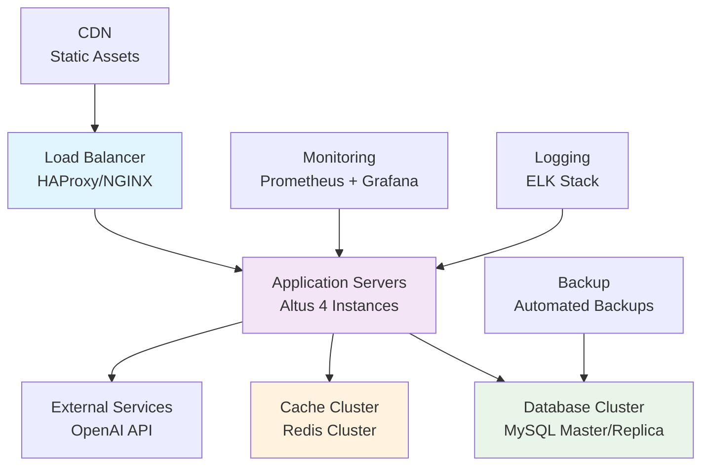

# Production Deployment Guide

Comprehensive Production Deployment Documentation

This guide covers deploying Altus 4 in production environments with enterprise-grade security, performance optimization, and reliability measures. It includes infrastructure setup, configuration management, security hardening, and operational procedures.

## Production Architecture Overview

### Recommended Architecture



### Infrastructure Components

| Component              | Purpose              | Minimum Specs   | Recommended Specs |
| ---------------------- | -------------------- | --------------- | ----------------- |
| **Application Server** | Altus 4 API          | 2 vCPU, 4GB RAM | 4 vCPU, 8GB RAM   |
| **Database Server**    | MySQL Primary        | 2 vCPU, 8GB RAM | 4 vCPU, 16GB RAM  |
| **Cache Server**       | Redis Cluster        | 2 vCPU, 4GB RAM | 4 vCPU, 8GB RAM   |
| **Load Balancer**      | Traffic Distribution | 1 vCPU, 2GB RAM | 2 vCPU, 4GB RAM   |

## Pre-Production Checklist

### Infrastructure Requirements

- [ ] **Compute Resources**: Adequate CPU, memory, and storage
- [ ] **Network Security**: Firewall rules, VPC configuration
- [ ] **Domain Setup**: SSL certificates, DNS configuration
- [ ] **External Services**: OpenAI API access, third-party integrations
- [ ] **Backup Strategy**: Database and configuration backups
- [ ] **Monitoring**: Logging, metrics, alerting setup

### Security Requirements

- [ ] **SSL/TLS Certificates**: Valid certificates for all domains
- [ ] **Database Security**: Encrypted connections, strong passwords
- [ ] **API Security**: Rate limiting, authentication verification
- [ ] **Network Security**: Firewall rules, VPN access
- [ ] **Secrets Management**: Secure environment variable storage
- [ ] **Access Control**: SSH keys, user permissions

## Environment Setup

### System Preparation

#### Operating System Configuration

**Ubuntu 20.04/22.04 LTS (Recommended):**

```bash
# Update system packages
sudo apt update && sudo apt upgrade -y

# Install essential packages
sudo apt install -y curl wget git build-essential

# Configure timezone
sudo timedatectl set-timezone UTC

# Configure limits for high-performance applications
sudo tee /etc/security/limits.d/altus4.conf << EOF
altus4 soft nofile 65536
altus4 hard nofile 65536
altus4 soft nproc 4096
altus4 hard nproc 4096
EOF

# Configure kernel parameters
sudo tee -a /etc/sysctl.conf << EOF
# Network optimizations
net.core.somaxconn = 1024
net.ipv4.tcp_max_syn_backlog = 2048
net.ipv4.ip_local_port_range = 10000 65000

# Memory optimizations
vm.swappiness = 10
vm.dirty_ratio = 60
vm.dirty_background_ratio = 2
EOF

sudo sysctl -p
```

#### Node.js Installation (Production Version)

```bash
# Install Node.js 20 LTS via NodeSource
curl -fsSL https://deb.nodesource.com/setup_20.x | sudo -E bash -
sudo apt-get install -y nodejs

# Verify installation
node --version  # Should be v20.x.x
npm --version   # Should be 10.x.x

# Install PM2 process manager globally
sudo npm install -g pm2

# Setup PM2 startup script
pm2 startup
sudo env PATH=$PATH:/usr/bin pm2 startup systemd -u altus4 --hp /home/altus4
```

### Database Setup (Production MySQL)

#### MySQL Installation and Configuration

```bash
# Install MySQL 8.0
sudo apt update
sudo apt install mysql-server-8.0 -y

# Secure MySQL installation
sudo mysql_secure_installation
```

**MySQL Configuration (`/etc/mysql/mysql.conf.d/mysqld.cnf`):**

```ini
[mysqld]
# Basic settings
bind-address = 0.0.0.0
port = 3306
server-id = 1

# Character set
character-set-server = utf8mb4
collation-server = utf8mb4_unicode_ci

# Performance optimizations
innodb_buffer_pool_size = 2G          # 70% of available RAM
innodb_log_file_size = 512M
innodb_flush_log_at_trx_commit = 2
innodb_flush_method = O_DIRECT

# Connection settings
max_connections = 500
thread_cache_size = 16
table_open_cache = 2000

# Full-text search optimizations
ft_min_word_len = 2
innodb_ft_min_token_size = 2
innodb_ft_max_token_size = 84
innodb_ft_sort_pll_degree = 6

# Binary logging (for replication)
log-bin = mysql-bin
binlog_format = ROW
expire_logs_days = 7

# Slow query logging
slow_query_log = 1
slow_query_log_file = /var/log/mysql/slow.log
long_query_time = 2

# Error logging
log-error = /var/log/mysql/error.log

# SSL Configuration
ssl-ca = /etc/mysql/ssl/ca-cert.pem
ssl-cert = /etc/mysql/ssl/server-cert.pem
ssl-key = /etc/mysql/ssl/server-key.pem
```

#### Database User and Schema Setup

```sql
-- Connect as root
mysql -u root -p

-- Create production database
CREATE DATABASE altus4_production CHARACTER SET utf8mb4 COLLATE utf8mb4_unicode_ci;

-- Create application user with restricted permissions
CREATE USER 'altus4_prod'@'%' IDENTIFIED BY 'STRONG_RANDOM_PASSWORD';
GRANT SELECT, INSERT, UPDATE, DELETE, CREATE, ALTER, INDEX, REFERENCES ON altus4_production.* TO 'altus4_prod'@'%';
FLUSH PRIVILEGES;

-- Create read-only user for analytics/reporting
CREATE USER 'altus4_read'@'%' IDENTIFIED BY 'READ_ONLY_PASSWORD';
GRANT SELECT ON altus4_production.* TO 'altus4_read'@'%';
FLUSH PRIVILEGES;

-- Verify users
SELECT User, Host FROM mysql.user WHERE User LIKE 'altus4_%';
```

### Redis Setup (Production Cache)

#### Redis Installation and Configuration

```bash
# Install Redis
sudo apt install redis-server -y

# Configure Redis for production
sudo tee /etc/redis/redis.conf << EOF
# Network
bind 0.0.0.0
port 6379
protected-mode yes
requireauth YOUR_STRONG_REDIS_PASSWORD

# Memory management
maxmemory 2gb
maxmemory-policy allkeys-lru

# Persistence
save 900 1
save 300 10
save 60 10000
rdbcompression yes
rdbchecksum yes

# Logging
loglevel notice
logfile /var/log/redis/redis-server.log

# Performance
tcp-keepalive 300
timeout 300
databases 16

# Security
rename-command FLUSHDB ""
rename-command FLUSHALL ""
rename-command DEBUG ""
rename-command CONFIG "CONFIG_b835729c1f924ac2"
EOF

# Start and enable Redis
sudo systemctl start redis-server
sudo systemctl enable redis-server

# Test Redis connection
redis-cli -a YOUR_STRONG_REDIS_PASSWORD ping
```

## Application Deployment

### Code Deployment Strategy

#### Option 1: Direct Deployment

```bash
# Create application user
sudo useradd -m -s /bin/bash altus4
sudo mkdir -p /opt/altus4
sudo chown altus4:altus4 /opt/altus4

# Switch to application user
sudo -u altus4 -i

# Clone repository
cd /opt/altus4
git clone https://github.com/your-org/altus4.git .
git checkout main

# Install dependencies
npm ci --only=production

# Build application
npm run build
```

#### Option 2: Blue-Green Deployment

```bash
#!/bin/bash
# Blue-Green deployment script

DEPLOY_DIR="/opt/altus4"
CURRENT_DIR="$DEPLOY_DIR/current"
NEW_VERSION_DIR="$DEPLOY_DIR/releases/$(date +%Y%m%d%H%M%S)"
BACKUP_DIR="$DEPLOY_DIR/backup"

# Create new version directory
mkdir -p "$NEW_VERSION_DIR"

# Clone and build new version
cd "$NEW_VERSION_DIR"
git clone https://github.com/your-org/altus4.git .
git checkout "$1"  # Version tag or commit hash

npm ci --only=production
npm run build
npm test

# Run database migrations
npm run migrate

# Backup current version
if [ -d "$CURRENT_DIR" ]; then
    cp -r "$CURRENT_DIR" "$BACKUP_DIR/$(date +%Y%m%d%H%M%S)"
fi

# Switch to new version
ln -sfn "$NEW_VERSION_DIR" "$CURRENT_DIR"

# Restart application
pm2 restart altus4

# Health check
sleep 10
if curl -f http://localhost:3000/health; then
    echo "Deployment successful"
else
    echo "Deployment failed, rolling back"
    ln -sfn "$BACKUP_DIR/$(ls -t $BACKUP_DIR | head -1)" "$CURRENT_DIR"
    pm2 restart altus4
    exit 1
fi

# Cleanup old releases (keep last 5)
cd "$DEPLOY_DIR/releases"
ls -t | tail -n +6 | xargs rm -rf
```

### Environment Configuration

#### Production Environment Variables

Create `/opt/altus4/.env.production`:

```bash
# Application
NODE_ENV=production
PORT=3000
LOG_LEVEL=info

# Database
DB_HOST=your-mysql-server.com
DB_PORT=3306
DB_USERNAME=altus4_prod
DB_PASSWORD=YOUR_STRONG_DB_PASSWORD
DB_DATABASE=altus4_production
DB_SSL=true

# Redis
REDIS_HOST=your-redis-server.com
REDIS_PORT=6379
REDIS_PASSWORD=YOUR_STRONG_REDIS_PASSWORD
REDIS_TLS=true

# Security
JWT_SECRET=your_64_character_jwt_secret_for_legacy_endpoints_only
ENCRYPTION_KEY=your_32_character_encryption_key_here
BCRYPT_ROUNDS=12

# OpenAI
OPENAI_API_KEY=sk-your_production_openai_api_key
OPENAI_MODEL=gpt-3.5-turbo
OPENAI_MAX_TOKENS=2000

# Rate Limiting
RATE_LIMIT_WINDOW_MS=3600000
RATE_LIMIT_MAX_REQUESTS=1000

# Monitoring
ENABLE_METRICS=true
METRICS_PORT=9090
ENABLE_HEALTH_CHECK=true

# External Services
WEBHOOK_SECRET=your_webhook_secret
CORS_ORIGINS=https://your-domain.com,https://app.your-domain.com

# Performance
CLUSTER_WORKERS=0  # 0 = auto-detect CPU cores
MAX_REQUEST_SIZE=10mb
REQUEST_TIMEOUT=30000

# Logging
LOG_FORMAT=json
LOG_FILE=/var/log/altus4/app.log
ERROR_LOG_FILE=/var/log/altus4/error.log
```

#### Secure Environment Management

```bash
# Set proper file permissions
sudo chmod 600 /opt/altus4/.env.production
sudo chown altus4:altus4 /opt/altus4/.env.production

# Create logging directory
sudo mkdir -p /var/log/altus4
sudo chown altus4:altus4 /var/log/altus4

# Setup log rotation
sudo tee /etc/logrotate.d/altus4 << EOF
/var/log/altus4/*.log {
    daily
    missingok
    rotate 52
    compress
    delaycompress
    notifempty
    create 644 altus4 altus4
    postrotate
        pm2 reloadLogs
    endscript
}
EOF
```

### Process Management with PM2

#### PM2 Configuration

Create `/opt/altus4/ecosystem.config.js`:

```javascript
module.exports = {
  apps: [
    {
      name: 'altus4',
      script: 'dist/index.js',
      cwd: '/opt/altus4/current',
      instances: 'max',
      exec_mode: 'cluster',
      env: {
        NODE_ENV: 'production',
        PORT: 3000,
      },
      env_file: '/opt/altus4/.env.production',

      // Memory and CPU limits
      max_memory_restart: '1G',
      node_args: '--max-old-space-size=1024',

      // Logging
      out_file: '/var/log/altus4/app.log',
      error_file: '/var/log/altus4/error.log',
      log_file: '/var/log/altus4/combined.log',
      time: true,

      // Restart behavior
      watch: false,
      ignore_watch: ['node_modules', 'logs'],
      max_restarts: 10,
      min_uptime: '10s',

      // Health monitoring
      health_check_grace_period: 3000,
      health_check_fatal_exceptions: true,
    },
  ],
};
```

#### PM2 Process Management

```bash
# Start application
pm2 start ecosystem.config.js --env production

# Check status
pm2 status
pm2 logs altus4
pm2 monit

# Application management
pm2 restart altus4
pm2 reload altus4    # Zero-downtime restart
pm2 stop altus4
pm2 delete altus4

# Save PM2 configuration
pm2 save

# Monitor resources
pm2 monit
```

## Load Balancer Configuration

### NGINX Configuration

Create `/etc/nginx/sites-available/altus4`:

```nginx
# Rate limiting
limit_req_zone $binary_remote_addr zone=altus4_api:10m rate=100r/m;
limit_req_zone $binary_remote_addr zone=altus4_auth:10m rate=10r/m;

# Upstream servers
upstream altus4_backend {
    least_conn;
    server 127.0.0.1:3000 max_fails=3 fail_timeout=30s;
    server 127.0.0.1:3001 max_fails=3 fail_timeout=30s backup;
    keepalive 32;
}

server {
    listen 80;
    server_name api.yourdomain.com;
    return 301 https://$server_name$request_uri;
}

server {
    listen 443 ssl http2;
    server_name api.yourdomain.com;

    # SSL configuration
    ssl_certificate /path/to/ssl/certificate.pem;
    ssl_certificate_key /path/to/ssl/private.key;
    ssl_protocols TLSv1.2 TLSv1.3;
    ssl_ciphers ECDHE-RSA-AES256-GCM-SHA512:DHE-RSA-AES256-GCM-SHA512:ECDHE-RSA-AES256-GCM-SHA384:DHE-RSA-AES256-GCM-SHA384;
    ssl_prefer_server_ciphers off;
    ssl_session_cache shared:SSL:10m;
    ssl_session_timeout 10m;

    # Security headers
    add_header X-Frame-Options DENY;
    add_header X-Content-Type-Options nosniff;
    add_header X-XSS-Protection "1; mode=block";
    add_header Strict-Transport-Security "max-age=31536000; includeSubDomains" always;

    # Gzip compression
    gzip on;
    gzip_vary on;
    gzip_min_length 1024;
    gzip_types application/json application/javascript text/css text/javascript text/plain text/xml;

    # Request size limits
    client_max_body_size 10M;
    client_body_buffer_size 128k;

    # Timeouts
    proxy_connect_timeout 5s;
    proxy_send_timeout 60s;
    proxy_read_timeout 60s;

    # Health check endpoint (no rate limiting)
    location /health {
        access_log off;
        proxy_pass http://altus4_backend;
        proxy_set_header Host $host;
        proxy_set_header X-Real-IP $remote_addr;
        proxy_set_header X-Forwarded-For $proxy_add_x_forwarded_for;
        proxy_set_header X-Forwarded-Proto $scheme;
    }

    # Authentication endpoints (strict rate limiting)
    location ~ ^/api/auth/(login|register) {
        limit_req zone=altus4_auth burst=5 nodelay;
        limit_req_status 429;

        proxy_pass http://altus4_backend;
        proxy_set_header Host $host;
        proxy_set_header X-Real-IP $remote_addr;
        proxy_set_header X-Forwarded-For $proxy_add_x_forwarded_for;
        proxy_set_header X-Forwarded-Proto $scheme;

        # Authentication-specific headers
        proxy_set_header X-Request-ID $request_id;
    }

    # API endpoints (moderate rate limiting)
    location /api/ {
        limit_req zone=altus4_api burst=20 nodelay;
        limit_req_status 429;

        proxy_pass http://altus4_backend;
        proxy_set_header Host $host;
        proxy_set_header X-Real-IP $remote_addr;
        proxy_set_header X-Forwarded-For $proxy_add_x_forwarded_for;
        proxy_set_header X-Forwarded-Proto $scheme;
        proxy_set_header X-Request-ID $request_id;

        # Enable proxy buffering for better performance
        proxy_buffering on;
        proxy_buffer_size 4k;
        proxy_buffers 8 4k;

        # Handle WebSocket upgrades if needed
        proxy_http_version 1.1;
        proxy_set_header Upgrade $http_upgrade;
        proxy_set_header Connection "upgrade";
    }

    # Error pages
    error_page 502 503 504 /50x.html;
    location = /50x.html {
        root /var/www/html;
    }

    # Logging
    access_log /var/log/nginx/altus4_access.log;
    error_log /var/log/nginx/altus4_error.log;
}
```

Enable the site:

```bash
# Enable site
sudo ln -s /etc/nginx/sites-available/altus4 /etc/nginx/sites-enabled/
sudo nginx -t
sudo systemctl reload nginx
```

## Security Hardening

### Firewall Configuration

```bash
# Install and configure UFW
sudo ufw --force reset
sudo ufw default deny incoming
sudo ufw default allow outgoing

# SSH access (change port from default)
sudo ufw allow 22022/tcp

# HTTP/HTTPS
sudo ufw allow 80/tcp
sudo ufw allow 443/tcp

# Application port (only from localhost)
sudo ufw allow from 127.0.0.1 to any port 3000

# Database (only from application servers)
sudo ufw allow from 10.0.1.0/24 to any port 3306

# Redis (only from application servers)
sudo ufw allow from 10.0.1.0/24 to any port 6379

# Enable firewall
sudo ufw enable
sudo ufw status verbose
```

### SSL Certificate Management

#### Using Let's Encrypt with Certbot

```bash
# Install Certbot
sudo apt install snapd
sudo snap install core; sudo snap refresh core
sudo snap install --classic certbot

# Create symlink
sudo ln -s /snap/bin/certbot /usr/bin/certbot

# Obtain certificate
sudo certbot --nginx -d api.yourdomain.com

# Test auto-renewal
sudo certbot renew --dry-run

# Setup automatic renewal
sudo crontab -e
# Add: 0 12 * * * /usr/bin/certbot renew --quiet
```

### Database Security

```bash
# MySQL SSL Configuration
sudo mkdir -p /etc/mysql/ssl
cd /etc/mysql/ssl

# Generate SSL certificates (or use your CA certificates)
sudo openssl genrsa 2048 > ca-key.pem
sudo openssl req -new -x509 -nodes -days 3600 -key ca-key.pem -out ca-cert.pem
sudo openssl req -newkey rsa:2048 -days 3600 -nodes -keyout server-key.pem -out server-req.pem
sudo openssl rsa -in server-key.pem -out server-key.pem
sudo openssl x509 -req -in server-req.pem -days 3600 -CA ca-cert.pem -CAkey ca-key.pem -set_serial 01 -out server-cert.pem

# Set permissions
sudo chown mysql:mysql /etc/mysql/ssl/*
sudo chmod 600 /etc/mysql/ssl/*

# Restart MySQL
sudo systemctl restart mysql
```

## Performance Optimization

### System-Level Optimizations

```bash
# Kernel parameters for high-performance applications
sudo tee -a /etc/sysctl.conf << EOF
# TCP optimizations
net.core.rmem_default = 262144
net.core.rmem_max = 16777216
net.core.wmem_default = 262144
net.core.wmem_max = 16777216
net.ipv4.tcp_rmem = 4096 87380 16777216
net.ipv4.tcp_wmem = 4096 65536 16777216

# Connection handling
net.core.netdev_max_backlog = 5000
net.core.netdev_budget = 600
net.ipv4.tcp_congestion_control = bbr

# File descriptor limits
fs.file-max = 2097152
EOF

sudo sysctl -p
```

### Application Performance Tuning

#### Node.js Optimization

```bash
# PM2 with performance tuning
pm2 start ecosystem.config.js --node-args="--max-old-space-size=2048 --optimize-for-size"

# Enable V8 profiling (for debugging)
pm2 start app.js --node-args="--prof --logfile=v8.log"
```

#### Database Query Optimization

```sql
-- Performance monitoring queries
-- Check slow queries
SELECT * FROM performance_schema.events_statements_summary_by_digest
WHERE DIGEST_TEXT LIKE '%your_table%'
ORDER BY AVG_TIMER_WAIT DESC LIMIT 10;

-- Monitor index usage
SELECT * FROM sys.schema_unused_indexes;

-- Buffer pool status
SHOW STATUS LIKE 'Innodb_buffer_pool%';
```

## Health Checks and Monitoring

### Application Health Endpoints

The application should expose health check endpoints:

```bash
# Basic health check
curl -f http://localhost:3000/health

# Detailed health check
curl -f http://localhost:3000/health/detailed

# Database health
curl -f http://localhost:3000/health/db

# Redis health
curl -f http://localhost:3000/health/redis
```

### Monitoring Integration

#### Prometheus Metrics

Ensure application exports Prometheus metrics:

```bash
# Metrics endpoint
curl http://localhost:3000/metrics
```

## Backup and Recovery

### Database Backup Strategy

```bash
#!/bin/bash
# Database backup script

BACKUP_DIR="/opt/backups/mysql"
DATE=$(date +%Y%m%d_%H%M%S)
DB_NAME="altus4_production"

mkdir -p $BACKUP_DIR

# Full backup
mysqldump -u altus4_prod -p$DB_PASSWORD \
    --single-transaction \
    --routines \
    --triggers \
    --all-databases \
    --master-data=2 | gzip > $BACKUP_DIR/full_backup_$DATE.sql.gz

# Incremental backup (binary logs)
mysql -u root -p -e "FLUSH LOGS;"
cp /var/log/mysql/mysql-bin.* $BACKUP_DIR/

# Cleanup old backups (keep 30 days)
find $BACKUP_DIR -type f -mtime +30 -delete

# Upload to cloud storage (optional)
aws s3 sync $BACKUP_DIR s3://your-backup-bucket/mysql/
```

### Configuration Backup

```bash
#!/bin/bash
# Configuration backup script

BACKUP_DIR="/opt/backups/config"
DATE=$(date +%Y%m%d_%H%M%S)

mkdir -p $BACKUP_DIR

# Backup application configuration
tar -czf $BACKUP_DIR/altus4_config_$DATE.tar.gz \
    /opt/altus4/.env.production \
    /opt/altus4/ecosystem.config.js \
    /etc/nginx/sites-available/altus4 \
    /etc/mysql/mysql.conf.d/mysqld.cnf \
    /etc/redis/redis.conf

# Cleanup old configs (keep 90 days)
find $BACKUP_DIR -type f -mtime +90 -delete
```

## Deployment Automation

### CI/CD Integration

Example GitHub Actions workflow:

```yaml
# .github/workflows/deploy-production.yml
name: Deploy to Production

on:
  push:
    tags:
      - 'v*'

jobs:
  deploy:
    runs-on: ubuntu-latest

    steps:
      - name: Deploy to production server
        uses: appleboy/ssh-action@v0.1.5
        with:
          host: ${{ secrets.PROD_HOST }}
          username: ${{ secrets.PROD_USER }}
          key: ${{ secrets.PROD_SSH_KEY }}
          script: |
            cd /opt/altus4
            git fetch --tags
            ./scripts/deploy.sh ${{ github.ref_name }}
```

### Deployment Checklist

#### Pre-Deployment

- [ ] Run full test suite
- [ ] Database migration testing
- [ ] Security vulnerability scan
- [ ] Performance benchmarking
- [ ] Backup verification

#### Deployment

- [ ] Database migrations
- [ ] Application deployment
- [ ] Configuration updates
- [ ] Health check verification
- [ ] Performance monitoring

#### Post-Deployment

- [ ] Health check validation
- [ ] Error rate monitoring
- [ ] Performance metrics review
- [ ] User acceptance testing
- [ ] Rollback plan verification

## Troubleshooting Production Issues

### Common Issues and Solutions

#### High Memory Usage

```bash
# Check memory usage
free -h
ps aux --sort=-%mem | head

# Check Node.js heap usage
pm2 monit

# Analyze memory leaks
node --inspect dist/index.js
```

#### Database Connection Issues

```bash
# Check MySQL connections
mysql -u root -p -e "SHOW PROCESSLIST;"

# Check connection pool status
mysql -u root -p -e "SHOW STATUS LIKE 'Threads%';"

# Monitor slow queries
mysql -u root -p -e "SELECT * FROM sys.statement_analysis ORDER BY avg_latency DESC LIMIT 10;"
```

#### Redis Performance Issues

```bash
# Monitor Redis
redis-cli info memory
redis-cli info stats
redis-cli monitor

# Check slow commands
redis-cli slowlog get 10
```

---

**This production deployment guide provides enterprise-grade setup procedures for reliable, secure, and performant Altus 4 deployments.**
