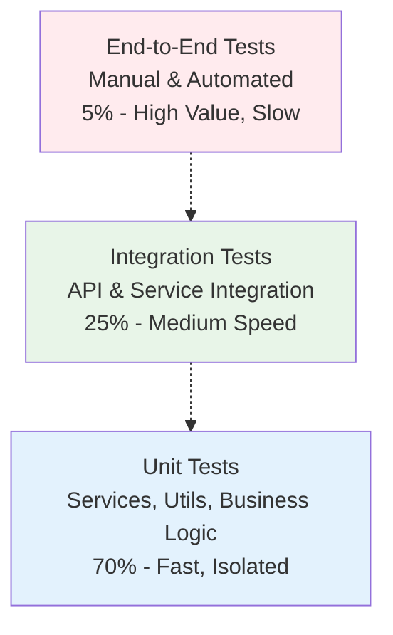

# Testing Strategy & Implementation

Comprehensive Testing Framework for Altus 4

This document outlines the complete testing strategy for Altus 4, covering all aspects from unit tests to performance testing, ensuring code quality, reliability, and maintainability.

## Testing Philosophy

### Testing Pyramid

Altus 4 follows the testing pyramid approach with emphasis on fast, reliable tests:



### Testing Principles

1. **Fast Feedback**: Tests should run quickly to enable rapid development
2. **Reliability**: Tests should be deterministic and not flaky
3. **Isolation**: Tests should not depend on external services or other tests
4. **Maintainability**: Tests should be easy to understand and modify
5. **Coverage**: Critical paths must have comprehensive test coverage

## Test Organization

### Directory Structure

```
tests/
├── unit/                    # Unit tests (70% of tests)
│   ├── services/           # Service layer tests
│   ├── controllers/        # Controller tests
│   ├── middleware/         # Middleware tests
│   ├── utils/              # Utility function tests
│   └── types/              # Type validation tests
├── integration/            # Integration tests (25% of tests)
│   ├── api/               # API endpoint tests
│   ├── database/          # Database integration tests
│   └── services/          # Service integration tests
├── performance/           # Performance tests (3% of tests)
│   ├── load/              # Load testing
│   └── stress/            # Stress testing
├── e2e/                   # End-to-end tests (2% of tests)
│   ├── user-flows/        # Complete user journeys
│   └── scenarios/         # Business scenario tests
├── fixtures/              # Test data and fixtures
│   ├── database/          # Database seed data
│   ├── api/               # API response fixtures
│   └── search/            # Search result fixtures
├── helpers/               # Test utilities and helpers
│   ├── database.ts        # Database test helpers
│   ├── auth.ts            # Authentication helpers
│   ├── mocks.ts           # Mock factories
│   └── assertions.ts      # Custom assertions
└── config/                # Test configuration
    ├── jest.config.js     # Jest configuration
    ├── setup.ts           # Global test setup
    └── teardown.ts        # Global test teardown
```

## Unit Testing Strategy

### Service Layer Testing

```typescript
// tests/unit/services/SearchService.test.ts
import { SearchService } from '@/services/SearchService'
import { createMockDatabaseService, createMockAIService } from '../../helpers/mocks'

describe('SearchService', () => {
  let searchService: SearchService
  let mockDatabaseService: jest.Mocked<DatabaseService>
  let mockAIService: jest.Mocked<AIService>

  beforeEach(() => {
    mockDatabaseService = createMockDatabaseService()
    mockAIService = createMockAIService()
    searchService = new SearchService(mockDatabaseService, mockAIService)
  })

  describe('search functionality', () => {
    it('should execute search with proper parameters', async () => {
      // Arrange
      const searchRequest = {
        query: 'mysql performance',
        databases: ['db-1'],
        userId: 'user-1'
      }

      const expectedResults = [
        { id: '1', title: 'MySQL Guide', relevanceScore: 0.9 }
      ]

      mockDatabaseService.executeFullTextSearch.mockResolvedValue(expectedResults)

      // Act
      const result = await searchService.search(searchRequest)

      // Assert
      expect(result.results).toHaveLength(1)
      expect(mockDatabaseService.executeFullTextSearch).toHaveBeenCalledWith(
        'db-1',
        'mysql performance',
        [],
        undefined,
        20,
        0
      )
    })

    it('should handle database failures gracefully', async () => {
      // Test error handling scenarios
      const searchRequest = {
        query: 'test query',
        databases: ['failing-db'],
        userId: 'user-1'
      }

      mockDatabaseService.executeFullTextSearch.mockRejectedValue(
        new Error('Database connection failed')
      )

      await expect(searchService.search(searchRequest))
        .rejects.toThrow('Search failed')
    })
  })
})
```

### Controller Testing

```typescript
// tests/unit/controllers/SearchController.test.ts
import { SearchController } from '@/controllers/SearchController'
import { Request, Response } from 'express'
import { createMockSearchService } from '../../helpers/mocks'

describe('SearchController', () => {
  let controller: SearchController
  let mockSearchService: jest.Mocked<SearchService>
  let mockRequest: Partial<Request>
  let mockResponse: Partial<Response>

  beforeEach(() => {
    mockSearchService = createMockSearchService()
    controller = new SearchController(mockSearchService)

    mockRequest = {
      body: {},
      user: { id: 'user-1' },
      apiKey: { id: 'key-1', permissions: ['search'] }
    }

    mockResponse = {
      json: jest.fn(),
      status: jest.fn().mockReturnThis()
    }
  })

  it('should return search results for valid request', async () => {
    // Test controller logic
    mockRequest.body = {
      query: 'test query',
      databases: ['db-1']
    }

    const mockResults = {
      results: [{ id: '1', title: 'Test Result' }],
      totalCount: 1
    }

    mockSearchService.search.mockResolvedValue(mockResults)

    await controller.search(mockRequest as Request, mockResponse as Response)

    expect(mockResponse.json).toHaveBeenCalledWith({
      success: true,
      data: mockResults,
      meta: expect.objectContaining({
        timestamp: expect.any(Date),
        requestId: expect.any(String)
      })
    })
  })
})
```

## Integration Testing Strategy

### API Integration Tests

```typescript
// tests/integration/api/search.test.ts
import request from 'supertest'
import { app } from '@/app'
import { setupTestDatabase, cleanupTestDatabase } from '../../helpers/database'
import { createTestUser, createTestApiKey } from '../../helpers/auth'

describe('Search API Integration', () => {
  let testApiKey: string
  let testDatabaseId: string

  beforeAll(async () => {
    await setupTestDatabase()

    const user = await createTestUser()
    testApiKey = await createTestApiKey(user.id)
    testDatabaseId = await createTestDatabase(user.id)
  })

  afterAll(async () => {
    await cleanupTestDatabase()
  })

  describe('POST /api/v1/search', () => {
    it('should return search results', async () => {
      const response = await request(app)
        .post('/api/v1/search')
        .set('Authorization', `Bearer ${testApiKey}`)
        .send({
          query: 'test search',
          databases: [testDatabaseId],
          limit: 10
        })
        .expect(200)

      expect(response.body).toMatchObject({
        success: true,
        data: {
          results: expect.any(Array),
          totalCount: expect.any(Number)
        }
      })
    })

    it('should handle authentication errors', async () => {
      await request(app)
        .post('/api/v1/search')
        .send({ query: 'test' })
        .expect(401)
    })

    it('should validate request parameters', async () => {
      const response = await request(app)
        .post('/api/v1/search')
        .set('Authorization', `Bearer ${testApiKey}`)
        .send({
          // Missing required query parameter
          databases: [testDatabaseId]
        })
        .expect(400)

      expect(response.body.error.code).toBe('VALIDATION_ERROR')
    })
  })
})
```

### Database Integration Tests

```typescript
// tests/integration/database/SearchRepository.test.ts
import { DatabaseService } from '@/services/DatabaseService'
import { setupTestDatabase, seedTestData } from '../../helpers/database'

describe('Database Integration', () => {
  let databaseService: DatabaseService

  beforeAll(async () => {
    await setupTestDatabase()
    databaseService = new DatabaseService()
  })

  beforeEach(async () => {
    await seedTestData()
  })

  it('should execute full-text search queries', async () => {
    const results = await databaseService.executeFullTextSearch(
      'test-db-id',
      'mysql performance',
      ['articles'],
      ['title', 'content'],
      20,
      0
    )

    expect(results).toBeInstanceOf(Array)
    expect(results.length).toBeGreaterThan(0)
    expect(results[0]).toHaveProperty('title')
    expect(results[0]).toHaveProperty('content')
  })

  it('should handle connection failures', async () => {
    const invalidDbService = new DatabaseService({
      host: 'invalid-host',
      port: 9999
    })

    await expect(
      invalidDbService.executeFullTextSearch('invalid', 'query', [], [], 10, 0)
    ).rejects.toThrow('Database connection failed')
  })
})
```

## Performance Testing

### Load Testing Configuration

```typescript
// tests/performance/load/search-load.test.ts
import { performance } from 'perf_hooks'
import { SearchService } from '@/services/SearchService'
import { createMockDependencies } from '../../helpers/mocks'

describe('Search Performance', () => {
  let searchService: SearchService

  beforeAll(() => {
    const { databaseService, aiService, cacheService } = createMockDependencies()
    searchService = new SearchService(databaseService, aiService, cacheService)
  })

  it('should handle concurrent searches efficiently', async () => {
    const concurrentRequests = 100
    const searchRequests = Array.from({ length: concurrentRequests }, (_, i) => ({
      query: `test query ${i}`,
      databases: ['test-db'],
      userId: `user-${i}`
    }))

    const startTime = performance.now()

    const results = await Promise.all(
      searchRequests.map(request => searchService.search(request))
    )

    const endTime = performance.now()
    const totalTime = endTime - startTime
    const averageTime = totalTime / concurrentRequests

    expect(results).toHaveLength(concurrentRequests)
    expect(averageTime).toBeLessThan(100) // Average response time < 100ms
    expect(totalTime).toBeLessThan(5000) // Total time < 5 seconds
  })

  it('should maintain performance under memory pressure', async () => {
    // Test memory usage and performance degradation
    const largeDataSet = Array.from({ length: 10000 }, (_, i) => ({
      id: i,
      title: `Large dataset item ${i}`,
      content: 'x'.repeat(1000) // 1KB of content per item
    }))

    const startMemory = process.memoryUsage().heapUsed
    const startTime = performance.now()

    // Process large dataset
    for (let i = 0; i < 1000; i++) {
      await searchService.search({
        query: 'test query',
        databases: ['large-db'],
        userId: 'performance-test-user'
      })
    }

    const endTime = performance.now()
    const endMemory = process.memoryUsage().heapUsed

    const memoryIncrease = (endMemory - startMemory) / 1024 / 1024 // MB
    const averageTime = (endTime - startTime) / 1000

    expect(memoryIncrease).toBeLessThan(100) // Memory increase < 100MB
    expect(averageTime).toBeLessThan(50) // Average time < 50ms
  })
})
```

### Stress Testing

```typescript
// tests/performance/stress/api-stress.test.ts
import request from 'supertest'
import { app } from '@/app'
import { performance } from 'perf_hooks'

describe('API Stress Testing', () => {
  const API_KEY = process.env.TEST_API_KEY

  it('should handle high request volume', async () => {
    const requestCount = 1000
    const concurrency = 50
    const batches = requestCount / concurrency

    const results = []

    for (let batch = 0; batch < batches; batch++) {
      const batchPromises = Array.from({ length: concurrency }, () =>
        request(app)
          .post('/api/v1/search')
          .set('Authorization', `Bearer ${API_KEY}`)
          .send({
            query: 'stress test query',
            databases: ['test-db'],
            limit: 10
          })
      )

      const batchResults = await Promise.allSettled(batchPromises)
      results.push(...batchResults)
    }

    const successful = results.filter(r => r.status === 'fulfilled').length
    const failed = results.filter(r => r.status === 'rejected').length
    const successRate = (successful / requestCount) * 100

    expect(successRate).toBeGreaterThan(95) // 95% success rate
    expect(failed).toBeLessThan(requestCount * 0.05) // Less than 5% failures
  })
})
```

## Test Data Management

### Fixtures and Seed Data

```typescript
// tests/fixtures/search-fixtures.ts
export const searchFixtures = {
  users: [
    {
      id: 'user-1',
      email: 'test@example.com',
      name: 'Test User',
      role: 'user'
    }
  ],

  apiKeys: [
    {
      id: 'key-1',
      userId: 'user-1',
      keyPrefix: 'altus4_sk_test_abc123',
      permissions: ['search', 'analytics'],
      environment: 'test'
    }
  ],

  databases: [
    {
      id: 'db-1',
      userId: 'user-1',
      name: 'Test Database',
      host: 'localhost',
      database: 'test_db'
    }
  ],

  searchResults: [
    {
      id: 1,
      title: 'MySQL Performance Optimization',
      content: 'Complete guide to optimizing MySQL performance...',
      author: 'Database Expert',
      published_at: '2024-01-15T10:00:00Z'
    }
  ]
}

// Database seeding helper
export async function seedTestData(connection: Connection) {
  // Clear existing data
  await connection.query('DELETE FROM searches')
  await connection.query('DELETE FROM databases')
  await connection.query('DELETE FROM api_keys')
  await connection.query('DELETE FROM users')

  // Insert test data
  for (const user of searchFixtures.users) {
    await connection.query('INSERT INTO users SET ?', user)
  }

  for (const apiKey of searchFixtures.apiKeys) {
    await connection.query('INSERT INTO api_keys SET ?', apiKey)
  }

  for (const database of searchFixtures.databases) {
    await connection.query('INSERT INTO databases SET ?', database)
  }
}
```

## Test Automation & CI/CD

### GitHub Actions Workflow

```yaml
# .github/workflows/test.yml
name: Test Suite

on:
  push:
    branches: [main, develop]
  pull_request:
    branches: [main]

jobs:
  unit-tests:
    runs-on: ubuntu-latest

    steps:
      - uses: actions/checkout@v3

      - name: Setup Node.js
        uses: actions/setup-node@v3
        with:
          node-version: '18'
          cache: 'npm'

      - name: Install dependencies
        run: npm ci

      - name: Run unit tests
        run: npm run test:unit -- --coverage

      - name: Upload coverage
        uses: codecov/codecov-action@v3
        with:
          file: ./coverage/lcov.info

  integration-tests:
    runs-on: ubuntu-latest

    services:
      mysql:
        image: mysql:8.0
        env:
          MYSQL_ROOT_PASSWORD: test
          MYSQL_DATABASE: altus4_test
        options: >-
          --health-cmd="mysqladmin ping"
          --health-interval=10s
          --health-timeout=5s
          --health-retries=3

      redis:
        image: redis:7
        options: >-
          --health-cmd="redis-cli ping"
          --health-interval=10s
          --health-timeout=5s
          --health-retries=3

    steps:
      - uses: actions/checkout@v3

      - name: Setup Node.js
        uses: actions/setup-node@v3
        with:
          node-version: '18'
          cache: 'npm'

      - name: Install dependencies
        run: npm ci

      - name: Run database migrations
        run: npm run migrate:test
        env:
          DB_HOST: localhost
          DB_PORT: 3306
          DB_USERNAME: root
          DB_PASSWORD: test
          DB_DATABASE: altus4_test

      - name: Run integration tests
        run: npm run test:integration
        env:
          DB_HOST: localhost
          DB_PORT: 3306
          DB_USERNAME: root
          DB_PASSWORD: test
          DB_DATABASE: altus4_test
          REDIS_HOST: localhost
          REDIS_PORT: 6379

  performance-tests:
    runs-on: ubuntu-latest
    if: github.event_name == 'push' && github.ref == 'refs/heads/main'

    steps:
      - uses: actions/checkout@v3

      - name: Setup Node.js
        uses: actions/setup-node@v3
        with:
          node-version: '18'
          cache: 'npm'

      - name: Install dependencies
        run: npm ci

      - name: Run performance tests
        run: npm run test:performance

      - name: Upload performance results
        uses: actions/upload-artifact@v3
        with:
          name: performance-results
          path: performance-results.json
```

### Test Scripts Configuration

```json
{
  "scripts": {
    "test": "npm run test:unit && npm run test:integration",
    "test:unit": "jest --config jest.config.js",
    "test:integration": "jest --config jest.integration.config.js",
    "test:performance": "jest --config jest.performance.config.js",
    "test:e2e": "jest --config jest.e2e.config.js",
    "test:watch": "jest --watch",
    "test:coverage": "jest --coverage",
    "test:ci": "jest --ci --coverage --watchAll=false"
  }
}
```

## Quality Gates & Metrics

### Coverage Requirements

```javascript
// jest.config.js
module.exports = {
  coverageThreshold: {
    global: {
      branches: 90,
      functions: 90,
      lines: 90,
      statements: 90
    },
    // Critical components require higher coverage
    'src/services/SearchService.ts': {
      branches: 95,
      functions: 95,
      lines: 95,
      statements: 95
    },
    'src/services/DatabaseService.ts': {
      branches: 95,
      functions: 95,
      lines: 95,
      statements: 95
    }
  }
}
```

### Performance Benchmarks

```typescript
// tests/performance/benchmarks.ts
export const performanceBenchmarks = {
  search: {
    averageResponseTime: 150, // ms
    p95ResponseTime: 300, // ms
    p99ResponseTime: 500, // ms
    throughput: 1000, // requests per second
    errorRate: 0.01 // 1% error rate
  },

  database: {
    connectionTime: 50, // ms
    queryTime: 100, // ms
    poolUtilization: 0.8 // 80% max utilization
  },

  cache: {
    hitRate: 0.85, // 85% cache hit rate
    responseTime: 5, // ms
    memoryUsage: 100 // MB max
  }
}
```

## Test Reporting & Analytics

### Custom Test Reporters

```typescript
// tests/config/custom-reporter.ts
class CustomTestReporter {
  onRunComplete(contexts: Set<Context>, results: AggregatedResult) {
    const summary = {
      totalTests: results.numTotalTests,
      passedTests: results.numPassedTests,
      failedTests: results.numFailedTests,
      coverage: results.coverageMap?.getCoverageSummary(),
      duration: results.runTime,
      timestamp: new Date().toISOString()
    }

    // Send to monitoring system
    this.sendToMonitoring(summary)

    // Generate detailed report
    this.generateDetailedReport(results)
  }

  private sendToMonitoring(summary: TestSummary) {
    // Implementation for sending metrics to monitoring system
  }

  private generateDetailedReport(results: AggregatedResult) {
    // Generate HTML/JSON reports
  }
}
```

## Best Practices Summary

### Testing Guidelines

1. **Write Tests First**: Follow TDD when possible
2. **Test Behavior, Not Implementation**: Focus on what the code does, not how
3. **Keep Tests Simple**: Each test should verify one specific behavior
4. **Use Descriptive Names**: Test names should clearly describe the scenario
5. **Maintain Test Independence**: Tests should not depend on each other
6. **Mock External Dependencies**: Isolate the code under test
7. **Test Edge Cases**: Include boundary conditions and error scenarios
8. **Keep Tests Fast**: Unit tests should run in milliseconds
9. **Regular Test Maintenance**: Update tests when code changes
10. **Monitor Test Quality**: Track coverage, flakiness, and performance

### Quality Metrics

- **Code Coverage**: Minimum 90% for critical components
- **Test Performance**: Unit tests < 1ms, Integration tests < 100ms
- **Test Reliability**: < 1% flaky test rate
- **Maintenance**: Tests updated within same PR as code changes

## Related Documentation

- **[Unit Testing Guide](../testing/unit.md)** - Detailed unit testing patterns
- **[Integration Testing Guide](../testing/integration.md)** - Integration testing strategies
- **[Performance Testing Guide](../testing/performance.md)** - Performance testing implementation
- **[Development Standards](../development/standards.md)** - Code quality standards

---

**A comprehensive testing strategy ensures Altus 4's reliability, performance, and maintainability. Follow these guidelines to build a robust test suite that supports confident development and deployment.**
